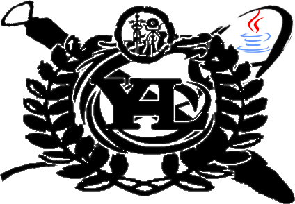

Java基础学习代码笔记

业精于勤，荒于嬉；行成于思，毁于随。 
方今圣贤相逢，治具毕张。拔去凶邪，登崇畯良。
占小善者率以录，名一艺者无不庸。 爬罗剔抉，刮垢磨光。
盖有幸而获选，孰云多而不扬？
诸生业患不能精，无患有司之不明；行患不能成，无患有司之不公。

This is a note-taking exercise class project for Basic Java learning, updating from the most basic parts of Java.First the basic Java content, gradually updated the front end, framework, exercise items, and so on.

这是一个Java基础学习的笔记练习类的项目,从java最基础的部分开始更新内容。先是Java的基础内容，逐渐更新出前端，框架，练习项目等内容。

## [ideaCode](https://github.com/mr-yhl/javajybc/tree/master/ideaCode)

Inside this folder are some basic Java syntax, including constants, variables, arrays, and so on.

在此文件夹内存在的是java的一些基本的语法,包括常量,变量,数组等最基础的内容.

## dayXX

DayXX file stores the contents of the object since it faces the object, and the corresponding notes are stored in the Note folder. DayXX is one-to-one, you can first query the note file in the Note file to find the corresponding source code file content.

dayXX文件存放的是自从面对对象以后的内容,其内容对应的笔记存在于note文件夹内,dayXX是一一对应的,可以先查询note笔记文件的中的笔记文件,在找对应的源代码文件内容.

## [day01面向对象](https://github.com/mr-yhl/javajybc/tree/master/day01)

The knowledge of this day is mainly about the knowledge of the object-oriented section.

这一天的知识主要是包含面向对象部分的知识.还有封住,构造方法,JavaBeen等内容。

1. Object orientation  面向对象
   1. The benefits  好处
   2. Classes and objects  类与对象
2. Definition and use of classes  类的定义和使用
3. Difference between local variables and member variables  局部变量和成员变量的区别
   1. Defined location  定义的位置
   2. Scope of use  使用范围
   3. Memory location  内存位置
   4. The initial value  初始值
   5. Life cycle  生命周期
4. Private keyword  private关键字
5. This keyword  this关键字
6. Construction method  构造方法
7. JavaBeen

## [day02String和StringBuilder的使用](https://github.com/mr-yhl/javajybc/tree/master/day02)

The main focus of the day is the use of String and StringBuilder.

这一天的主要内容就是String和StringBuilder的使用。

1. String
   1. Construction method  构造方法
   2. Judgment method  判断方法
   3. Access method  获取方法
   4. Conversion method  转换方法
   5. Segmentation method  分割方法
2. StringBuilder
   1. Construction method  构造方法
   2. Common methods  常见方法
3. Conversion between StringBuilder and String   StringBuilder和String的相互转换

## [day03ArrayList集合](https://github.com/mr-yhl/javajybc/tree/master/day03)

This day's knowledge is mainly about the contents related to List.

这一天的知识主要是与List有关的内容。

1. ArrayList collection  ArrayList集合
   1. The difference between collections and arrays  集合和数组的区别
   2. Construction method  构造方法
   3. Other methods  其他方法
   4. The collection holds data of the base type  集合保存基本类型的数据

## [day04继承、抽象类、模板设计模 式、final关键字](https://github.com/mr-yhl/javajybc/tree/master/day04)

This day's content is primarily about the inheritance part.

这一天的内容主要是关于继承部分的内容。

1. Anonymous objects  匿名对象
2. inheritance  继承 
   1. Construction method  构造方法
   2. Surper
   3. This
3. An abstract class  抽象类
   1. Method of use  使用方法
   2. Matters needing attention  注意事项
4. Template design pattern  模板设计模式
5. final 关键字

## [day05static 、接口、多态、内部类](https://github.com/mr-yhl/javajybc/tree/master/day05)

This day is mainly about inheritance and implementation.

这一天的内容主要还是继承实现的内容。

1. static 
2.  interface   接口
   1. Abstract method  抽象方法
   2. Default method   默认方法
   3. Static method  静态方法
3. polymorphism  多态
   1. instanceof
4. The inner class   内部类

## [day06权限修饰符、代码块、常用API](https://github.com/mr-yhl/javajybc/tree/master/day06)

- Permission modifier  权限修饰符
- The code block  代码块
  - Construction code block  构造代码块
  - Static code block  静态代码块
- Object类
  - toString
  - Equals
  - Objects
  - native本地方法
- Date类
  - getTime
  - setTime
  - DateFormat
- Calendar类
  - get
  - set
  - add
- Math
- System
- BigInteger
- BigDecimal
- Arrays
- A wrapper class   包装类
  - Automatic packing and unpacking  自动装箱拆箱
  - String conversion  字符串转换

## [day07学生管理系统练习](https://github.com/mr-yhl/javajybc/tree/master/day07)

## [day08Collection、List、泛型、数据结构](https://github.com/mr-yhl/javajybc/tree/master/day08)

+ collection  集合
+ iterator  迭代器
+ Strengthening for  增强for【重点】
+ generic  泛型
  + a generic class  泛型类
  + Generic methods   泛型方法
  + Generic interface  泛型接口
  + Generic wildcards  泛型通配符
+ Introduction to data structure  数据结构简介
+ List interface  List接口
  + ArrayList
  + LinkedList
+ Set small exercises  集合小练习

## [day09Collections、Set、Map、斗地主排序](https://github.com/mr-yhl/javajybc/tree/master/day09)

+ Collections
  + shuffle
  + sort natural sort  sort自然排序
  + comparator sort  比较器排序
  + Variable parameter  可变参数[重]
  + addall method  addall方法
+ the Set interface  Set接口
  + hashCode
  + hash table  哈希表
  + other sets  其他集合
+ Map set (double column set)    map集合(双列集合)
  + keySet()
  + entrySet()

## [day10排序算法、异常、多线程基础](https://github.com/mr-yhl/javajybc/tree/master/day10)

+ Plus bubble sort  冒泡排序 
+ selection sort  选择排序 
+ Binary search  二分查找 
+ Exception handling  异常处理
  + throw、throws
  + Objects
  + try...catch...finally
+ Multithreading foundation  多线程基础
  + Processes and threads  进程与线程
  + Concurrency and parallelism  并发与并行
  + methods in threads  线程里的方法
  + Two ways to achieve multithreading  多线程的两种实现方法

## [day11线程安全、volatile关键字、原子性、并发包](https://github.com/mr-yhl/javajybc/tree/master/day11)

+ high concurrency  高并发
+ Thread safety  线程安全
  + visibility  可见性
  + order  有序性
  + atomic  原子性
+ volatile关键字
  + Resolve visibility  解决可见性
  + Solve order  解决有序性
+ Atomic classes  原子类
  + CAS[Optimistic lock]  CAS[乐观锁]
+ synchronized
  + Synchronization block [Pessimistic lock]  同步代码块[悲观锁]
  + Synchronized methods  同步方法
+ And contract  并发包
  + CopyOnWriteArrayList
  + CopyOnWriteArraySet
  + Hashtable
  + CountDownLatch
  + CyclicBarrier
  + Semaphore
  + Exchanger

## [day12线程池、死锁、线程状态、等待与唤醒](https://github.com/mr-yhl/javajybc/tree/master/day12)

+ The thread pool  线程池
  + Executor
  + ExecutorService
  + Executors
+ a deadlock  死锁
+ the state of the thread  线程的状态
  + wait () to wait  wait()等待
  + notify()唤醒
+ Timer Timer  定时器Timer
+  Lambda expression  Lambda表达式
+ Stream
  + A single-column collection gets the stream  单列集合获取流
  + The two-column collection gets the stream  双列集合获取流
  + forEach
  + filter
  + Count
  + Linit
  + skip
  + concat
  + Map
  + Collect arrays, collections  收集到数组、集合

## [day13File类、递归、字节流、字符流](https://github.com/mr-yhl/javajybc/tree/master/day13)

+ file class  file类
  + acquisition method  获取方法
  + Judgment method  判断方法
  + create method  创建方法
  + delete method  删除方法
+ recursion  递归
+ byte stream  字节流
  + input stream  输入流
  + the output stream  输出流
+ character stream  字符流
  + input stream  输入流
  + the output stream  输出流

## [day14Properties类、缓冲流、转换流、序 列化流、装饰者模式、commons-io工具包](https://github.com/mr-yhl/javajybc/tree/master/day14)

+ IO resource processing   IO资源的处理
+ Properties class  Properties类
+ ResourceBundle
+ buffer flow  缓冲流
  + Byte buffer stream  字节缓冲流
    + Byte input buffered stream  字节输入缓冲流
    + Byte output buffered stream  字节输出缓冲流
  + character buffer stream   字符缓冲流
    + character input buffered stream  字符输入缓冲流
    + character output buffered stream   字符输出缓冲流
+ transformation flows  转换流

## [day15JUnit单元测试、网络编程](https://github.com/mr-yhl/javajybc/tree/master/day15)

This day is mainly to practice unit testing content, as well as network programming content.

这一天主要是练习单元测试的内容,以及网络编程的内容。

+ JUnit unit tests   JUnit单元测试
+ Network programming  网络编程
  + IP: The unique identity of a device in a network.   IP：在网络中对于设备的唯一标识。
  + 端口：在计算机中对应应用程序的唯一标识。
  + Port: The unique identity of the corresponding application on the computer.      TCP protocol code   TCP协议代码：
    + Socket：(Presentation client)表示客户端  
    + ServerSocket：(Presentation server)表示服务器。

## [day16NIO,AIO](https://github.com/mr-yhl/javajybc/tree/master/day16)

Today, we're talking about some of the parts of the nioo and aio section, and we're going to do a lot of what that does.

今天主要讲述了NIO,AIO部分的一些内容,大体了解了这些有什么作用.

+ NIO
  + Synchronous and asynchronous   同步和异步
  + Blocking and non-blocking  阻塞和非阻塞
+ BUffer
  + allocate
  + allocateDirect
  + wrap
  + put
  + limit
  + mark
  + position
  + flip
  + clear
+ Channel
  + FileChannel
  + SocketChannel
  + ServerSocketChannel
+ Selector
+ AIO

## [day17反射,注解,动态代理](https://github.com/mr-yhl/javajybc/tree/master/day17)

Today's lesson is about reflection, getting Class objects, getting constructors, getting member variables, and so on.You also learned about dynamic proxies, which require you to understand the methods of dynamic proxies.

今日内容主要是学习反射,学会获取Class对象,获取构造方法,获取成员变量等内容。还学习了关于动态代理的内容,要求可以看懂动态代理的方法.

+ reflection  反射

  + loader   加载器
  + Class loading mechanism   类加载机制

  + class object acquisition  class对象获取
  + Common methods  常用方法
  + Gets the constructor by reflection   通过反射获取构造方法
  + Gets the member method by returning   通过返回获取成员方法

+  annotation   注解

  + Target
  + Retention

+ Dynamic agent   动态代理

## [day18XML,jdk8的新特性](https://github.com/mr-yhl/javajybc/tree/master/day18)

Today, I mainly learned the content of XML description document, mainly including format, specification, parsing and so on.

今日主要学习了关于xml说明文档部分的内容,主要包括格式,规范,解析等内容.

+ XML

+ XML constraint    xml约束

  + DTD

  + schema

+ XML parsing   xml解析

+ NEW features of JDK8   JDK8的新特性

  + Method reference   方法的引用

  + Base64

