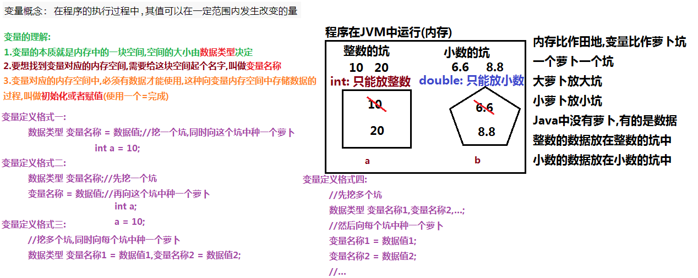
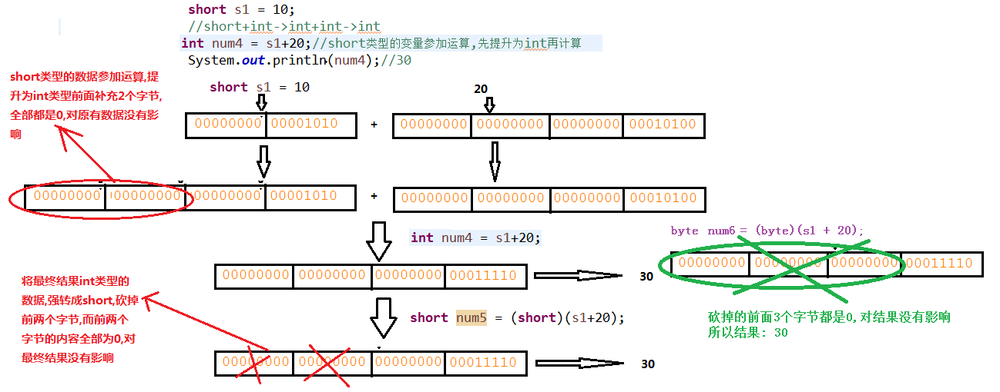
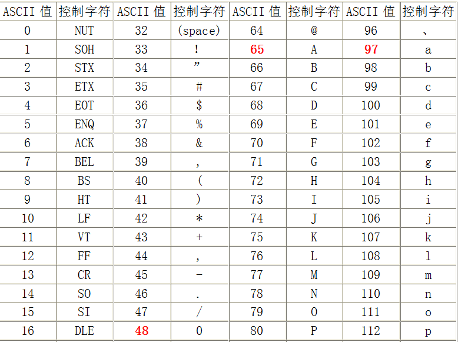

# day02【变量、类型转换、运算符】

##### 今日复习指南

```java
1.变量【重点: 用30分钟】
  	Demo01Var.java 
    Demo02Var.java

2.运算符【重点: 用1个小时】	
    Demo11Operator.java
    Demo12Operator.java
    Demo13Operator.java
    Demo14Operator.java
    Demo15Operator.java
    Demo16Operator.java
    Demo17Operator.java
    
	练习写代码时,必要的注释是需要的,但是千万不要像响哥一样写的这么详细,只要自己理解就ok了
    
3.数据类型转换【难点非重点: 理解,用30分钟】 大体看看
    

```

##### 今日内容介绍

```java
变量【重点】
数据类型转换【难点非重点: 理解】
运算符【重点】	
```


### 第一章 变量和数据类型【重要】

##### 2.1 变量概念及分类

```java
数学中有个常数的概念:
y = x + 10; 	//整数数字10是不可以发生变化的
b = a + 6.6;	//小数数字6.6是不可以发生变化的

数学中的数字(常数)是有分类的,对应java中的常量也是有分类的

x,y中的值是可以发生变化的
x: 2 y:12
x: 6 y: 16
x,y中的值是可以发生变化的,而且内部的数据也是有数据类型的

a,b中的值是可以发生变化的
a:2.2 b:8.8
a:3.3 b:9.9
a,b中的值是可以发生变化的,而且内部的数据也是有数据类型的

像x,y,a,b这样的东西,内部可以存储一个数据,而且该数据是有类型的,这样的东西我们叫做变量,可以理解为一个容器(小的容器),也是有类型的,不同类型的变量可以存储不同类型的数据

变量为什么要有这么多的分类?
    不同的类型占用的字节数不同,取值范围不同,所以对应的使用场景也是不同的
        
1.变量概念: 在程序的执行过程中,其值可以在一定范围内发生改变的量
2.分类(四类八种): 
	(1)整数
		byte	占1个字节	取值范围 -128到127
		short	占2个字节	取值范围 正负3万多
		int		占4个字节	取值范围 正负21亿	整数常量默认是int类型
		long	占8个字节	取值范围 大概19位数字	表示long类型的数据时,建议右键添加字母L/l
	(2)小数
		float	占4个字节	表示float类型的数据时,建议右键添加字母F/f
			虽然float占4个字节,但是由于内部采用科学计数法,取值范围远远大于占用8个字节的long类型
		
		double		占8个字节	小数常量默认是double类型
		
	(3)字符:
		char	占2个字节	取值范围0到65535
		
	(4)布尔:
		boolean	占1个字节	取值只有 true,false
			
```


##### 2.2 变量定义格式图解分析 

```java
变量的理解:
	1.变量的本质就是一块内存空间,内存空间的大小由数据类型确定
	2.要想找到变量对应的内存空间,必须给给内存空间起个名字,叫做变量名称
	3.变量对应的内存空间中,不许有值才能使用,没有值是不能使用的,
		这种把数据存储到变量对应的内存空间的过程,叫做赋值/初始化
变量定义的四种格式:
	1.格式一(先挖坑,后种萝卜)
		数据类型 变量名称;//先挖一个坑
		变量名称 = 数据值;//再往坑中种一个萝卜
	2.格式二(挖坑,同时向垦种种一个萝卜)
		数据类型 变量名称 = 数据值;//挖坑,同时向垦种种一个萝卜
	3.格式三(先挖多个坑,然后向每个坑中种一个萝卜)
		数据类型 变量名称1, 变量名称2...;//先挖多个坑
		变量名称1 = 数据值1;//再往坑中种一个萝卜
		变量名称2 = 数据值2;//再往坑中种一个萝卜
	4.格式三(挖多个坑,同时向每个坑中种一个萝卜)
		数据类型 变量名称1 = 数据值1, 变量名称2 = 数据值2...;
```

##### 图解:




##### 2.3 定义8种变量

```java
//整数变量的四种定义方式
public class Demo01Var {
	public static void main(String[] args){
		/*
			1.格式一(先挖坑,后种萝卜)
				数据类型 变量名称;//先挖一个坑
				变量名称 = 数据值;//再往坑中种一个萝卜
		*/
		//先挖了一个byte类型的坑(占1个字节),给这个坑起个名字叫a
		byte a;
		
		a = 10;//把数字10存储到名称为a的坑中
		
		System.out.println(a);//打印名称为a的坑中的数据:10

		/*
			2.格式二(挖坑,同时向垦种种一个萝卜)
				数据类型 变量名称 = 数据值;//挖坑,同时向垦种种一个萝卜
		*/
		//挖了一个short类型的坑(占2个字节),给这个坑起个名字叫b,同时向这个坑中放入数据20
		short b = 20;
		
		System.out.println(b);//打印名称为b的坑中的数据:20
		
		/*
			3.格式三(先挖多个坑,然后向每个坑中种一个萝卜)
				数据类型 变量名称1, 变量名称2...;//先挖多个坑
				变量名称1 = 数据值1;//再往坑中种一个萝卜
				变量名称2 = 数据值2;//再往坑中种一个萝卜
		*/
		//先挖了两个int类型的坑(占4个字节),分别给这两个坑起名字为c和d
		int c, d;
		c = 30;//把数字30存储到名称为c的坑中
		d = 40;//把数字40存储到名称为d的坑中
		System.out.println(c);//打印名称为c的坑中的数据:30
		System.out.println(d);//打印名称为d的坑中的数据:40
		
		/*
			4.格式三(挖多个坑,同时向每个坑中种一个萝卜)
				数据类型 变量名称1 = 数据值1, 变量名称2 = 数据值2...;
		*/
		//挖了两个long类型的坑(占8个字节),分别给这两个坑起名字为e和f
		//把数字50L存储到名称为e的坑中,把数字60L存储到名称为f的坑中
		long e = 50L, f = 60L;
		System.out.println(e);//打印名称为e的坑中的数据:50
		System.out.println(f);//打印名称为f的坑中的数据:60
	}
}
```

```java
//其它类型变量的定义
public class Demo02Var {
	public static void main(String[] args){
		//1.定义float变量
		//定义float类型变量a,并初始化
		float a = 6.6F;
		System.out.println(a);//打印变量a中的内容: 6.6
		
		//2.定义double变量
		//定义double类型变量b,并初始化
		double b = 8.8;
		System.out.println(b);//打印变量b中的内容: 8.8
		
		//3.定义char变量
		//定义char类型变量c,并初始化
		char c = 'a';
		System.out.println(c);//打印变量c中的内容: a
		
		//定义char类型变量c,并初始化
		//char c2 = 'aa';//错误: ''中不能写2个及以上的字符,只能写1个字符
		//System.out.println(c2);//打印变量c2中的内容: 
		
		//4.定义boolean变量
		//定义boolean类型变量d,并初始化
		boolean d = true;
		System.out.println(d);//打印变量d中的内容: true
		d = false;//把false存储到变量d中,d中原有的数据true被替换/覆盖
		System.out.println(d);//打印变量d中的内容: false
		
		//d = 100;//数据类型不匹配,100是int类型,而d中只能放boolean数据
	}
}
```


##### 2.4 变量的注意事项

```java
变量定义的注意事项:
	1.变量名称：在同一个大括号范围内，变量的名字不可以相同。
	2.变量赋值：定义的变量，不赋值不能使用。
	
public class Demo03VarNotice {
	public static void main(String[] args){
		//1.定义int变量a,并初始化
		int a = 10;
		System.out.println(a);
		
		//错误: 已经在main方法中定义了变量a
		//int a = 20;
		//System.out.println(a);
		
		//2.变量定义后,不赋值不能使用
		//定义int变量b,未初始化
		int b;
		//System.out.println(b);//错误的: 变量b中没有值不能使用
		
		b = 30;
		System.out.println(b);
	}
}
```

```java
变量定义的注意事项:		
	1.定义long类型的变量时，需要在整数的后面加L（大小写均可，建议大写）。
		因为整数默认是int类型，整数太大可能超出int范围。		
	2.定义float类型的变量时，需要在小数的后面加F（大小写均可，建议大写）。
		因为浮点数的默认类型是double， double的取值范围是大于float的，类型不兼容。

public class Demo04VarNotice {
	public static void main(String[] args){
		//错误:
		//整数6000000000默认是int类型,而int类型的取值范围正负21亿
		//目前6000000000已经超出了int的取值范围正负21亿
		//long a = 6000000000;
		
		//6000000000L表示long类型的数据,long的取值范围大概19位数字,没有超出范围
		long b = 6000000000L;
		
		System.out.println(b);
		
		//错误:
		//小数6.6默认是double类型,占8个字节,左侧的变量float类型,占4个字节
		//大萝卜不能直接放入小坑中
		//float c = 6.6;
		//System.out.println(c);
		
		float d = 6.6F;//6.6F表示float类型,占4个字节,可以存储到左侧float类型的变量中
		System.out.println(d);
	}
}
```


##### 2.5 标识符的含义及注意事项

```java
标识符:
	1.概念: 程序中起名字的地方(类名,方法名称,变量名)
	2.命名规则： 硬 性 要 求
		标识符可以包含 英文字母26个(区分大小写) 、 0-9数字 、 $（美元符号） 和 _（下划线） 。
		标识符不能以数字开头。
		标识符不能是关键字。
		
	3.命名规范： 软 性 建 议
        类名规范：首字母大写，后面每个单词首字母大写（大驼峰式）。
			Demo01BianLiang
			Demo02BianLiang
			Demo03BianLiangNotice
			Demo04BiaoShiFu
				
		方法名规范： 首字母小写，后面每个单词首字母大写（小驼峰式）。
			getMin(...){...}
			getMax(...){...}
				
		变量名规范：首字母小写，后面每个单词首字母大写（小驼峰式）。
			num
			value
			maxValue

```

```java
//标识符
public class Demo05BiaoShiFu {
	public static void main(String[] args){
		//int b%2;//错误: 不能包含除字母,数字,$和_以外的符号
		
		//int 2b;//错误: 不能以数字开头
		
		//int public;//错误: 不能使用关键字作为标识符
		
		int b2$_c;
		int $_2b;
		
		//变量名规范：首字母小写，后面每个单词首字母大写（小驼峰式）。
		int ageOfMyGirlFriend = 18;
		
		int ageofmygirlfriend = 18;//正确的,但是不符合规范
	}
}
```


### 第二章 数据类型转换【理解】

##### 3.1 自动类型转换【从小到大自动】

```java
Java程序中要求参与的计算的数据，必须要保证数据类型的一致性，如果数据类型不一致将发生类型的转换。
举例:
	int + int --> int	两个int数据运算,类型一致,就可以直接运算
	int + long --> long + long --> long int和long进行运算,类型不一致,必须转换成一致的,才可以运算
	目前:把int转换成long,这种转换是把小类型转成大类型(自动类型转换),java帮我们自动完成,不需要特殊处理
	
	int + long --> int + int --> int int和long进行运算,类型不一致,必须转换成一致的,才可以运算
	目前:把long转换成int,这种转换是吧大类型转成小类型(强制类型转换),java不会帮我们自动完成,必须特殊处理

        
1.自动类型转换概念:
	取值范围小的数据或者变量可以直接赋值给取值范围大的变量,会发生自动类型转换(小萝卜可以直接放入大坑中)
        
2.特点: 
	(1)是自动完成的,不需要代码的特殊处理
	(2)byte/short/char,只要参加运算会自动转换为int类型
	(3)范围小的类型向范围大的类型提升， byte、short、char 运算时直接提升为 int 。
		byte、short、char-->int-->long-->float-->double
	
举例:00000000
有一个byte类型(1个字节)的数字5:			00000101	
byte类型自动类型转换成short类型(2个字节):
	在左侧补充1个字节的0,因为补充的都是0,所以对数字原有大小是没有影响的,还是5
	00000000 00000101
        
byte类型自动类型转换成int类型(4个字节): 
	在左侧补充3个字节的0,因为补充的都是0,所以对数字原有大小是没有影响的,还是5
    00000000 00000000 00000000 00000101
        
byte类型自动类型转换成long类型(8个字节): 
	在左侧补充7个字节的0,因为补充的都是0,所以对数字原有大小是没有影响的,还是5
	00000000 00000000 00000000 00000000 00000000 00000000 00000000 00000101

总结:
	根据需求,在左侧补充若干字节的0,因为补充的都是0,所以对数字原有大小是没有影响的,但是占用的空间却发生了变换(打肿脸充胖子)
	
```

```java
//自动类型转换练习一
//注意:byte/short/char,只要参加运算会自动转换为int类型
public class Demo06Convert {
	public static void main(String[] args){
		int i = 1; 
		byte b = 2; 
		/*	
			错误: 
			b是byte类型(占1个字节),i是int类型(占4个字节),类型不一致,会发生自动类型转换
			把byte类型的b,自动转换为int类型(左侧补充3个字节的0),b的大小仍然2
			byte + int ==> int + int ==> int 结果是int类型,占4个字节,
			不能直接赋值给左侧的占用1个字节的byte类型的变量x
			大萝卜不能直接放入小坑中
			解决方案:
				1.把左侧的坑变大(目前采用这种方式)
				2.把右侧的萝卜变小(后面讲的强制类型转换)
		*/
		//byte x = b + i;
		
		/*	
			正确: 
			b是byte类型(占1个字节),i是int类型(占4个字节),类型不一致,会发生自动类型转换
			把byte类型的b,自动转换为int类型(左侧补充3个字节的0),b的大小仍然2
			byte + int ==> int + int ==> int 结果是int类型,占4个字节,
			可以直接赋值给左侧的占用4个字节的int类型的变量y			
		*/
		int y = b + i;
		System.out.println(y);
	}
}
```

```java
//自动类型转换练习二
//注意:byte/short/char,只要参加运算会自动转换为int类型
public class Demo07Convert {
	public static void main(String[] args){
		int i = 1; 
		double d = 2.5;
		
		/*	
			错误: 
			d是double类型(占8个字节),i是int类型(占4个字节),类型不一致,会发生自动类型转换
			把int类型的i,自动转换为double类型,最终的效果就是把i中的数据1变成1.0
			
			double + int ==> double + double ==> double 结果为double类型,占8个字节
			问题:
				结果为double类型,占8个字节,不能直接赋值给左侧占4个字节的int变量x
				
			大萝卜不能直接放入小坑中			
			解决方案:
				1.把左侧的坑变大(目前采用这种方式)
				2.把右侧的萝卜变小(后面讲的强制类型转换)
		*/
		
		//int x = d + i;
		
		/*	
			正确: 
			d是double类型(占8个字节),i是int类型(占4个字节),类型不一致,会发生自动类型转换
			把int类型的i,自动转换为double类型,最终的效果就是把i中的数据1变成1.0
			
			double + int ==> double + double ==> double 结果为double类型,占8个字节
			结果为double类型,占8个字节,可以直接赋值给左侧占8个字节的double变量y				
			
		*/
		
		double y = d + i;
		System.out.println(y);
		
	}
}
```


##### 3.2 强制类型转换【从大到小强制】


```java
1.强制类型转换概念:		
	取值范围大的数据/变量,不能直接赋值给取值范围小的变量,必须进行强制类型转换(大萝卜不可以直接放入小坑中)
    long a = 5L;
	int b = (int)a;
    
2.格式:
	注意: 强制类型转换不会自动完成,必须通过代码人为干预
	
	转后类型 变量名称 = (转后类型)转前数据/转前变量;
	
	举例: 把int变量a,强制转换成byte变量后存储到b中
	int a = 10;
	byte b = (byte)a;

3.问题:
	会损失精度,可能会影响最终数据的大小

举例:
有一个long类型(8个字节)的数字5:	
	00000000 00000000 00000000 00000000 00000000 00000000 00000000 00000101

long类型强制类型转换成int类型(4个字节):	
    砍掉左侧4个字节的内容,因为目前砍掉的都是0,所以对数字原有大小是没有影响的,还是5
	00000000 00000000 00000000 00000101
        
long类型强制类型转换成short类型(2个字节):		
	砍掉左侧6个字节的内容,因为目前砍掉的都是0,所以对数字原有大小是没有影响的,还是5
    00000000 00000101
        
long类型强制类型转换成byte类型(1个字节):
	砍掉左侧7个字节的内容,因为目前砍掉的都是0,所以对数字原有大小是没有影响的,还是5
	00000101
	
总结:    
   根据需求,砍掉数据左侧若干字节的内容,如果砍掉的都是0,对于原有数据没有影响,如果砍掉的内容中包含1,
	就会对原有数据产生影响(大小发生变化)
        
```

```java
//强制类型转换练习一
public class Demo08Convert {
	public static void main(String[] args){
		//short类型变量，内存中2个字节 
		short s = 1;
		
		/*	
			错误: 
			s是short类型(占2个字节),1是int类型(占4个字节),类型不一致,会发生自动类型转换
			把short类型的s,自动转换为int类型(左侧补充2个字节的0),s的大小仍然1
			short + int ==> int + int ==> int 结果是int类型,占4个字节,
			不能直接赋值给左侧的占用2个字节的short类型的变量s
			大萝卜不能直接放入小坑中
			解决方案:
				1.把左侧的坑变大(以前采用这种方式)
				2.把右侧的萝卜变小(目前使用强制类型转换)
		*/
		//s = s + 1;//编译失败
		
		/*
			s是short类型(占2个字节),1是int类型(占4个字节),类型不一致,会发生自动类型转换
			把short类型的s,自动转换为int类型(左侧补充2个字节的0),s的大小仍然1
			short + int ==> int + int ==> int 结果是int类型,占4个字节,
			但是紧接着把int类型的结果数据强制类型转换为short类型
			(砍掉左侧的两个字节,被砍掉的都是0,最终结果不受影响),
			可以直接赋值给左侧的short变量s
			
			强转前结果int数据2:
				00000000 00000000 00000000 00000010
			强转成hsort后: 砍掉的都是0,结果还是2
				00000000 00000010
		*/
		
		s = (short)(s + 1);//把s+1的结果强制类型转换为short
		
		System.out.println(s);
		
	}
}
```


```java
//强制类型转换练习二
public class Demo09Convert {
	public static void main(String[] args){
		/*
			右侧1.5是double类型,占8个字节,不能直接赋值给左侧占4个字节的int变量j
			
			大萝卜不能直接放入小坑中
			解决方案:
				1.把左侧的坑变大(以前采用这种方式)
				2.把右侧的萝卜变小(目前使用强制类型转换)
		*/
		//int j = 1.5;
		
		/*
			右侧1.5是double类型,占8个字节,虽然不能直接赋值给左侧占4个字节的int变量i,
			但是赋值前对double类型数据1.5进行强制类型转换成int
			double --> int 直接砍掉小数部分
			1.5 --> 1
			
			问题: 会损失精度
		*/
		
		int i = (int)1.5;
		
		System.out.println(i);//1
	}
}
```


##### 图解(其它案例):




##### 3.3 ASCII码表

```java
计算机是一个二货,只能存储0和1,所以存储到计算机中的所有内容都会转换成0和1进行存储
所以我们在计算机中存储的字符也不例外,也需要把字符转换成0和1进行存储

问题: 如何把字符转换成对应的0和1进行存储呢?
    
解决方案:
	ASCII编码表：就是将人类的文字和一个十进制数进行对应起来组成一张表格。

存储字符时：需要查找ASC码表,找到字符对应的数字,将数字转换为二进制数存放到计算机中
	'a' --> 97 --> 1100001		小写字母ASCII码值是连续的
    'A' --> 65  --> 1000001		大写字母ASCII码值是连续的
    '0' --> 48 --> 110000		数字字符ASCII码值是连续的
    
使用字符时：将对应的二进制数转换为十进制 找到ASCII表中对应的字符
	1100001 --> 97 --> 'a'
    1000001 --> 65 --> 'A'
    110000 --> 48 --> '0'
```



##### 3.4 int类型和char类型的运算原理

```java
public class Demo10Char {
	public static void main(String[] args){
		//定义char类型的变量ch,并初始化
		char ch = 'a';
		System.out.println(ch);//a
		
		/*
			注意: byte/short/char,只要参加运算会自动转换为int类型
			ch是char类型,数字1是int类型,不一致,会发生自动类型转换
			把char类型的ch,自动转换成int类型
			问题:
				如何把char类型自动转换成int类型
			解决方案:
				查看ASCII码表,找到字母'a'对应的int数字97
				
			char + int --> int + int --> 97 + 1 --> 98 (int类型)
		*/		
		System.out.println(ch + 1);//98
		
		/*
			注意: byte/short/char,只要参加运算会自动转换为int类型
			ch是char类型,数字1是int类型,不一致,会发生自动类型转换
			把char类型的ch,自动转换成int类型
			char + int --> int + int --> 97 + 1 --> 98 (int类型)
			然后前面还有一个强制类型转换,把int类型结果数据98强制类型转换成char类型
			
			问题:
				如何把int类型强制类型转换成char类型
			解决方案:
				查看ASCII码表,找到int数字98对应的字母'b'
		*/	
		System.out.println((char)(ch + 1));//b: 把ch+1的结果数据int类型的98强制转换成char类型(查看ASCII码表)
	}
}
```


### 第三章 运算符

##### 4.1 算术运算符加减乘除

```java
1.运算符：对常量或者变量进行操作/运算的符号 
2.表达式：用运算符把常量或者变量连接起来符合java语法的式子就可以称为表达式。
3.数学运算符:
	(1)+: 加法运算
    (2)-: 减法运算
    (3)*: 乘法运算
    (4)/: 除法运算
		被除数 ÷ 除数	= 	商(/: 获取除法运算中的商) ... 余数(%: 获取除法运算中的余数)
```

```java
//算术运算符
public class Demo11Operator {
	public static void main(String[] args){
		//定义int变量,并初始化
		int a = 30, b = 20;
		
		//两个int数据进行运算,结果一定是int类型
		System.out.println(a + b);//30 + 20: 50
		System.out.println(a - b);//30 - 20: 10
		System.out.println(a * b);//30 * 20: 600
		System.out.println(a / b);//30 / 20: 1
		//int*double / int --> double*double/double --> double
		System.out.println(a*1.0 / b);//30 / 20: 1.5
	}
}
```


##### 4.2 算术运算符%

```java
/*
	取模(余数)运算符: %
		被除数 ÷ 除数	= 	商(/: 获取除法运算中的商) ... 余数(%: 获取除法运算中的余数)
		
	作用:
		1.判断数字的奇偶性
			能够被2整除,说明是偶数: 		数字%2的结果是0
			不能够被2整除,说明是奇数数: 	数字%2的结果是1
		2.判断一个数字能否被另外一个数字整除
		
	应用场景:
		使用/和%可以求出一个四位数字的个位,十位,百位,千位
		比如:
			1234这个四位数字
			个位: 4
			十位: 3
			百位: 2
			千位: 1
*/
public class Demo12Operator {
	public static void main(String[] args){
		System.out.println(10%2);//0	说明数字10是偶数数字
		System.out.println(11%2);//1	说明数字11是奇数数字
		System.out.println(100%25);//0	说明100可以被25整除
		System.out.println(101%25);//1	说明101不可以被25整除
	}
}
```


##### 4.3 算术运算符+的特殊用法

```java
/*
	算术运算符+的特殊用法
		1.完成数学中的加法运算
		2.完成字符串的拼接(连接)
*/
public class Demo13Operator {
	public static void main(String[] args){
		System.out.println(5 + 5);//10
		//byte/short/char,只要参加运算会自动转换为int类型
		//char + int --> int + int --> 97 + 5 --> 102
		System.out.println('a' + 5);//102
		//char + char --> int + int --> 97 + 98 --> 195
		System.out.println('a' + 'b');//195
		
		System.out.println("HelloWorld");
		System.out.println("Hello"+"World");//此处+代表字符串的连接: HelloWorld
		/*
			表达式"5+5="+5+5从左向右计算
			先计算"5+5="+5: +前面是字符串"5+5=",后面是数字5,此处+代表字符串的拼接
			"5+5="+5运算结果: "5+5=5"
			再计算"5+5=5"+5: +前面是字符串"5+5=5",后面是数字5,此处+代表字符串的拼接
			"5+5=5"+5运算结果: "5+5=55"
		*/
		System.out.println("5+5="+5+5);//5+5=55
		/*
			表达式"5+5="+(5+5)从左向右计算,但是内部含有(),所以优先计算()中的式子
			先计算(5+5): +前面是数字5,后面是数字5,此处+代表字数学中加法运算
			(5+5)运算结果: 10
			再计算"5+5="+10: +前面是字符串"5+5=",后面是数字10,此处+代表字符串的拼接
			"5+5="+10运算结果: "5+5=10"
		*/
		System.out.println("5+5="+(5+5));//5+5=10
	}
}
```


##### 4.4 赋值运算符

```java
= 	赋值 		a=10，将10赋值给变量a 
+= 	加后赋值   a+=b，将a+b的值给a 	a = a + b
-= 	减后赋值   a-=b，将a-b的值给a 	a = a - b
*= 	乘后赋值   a*=b，将a×b的值给a 	a = a * b
/= 	除后赋值   a/=b，将a÷b的商给a    a = a / b
%= 	取余后赋值  a%=b，将a÷b的余数给a  a = a % b
```

```java
//赋值运算符
public class Demo14Operator {
	public static void main(String[] args){
		
		int a = 30,b = 20;
		a += b;//a = a + b = 30 + 20 = 50
		
		System.out.println(a);//50
		System.out.println(b);//20
		
		int c = 3,d = 2;
		c %= d;// c = c%d = 3%2 = 1
		System.out.println(c);//1
		System.out.println(d);//2
	}
}
```


##### 4.5 赋值运算符的特点

```java
/*
	赋值运算符的特点
		1.整数常量,只要不超出所赋值的变量的取值范围,可以直接赋值,编译器内部会隐藏进行强制类型转换
		2.+=,-=,*=,/=,%= 运算符,如果运算结果的类型和左侧变量的类型不一致,编译器内部会隐藏进行强制类型转换
*/
public class Demo15Operator {
	public static void main(String[] args){
		/*
			右侧1默认是int类型,占4个字节,左侧变量s是short类型,占2个字节
			按照道理来讲,大萝卜是不能直接放入小坑中
			这里为什么没有报错?
			数字1虽然是int类型,但是是常量,而且没有超出short的取值范围,
			此时编译器内部帮助我们做强制类型转换
		*/
		short s = /*(short)*/1;
		System.out.println(s);
		
		/*	
			错误: 
			s是short类型(占2个字节),1是int类型(占4个字节),类型不一致,会发生自动类型转换
			把short类型的s,自动转换为int类型(左侧补充2个字节的0),s的大小仍然1
			short + int ==> int + int ==> int 结果是int类型,占4个字节,
			不能直接赋值给左侧的占用2个字节的short类型的变量s
			大萝卜不能直接放入小坑中
			解决方案:
				1.把左侧的坑变大(以前采用这种方式)
				2.把右侧的萝卜变小(目前使用强制类型转换)
		*/
		//s = s + 1;//编译失败
		/*
			把s和1相加后的结果赋值给s
			如果s和1相加后的结果的类型和s不一致,内部影藏强制类型转换,
			把结果数据强制类型转换成short类型
		*/
		s += 1;//等价于 s = (short)(s+1)
		
		System.out.println(s);
	}
}
```

##### 4.6 自增自减运算符

```java
/*
	自增(++)自减(--)运算符
		1.作用: 让变量的值增加1(++)或者减少1(--)
		2.使用格式:
			(1)写在变量的前面: ++a,--a
			(2)写在变量的后面: a++,a--
		3.使用方式(举例只用++):
			(1)单独使用: ++/--自己独占一行,没有其它操作(赋值/打印等)一起进行
				++写在变量的前面和++写在变量的后面没有区别
				前++ 和 后++没有区别,都是让变量的值增加1
				--写在变量的前面和--写在变量的后面没有区别
				前-- 和 后--没有区别,都是让变量的值减少1
			
			(2)混合使用: ++/-- 和其它操作(赋值/打印等)一起进行
				++写在变量的前面和++写在变量的后面,将会有重大区别
				++写在变量的前面【++a:先增加后使用】: 把变量的值先增加1,再使用变量增加1后的结果数据进行其它运算
				++写在变量的后面【a++:先使用后增加】: 先把变量增加1之前的数据进行其它运算,然后变量的值再增加1
				
				--写在变量的前面和--写在变量的后面,将会有重大区别
				--写在变量的前面【--a:先减少后使用】: 把变量的值先减少1,再使用变量减少1后的结果数据进行其它运算
				--写在变量的后面【a--:先使用后减少】: 先把变量减少1之前的数据进行其它运算,然后变量的值再减少1
				
			注意:
				以后使用最多的就是单独使用中的a++,a--	
*/
public class Demo16Operator {
	public static void main(String[] args){
		int a = 2;
		//单独使用,++写在变量的后面
		a++;//a = a + 1
		System.out.println(a);//3		
		
		int b = 2;
		//单独使用,++写在变量的前面
		++b;//b = b + 1
		System.out.println(b);//3
		System.out.println("====================");
		
		int c = 2;
		/*
			表达式d = ++c 有两个运算,一个是++,另外一个是=
			++在变量c的前面,先把c的值增加1,c变成3,再使用c增加1后的结果数据3,赋值给变量d,
			所以d的值3
		*/
		int d = ++c;
		System.out.println(c);//3
		System.out.println(d);//3
		
		System.out.println("====================");
		
		int e = 2;
		/*
			表达式f = e++ 有两个运算,一个是++,另外一个是=
			++在e的后面,所以先使用e的值2,进行赋值运算,e的值2赋值给左侧的变量f,f的结果就是2,然后e的值增加1,
			e最终的结果3
		*/
		int f = e++;
		System.out.println(e);//3
		System.out.println(f);//2
	}
}
```

```java
//自增(++)自减(--)运算符的练习
public class Demo17Operator {
	public static void main(String[] args){
		int x = 4; //5 6
		/*
			表达式(x++)+(++x)+(x*10)是从左向右计算的
			先计算(x++): 因为++在x的后面,先使用x的值4,后面的式子进行加法运算,接着x的值增加1,变成5
			(x++)+(++x)+(x*10)等价于: 4 + (++x)+(x*10)	此处x的值都是5
			接着计算(++x): 因为++在x的前面,x的值先增加1,变成6,然后再使用x的值和后面的式子进行加法运算
			4 + (++x)+(x*10)等价于: 4 + 5 + (x*10) 此处x的值都是6
			4 + 5 + 6*10 = 70		
		*/
		int y = (x++)+(++x)+(x*10);
				//4 + 6 + 6*10
		System.out.println(x);//6
		System.out.println(y);//70
	}
}
```


## 总结

```java
能够说出8种基本数据类型
	1.整数类型: byte,short,int,long
	2.小数类型: float,double
	3.字符类型: char
	4.布尔类型: boolean
	
能够完成变量的定义及输出
	int a = 10;

	int b;
	b = 20;

	int c = 30, d = 40;

	int e, f;
	e = 50;
	f = 60;

能够知道类型转换的格式和顺序【小到大自动，大到小强制】
	自动类型转换: 从小到大,自动完成	      小萝卜可以直接放入大坑中
	强制类型转换: 长大到小,必须手动完成		大萝卜不尅直接放入小坑中
		格式: 转后类型 变量名称 = (转后类型)转前数据/变量;
		问题: 可能会损失精度
		
能够说出常见的运算符有哪几种
	1.算术运算符: +,-,*,/(商),%(余数)
    2.赋值运算符: =,+=,-=,*=,/=,%=
    3.自增自减运算符: ++和--
        
能够知道除法和取余的区别
	/: 取的是除法运算中的商
	%: 取的是除法运算中的余数
	
能够完成字符和字符串的加
	char + char --> int + int --> int
	如果+的运算中含有字符串,此处+代表的是字符串的拼接
```


