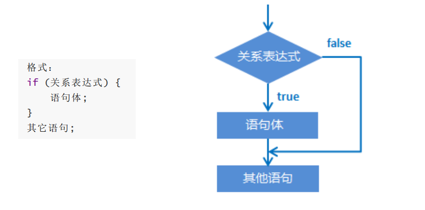
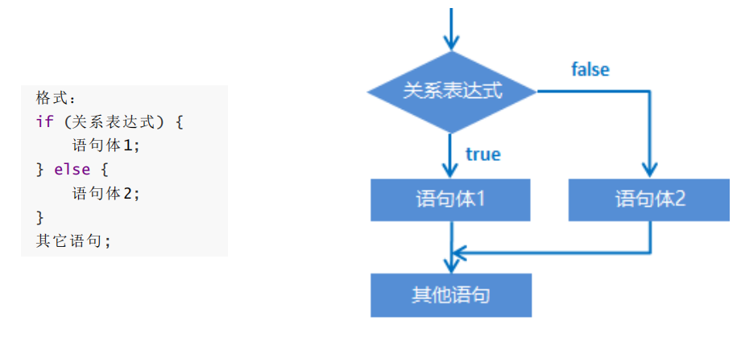
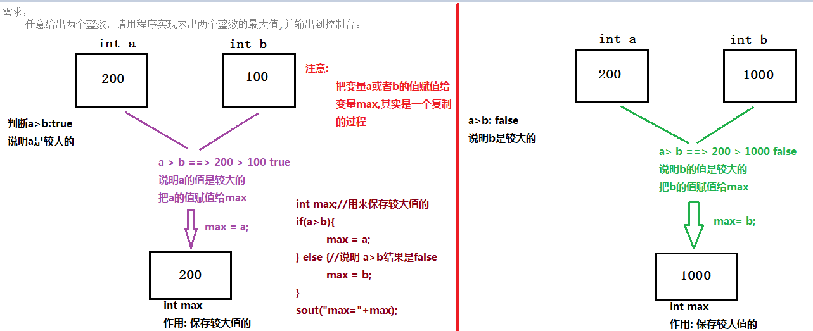
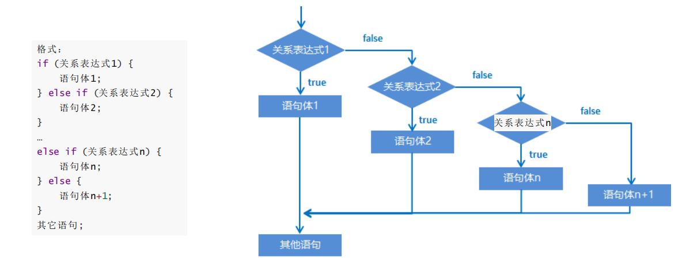
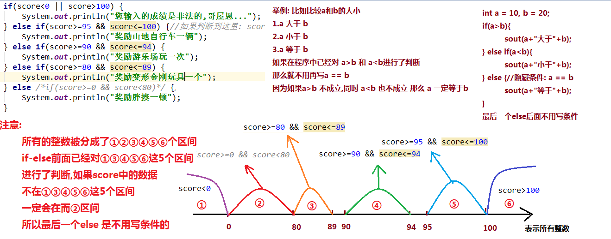
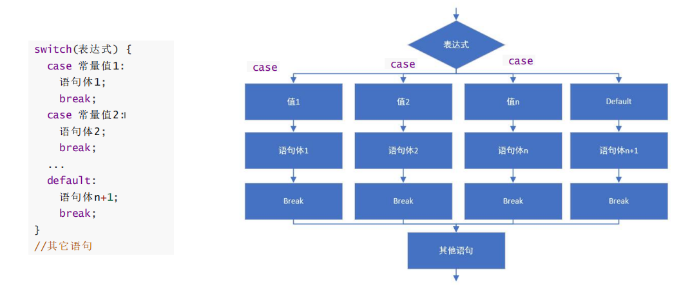

# day04 【选择结构】

##### 今日复习指南

```java
1.if语句(1个小时内完成,80%的内容搞定,switch的重要程度比if要低):
	(1)第一种格式:Demo01If.java
	(2)第二种格式:Demo04IfElseMax.java		获取两个int数字最大值
	(3)第三种格式:
		Demo01IfElseWeek.java	根据数字输出对应的星期数
		Demo03IfElseScore.java	根据成绩进行奖励
		
        
2.switch语句(半个小时内完成,20%的内容搞定):
	Demo02SwitchMonth.java	练习根据数字月份判断输出对应的季节        
```

##### 今日内容

```java
顺序结构【了解】
选择结构之if【重点之重点：应用】
选择结构之switch【重点：应用】

修改类/包的名称:
    1.右键/Refactor/Rename
    2.快捷键: shift + f6
    3.直接修改class关键字后面的名称,alt+回车-->Rename file

创建包/类/模块的快捷键: alt + insert
    有的笔记本电脑insert键位的使用需要按住fn键
    有的笔记本电脑上的insert键被简写成ins
    
自动补全代码: ctrl + shift + 回车
    
向下换行: shift + 回车
    
向上换行: ctrl + alt + 回车
```

## 第一章 流程控制

##### 1.1 流程控制分类

```java
流程：简单来讲所谓流程就是完成一件事情的多个步骤组合起来就叫做一个流程
注意: 在一个流程程序执行的过程中，各条语句的执行顺序对程序的结果是有直接影响的。
举例：
	现在你正在学习Java基础课程
    流程: 学习Java的想法 --> 网站和咨询老师沟通 --> 安排课程 --> 听课
    
流程控制语句分类
     1.顺序结构: 按照代码的书写顺序自上而下依次执行
     2.选择结构:
		(1)if结构【重点之重点：应用】
		(2)switch结构【重点：应用】
	 3.循环结构:
		(1)for循环【重点之重点：应用】
		(2)while循环【重点：应用】
		(3)do-while循环【了解】
```

##### 1.2 顺序结构

```java
/*
    顺序结构: 按照代码的书写顺序自上而下依次执行
 */
public class Demo01ShunXu {
    public static void main(String[] args) {
        System.out.println("今天天气不错....1");
        System.out.println("挺风和日丽的....2");
        System.out.println("我们上午响哥直播java课....3");
        System.out.println("这的确挺爽的....4");
    }
}
```


## 第二章 选择结构-if【重点】

##### 2.1 if语句的第一种格式介绍

```java
英文单词if是: 如果的意思
1.if语句的第一种格式:
	if(布尔表达式){
        语句体;
    }
	其它语句;

2.执行流程:
	(1)计算if后面()中布尔表达式的结果,看是true还是false
	(2)如果if后面()中布尔表达式的结果是true,执行if后面{}中的语句体,接着执行其它语句
	(3)如果if后面()中布尔表达式的结果是false,不执行if后面{}中的语句体,直接执行其它语句

3.注意:
	(1)if语句的第一种格式,只适用于有一种情况的场景
	(2)if后面()中的表达式,不管多么简单或者多么复杂,结果必须是布尔类型,要么是true,要么是false
	(3)if后面的()之间以及()和{}之间都是没有分号的
	(4)if后面的{}中的语句体要么被执行,要么被跳过
	(5)if后面的{}中的语句体: 一条/多条语句
	(6)if后面的{}中如果只有一条语句,则可以省略{},但是对于初学者而言,建议保留
```

##### 图解:



##### 2.2 if语句的第一种格式练习

```java
练习
	需求1：判断a和b的值是否相等，如果相等，就在控制台输出：a等于b
	需求2：判断a和c的值是否相等，如果相等，就在控制台输出：a等于c
public class Demo01If {
    public static void main(String[] args) {
        //定义2个int变量a和b,并初始化
        int a = 10, b = 20;
        //判断a和b的值是否相等，如果相等，就在控制台输出：a等于b
        if (a == b) {
            System.out.println(a+"等于"+b);
        }
        
        //判断a和b的值是否不相等，如果不相等，就在控制台输出：a不等于b
        if(a != b) {
            System.out.println(a+"不等于"+b);
        }

        //定义1个int变量c,并初始化
        int c = 10;
        //判断a和c的值是否相等，如果相等，就在控制台输出：a等于c
        if(a == c) {
            System.out.println(a+"等于"+c);
        }

        //判断a和c的值是否不相等，如果不相等，就在控制台输出：a不等于c
        if(a != c) {
            System.out.println(a+"不等于"+c);
        }

        System.out.println("main...end...");//模拟其它语句

    }
}

```


##### 2.3 if语句的第二种格式介绍

```java
英文单词if是: 如果的意思
英文单词else是: 否则的意思
1.if语句的第二种格式:
	if (布尔表达式) {
        语句体1;
    } else {
        语句体2;
    } 	
	其它语句;

2.执行流程:
	(1)计算if后面()中布尔表达式的结果,看是true还是false
	(2)如果if后面()中布尔表达式的结果是true,执行if后面{}中的语句体1,接着执行其它语句
    (3)如果if后面()中布尔表达式的结果是false,执行else后面{}中的语句体2,接着执行其它语句
    
3.注意:
	(1)if语句的第二种格式,只适用于有两种情况的场景	是二选一的情况
	(2)if后面()中的表达式,不管多么简单或者多么复杂,结果必须是布尔类型,要么是true,要么是false
	(3)if和后面的()之间以及()和{}之间都是没有分号的,else 和前后的{}之间也没有分号
	(4)语句体1和语句体2只有一个会被执行,必须从二中选一来执行
	(5)if和else后面的{}中的语句体: 一条/多条语句
	(6)if和else后面的{}中如果只有一条语句,则可以省略{},但是对于初学者而言,建议保留
```

##### 图解:



##### 2.4 if语句的第二种格式练习判断大小

```java
需求：
    判断a是否大于b，如果是，在控制台输出：a的值大于b，否则，在控制台输出：a的值不大于b
    
实现步骤:
	1.定义2个int变量a和b,并初始化
	2.使用if语句的第二种格式,对a和b的大小进行判断,并输出对应的结果
```

```java
public class Demo02IfElseDaXiao {
    public static void main(String[] args) {
        //1.定义2个int变量a和b,并初始化
        int a = 100, b = 20;

        //2.使用if语句的第二种格式,对a和b的大小进行判断,并输出对应的结果
        if (a > b) {
            System.out.println(a+"的值大于"+b);
        } else {
            System.out.println(a+"的值不大于"+b);
        }
        System.out.println("main...end...");//模拟其它语句的
    }
}
```


##### 2.5 if语句的第二种格式练习判断奇偶数

```java
需求：
    任意给出一个整数，请用程序实现判断该整数是奇数还是偶数，并在控制台输出该整数是奇数还是偶数。
    
实现步骤:
	1.创建键盘录入Scanner类的对象(1.导包 2.创建对象)
    2.获取键盘录入的整数数字,保存到int变量num中
    3.使用if语句的第二种格式判断num中数字的奇偶性,输出对应的内容
```

```java
public class Demo02IfElseJiOu {
    public static void main(String[] args) {
        //1.创建键盘录入Scanner类的对象(1.导包 2.创建对象)
        Scanner sc = new Scanner(System.in);

        //2.获取键盘录入的整数数字,保存到int变量num中
        System.out.println("请输入一个整数数字: ");
        int num = sc.nextInt();

        //3.使用if语句的第二种格式判断num中数字的奇偶性,输出对应的内容
        /*if(num%2 == 0) {
            System.out.println(num+"是一个偶数数字");
        } else {
            System.out.println(num+"是一个奇数数字");
        }*/

        if(num%2 != 0) {
            System.out.println(num+"是一个奇数数字");
        } else {
            System.out.println(num+"是一个偶数数字");
        }

        System.out.println("main...end...");//模拟其它语句的
    }
}

```


```java
需求：
    任意给出两个整数，请用程序实现求出两个整数的最大值,并输出到控制台。
    
实现步骤:
	1.创建键盘录入Scanner类的对象
	2.获取键盘录入的两个整数数字,分别保存到两个int变量a和b中
	3.定义int变量max,用来保存较大值的
	4.使用if语句的第二种格式对a和b的大小关系进行判断
		(1)如果a 大于 b 说明a是较大的 把a的值赋值给max
		(2)否则(a 小于或者等于 b) 说明b是较大的 把b的值赋值给max
	5.打印max的值
```

```java
public class Demo03IfElseMax {
    public static void main(String[] args) {
        //1.创建键盘录入Scanner类的对象
        Scanner sc = new Scanner(System.in);

        //2.获取键盘录入的两个整数数字,分别保存到两个int变量a和b中
        System.out.println("请输入第一个整数数字: ");
        int a = sc.nextInt();

        System.out.println("请输入第二个整数数字: ");
        int b = sc.nextInt();

        //3.定义int变量max,用来保存较大值的
        int max;

        //4.使用if语句的第二种格式对a和b的大小关系进行判断
        if (a > b) {
            //(1)如果a 大于 b 说明a是较大的 把a的值赋值给max
            max = a;
        } else {
            //(2)否则(a 小于或者等于 b) 说明b是较大的 把b的值赋值给max
            max = b;
        }

        //5.打印max的值
        System.out.println("两个数字: " + a + "和" + b + " 中的最大值: " + max);
    }
}

```


##### 图解分析:



##### 2.6 if语句的第三种格式介绍

```java
英文单词if是: 如果的意思
英文单词else是: 否则的意思
1.if语句的第三种格式:
	if(布尔表达式1) {
        语句体1;
    } else if(布尔表达式2) {
        语句体2;
    }
	...
    else if(布尔表达式n) {
        语句体n;
    } else {
        语句体n+1;
    }
	其它语句;

2.执行流程:
	(1)首先计算布尔表达式1的值
	(2)如果值为true就执行语句体1；如果值为false就计算布尔表达式2的值
	(3)如果值为true就执行语句体2；如果值为false就计算布尔表达式3的值
	(4)…
	(5)如果没有任何布尔表达式为true，就执行语句体n+1。
	
3.注意:
	(1)if语句的第三种格式,只适用于有多种(至少两种以上)情况的场景	是多选一的情况
	(2)if后面()中的表达式,不管多么简单或者多么复杂,结果必须是布尔类型,要么是true,要么是false
	(3)if和后面的()之间以及()和{}之间都是没有分号的,else 和前后的{}之间也没有分号
	(4)语句体1到语句体n+1,只有一个会被执行,必须从多个当中选择一个执行 是多选一的情况
	(5)if和else后面的{}中的语句体: 一条/多条语句
	(6)if和else后面的{}中如果只有一条语句,则可以省略{},但是对于初学者而言,建议保留
	(7)只能在if后面写条件,有if就可以写条件,没有if就不能写条件,不能直接在else后面写条件
	(8)最后一个else是用来兜底的,如果前面的所有的条件都不成立,就执行最后一个else后{}中的语句体
```

图解:



##### 2.7 if语句的第三种格式练习根据数字输出对应的星期

```java
需求:
	键盘录入一个星期数(1,2,...7)，输出对应的星期一，星期二，...星期日
演示效果:
	输入 1 输出 星期一
    输入 2 输出 星期二
    输入 3 输出 星期三 
    输入 4 输出 星期四 
    输入 5 输出 星期五 
    输入 6 输出 星期六 
    输入 7 输出 星期日 
    输入 其它数字 输出 数字有误
        
实现步骤:
	1.创建键盘录入Scanner类的对象
	2.获取键盘录入的代表星期数的整数数字,保存到int变量week中
	3.因为week中的数字有7+1种情况,使用if语句的第三种格式对week中的数字进行判断,并输出不同的结果
```

```java
public class Demo01IfElseWeek {
    public static void main(String[] args) {
        //1.创建键盘录入Scanner类的对象
        Scanner sc = new Scanner(System.in);

        //2.获取键盘录入的代表星期数的整数数字,保存到int变量week中
        System.out.println("请输入代表星期数的1到7之间的整数数字: ");
        int week = sc.nextInt();

        //3.因为week中的数字有7+1种情况,使用if语句的第三种格式对week中的数字进行判断,并输出不同的结果
        if(week == 1) {
            System.out.println("星期一");
        } else if(week == 2) {
            System.out.println("星期二");
        } else if(week == 3) {
            System.out.println("星期三");
        } else if(week == 4) {
            System.out.println("星期四");
        } else if(week == 5) {
            System.out.println("星期五");
        } else if(week == 6) {
            System.out.println("星期六");
        } else if(week == 7) {
            System.out.println("星期日");
        } else /*if(week<1 || week>7)*/ {//隐藏条件: week<1 || week>7
            System.out.println("您输入的星期数不存在,火星来的吧,哥屋恩...");
        }
        System.out.println("main...end...");//模拟其它语句的
    }
}
```

```java
public class Demo02IfElseWeek {
    public static void main(String[] args) {
        //1.创建键盘录入Scanner类的对象
        Scanner sc = new Scanner(System.in);

        //2.获取键盘录入的代表星期数的整数数字,保存到int变量week中
        System.out.println("请输入代表星期数的1到7之间的整数数字: ");
        int week = sc.nextInt();

        //3.因为week中的数字有7+1种情况,使用if语句的第三种格式对week中的数字进行判断,并输出不同的结果
        //先判断非法数据
        if(week<1 || week>7) {
            System.out.println("您输入的星期数不存在,火星来的吧,哥屋恩...");
        } else if(week == 1) {//如果判断到这里: week>=1 && week<=7
            System.out.println("星期一");
        } else if(week == 2) {
            System.out.println("星期二");
        } else if(week == 3) {
            System.out.println("星期三");
        } else if(week == 4) {
            System.out.println("星期四");
        } else if(week == 5) {
            System.out.println("星期五");
        } else if(week == 6) {
            System.out.println("星期六");
        } else /*if(week == 7)*/ {//隐藏条件: week == 7
            System.out.println("星期日");
        }
        System.out.println("main...end...");//模拟其它语句的
    }
}

```


##### 2.8 if语句的第三种格式练习根据成绩进行奖励

```java
需求：
    小明快要期末考试了，小明爸爸对他说，会根据他不同的考试成绩，送他不同的礼物，
    假如你可以控制小明的得分，请用程序实现小明到底该获得什么样的礼物，并在控制台输出。
    [m,n]: 从m到n,包含m,包含n
    (m,n): 从m到n,不包含m,不包含n
奖励规则:
	95~100 山地自行车一辆 		包含95和100的	数学中[95,100] 表示95到100之间,包含95,包含100	
    90~94  游乐场玩一次 		 包含90和94的	 数学中(95,100)  表示95到100之间,不包含95,不包含100
    80~89  变形金刚玩具一个     包含80和89的
    80以下  胖揍一顿 			 不包含80分的
        
实现步骤:
	1.创建键盘录入Scanner类的对象
	2.获取键盘录入的代表小明成绩的0到100之间的整数数字,保存到int变量score中
	3.使用if语句第三种格式,对score中的数据进行判断,输出不同的结果
	
注意: 
	要表示score中的int数字(成绩)在[95,100]区间
	数学中: 95=<score<=100		java中绝对不允许这么写
	java中:
			score>=95 && score<=100
```

```java
public class Demo03IfElseScore {
    public static void main(String[] args) {
        //1.创建键盘录入Scanner类的对象
        Scanner sc = new Scanner(System.in);

        //2.获取键盘录入的代表小明成绩的0到100之间的整数数字,保存到int变量score中
        System.out.println("请输入0到100之间的整数数字(代表小明的考试成绩): ");
        int score = sc.nextInt();

        //3.使用if语句第三种格式,对score中的数据进行判断,输出不同的结果
        if(score>=95 && score<=100) {
            System.out.println("奖励山地自行车一辆");
        } else if(score>=90 && score<=94) {
            System.out.println("奖励游乐场玩一次");
        } else if(score>=80 && score<=89) {
            System.out.println("奖励变形金刚玩具一个");
        } else if(score>=0 && score<80) {
            System.out.println("奖励胖揍一顿");
        } else /*if(score>0 || score<100)*/ {//隐藏条件: score<0 || score>100
            System.out.println("您输入的成绩是非法的,哥屋恩...");
        }

        System.out.println("main...end...");//模拟其它语句的
    }
}

```

```java
public class Demo04IfElseScore {
    public static void main(String[] args) {
        //1.创建键盘录入Scanner类的对象
        Scanner sc = new Scanner(System.in);

        //2.获取键盘录入的代表小明成绩的0到100之间的整数数字,保存到int变量score中
        System.out.println("请输入0到100之间的整数数字(代表小明的考试成绩): ");
        int score = sc.nextInt();

        //3.使用if语句第三种格式,对score中的数据进行判断,输出不同的结果
        //先判断非法数据
        if(score<0 || score>100) {
            System.out.println("您输入的成绩是非法的,哥屋恩...");
        } else if(score>=95 && score<=100) {//如果判断到这里: score>=0 && score<=100
            System.out.println("奖励山地自行车一辆");
        } else if(score>=90 && score<=94) {
            System.out.println("奖励游乐场玩一次");
        } else if(score>=80 && score<=89) {
            System.out.println("奖励变形金刚玩具一个");
        } else /*if(score>=0 && score<80)*/ {//隐藏条件: score>=0 && score<80
            System.out.println("奖励胖揍一顿");
        }

        System.out.println("main...end...");//模拟其它语句的
    }
}
```


##### 图解:



```java

```

```java

```


## 第三章 选择结构-switch【重点】

##### 3.1 switch语句格式和介绍

```java
1.switch语句的格式:
	switch(表达式) {
        case 常量值1:
            语句体1;
            break;
        case 常量值2:
            语句体2;
            break;
        ...
        case 常量值n:
        	语句体n;
            break;
        default:
            语句体n+1;
            break;
    }
	其它语句;

2.执行流程:
	(1)首先计算出表达式的值
	(2)其次，和case依次比较，一旦有对应的值，就会执行相应的语句，在执行的过程中，遇到break就会结束。
	(3)最后，如果所有的case都和表达式的值不匹配，就会执行default语句体部分，然后程序结束掉。
	
3.注意事项:
	(1)switch后面()中表达式的类型: byte/short/char/int String/枚举	----最重要----
	(2)case后面只能写常量,而且常量的值不可以重复
	(3)switch后后面的()之间,已经()和{}之间没有分号
	(4)case 后面的常量值的后面是冒号,而不是分号
	(5)break是用来结束switch语句的,一旦执行break,后面的代码将不再执行,直接执行switch后面的内容
	(6)如果所有的case和default后面都有break,那么case和default的顺序可以随便写
	(7)如果default放在最后,可以省略default中的break
	(8)default的作用类似于if语句第三种格式中的最后一个else,用来兜底的,
		如果所有的case中的常量值和表达式的值都不相同,那么执行default中的内容
```

##### 执行流程



```java
//switch语句的简单演示
public class Demo01Switch {
    public static void main(String[] args) {
        int num = 1;

        switch (num) {
            case 1:
                System.out.println("你好");
                break;
            case 2:
                System.out.println("我好");
                break;
            case 3:
                System.out.println("大家好,才是真的好");
                break;
            default:
                System.out.println("他/她好,我也好");
                break;
        }
        System.out.println("main...end...");//模拟其它语句
    }
}
```


##### 3.2 switch练习根据月份输出对应的季节

```java
需求：
    一年有12个月，分属于春夏秋冬4个季节，
    键盘录入一个月份，请用程序实现判断该月份属于哪个季节，并输出。
	
演示效果
	输入： 1、2、12 输出：冬季
	输入： 3、4、5 输出：春季
	输入： 6、7、8 输出：夏季
	输入： 9、10、11 输出：秋季
	输入： 其它数字 输出：数字有误

实现步骤(本案例使用switch):
	1.创建键盘录入Scanner类的对象
	2.获取键盘录入的代表月份的1到12之间的整数数字,保存到int变量month中
	3.使用switch语句判断month中的数字,根据不同的数字输出对应的季节
```

```java
public class Demo02SwitchMonth {
    public static void main(String[] args) {
        //1.创建键盘录入Scanner类的对象
        Scanner sc = new Scanner(System.in);

        //2.获取键盘录入的代表月份的1到12之间的整数数字,保存到int变量month中
        System.out.println("请输入1到12之间的整数数字(代表月份): ");
        int month = sc.nextInt();

        //3.使用switch语句判断month中的数字,根据不同的数字输出对应的季节
        switch (month) {
            case 1:
                System.out.println("冬季");
                break;
            case 2:
                System.out.println("冬季");
                break;
            case 12:
                System.out.println("冬季");
                break;
            case 3:
                System.out.println("春季");
                break;
            case 4:
                System.out.println("春季");
                break;
            case 5:
                System.out.println("春季");
                break;
            case 6:
                System.out.println("夏季");
                break;
            case 7:
                System.out.println("夏季");
                break;
            case 8:
                System.out.println("夏季");
                break;
            case 9:
                System.out.println("秋季");
                break;
            case 10:
                System.out.println("秋季");
                break;
            case 11:
                System.out.println("秋季");
                break;
            default:
                System.out.println("您输入的月份不存在,火星来的吧,哥屋恩....");
                break;
        }
        System.out.println("main...end...");//模拟其它语句
    }
}

```


##### 3.3 使用case穿透优化根据月份输出对应的季节的案例

```java
使用case穿透优化根据月份输出对应的季节的案例
	发现问题:
    	前面Demo02SwitchMonth.java文件中出现了大量的重复的代码
        1,2,12代码重复,3,4,5代码重复,6,7,8代码重复,9,10,11代码重复
        每三个case中的代码都是相同的   
        
解决方案使用case穿透:
	如果多个连续的case中,每个case都有相同的代码和break,可以只保留最后一个case中的代码和break,
	前面的多个case中代码和break全部省略,只保留case 和 后面的常量值
	
	在switch语句中，如果case的后面不写break，将出现穿透现象，也就是不会在判断下一个case的值，
	直接向后运行，直到遇到break，或者整体switch结束。
	
case穿透执行步骤:
	(1)找到case入口,找到常量值和switch后()中表达式值相同的那个case
	(2)执行case入口中的代码,如果当前case代码后面没有break,将不再判断下一个case后的常量值和表达式的值是否相同,直接执行下一个case中的代码,如果这个case后面的代码中也没有break,继续向后穿透
	....
    (3)直到遇到break,才会结束switch语句
```

```java
public class Demo03SwitchMonth {
    public static void main(String[] args) {
        //1.创建键盘录入Scanner类的对象
        Scanner sc = new Scanner(System.in);

        //2.获取键盘录入的代表月份的1到12之间的整数数字,保存到int变量month中
        System.out.println("请输入1到12之间的整数数字(代表月份): ");
        int month = sc.nextInt();

        //3.使用switch语句判断month中的数字,根据不同的数字输出对应的季节
        switch (month) {//13
            case 1:

            case 2:

            case 12:
                System.out.println("冬季");
                break;
            case 3:

            case 4:

            case 5:
                System.out.println("春季");
                break;
            case 6:

            case 7:

            case 8:
                System.out.println("夏季");
                break;
            case 9:

            case 10:

            case 11:
                System.out.println("秋季");
                break;
            default:
                System.out.println("您输入的月份不存在,火星来的吧,哥屋恩....");
                break;
        }
        System.out.println("main...end...");//模拟其它语句
    }
}
```

**case穿透练习**

```java
public class Demo04SwitchCT {
    public static void main(String[] args) {
        int i = 3, j = 5;
        switch (i + j) {
            case 3:
                i *= 10;
            case 5:
                j *= 10;
            case 8:
                j++;
            case 9:
                j += 5;
            case 10:
                j += 4;
            default:
                j /= i;

        }
        System.out.println("i = " + i);
        System.out.println("j = " + j);
    }
}

```


## 总结

```java
能够使用if语句完成获取两个数中较大值
	//1.定义2个int变量并初始化
	int a = 10, b = 20;
	//2.定义int变量max,用来保存最大值的
	int max;
	//3.使用if语句第二种格式,判断a和b的大小获取最大值
	if(a>b) {
        max = a;
    } else {
        max = b;
    }
能够使用if语句完成根据分数输出对应级别
	举例:
		[90,100] 	"优秀"        
        [80,90)		"良好"
        [70,80)		"一般"
        [60,70)		"及格"
        [0,60)		"不及格"
        其它情况	 "数字错误"      
    //1.定义int变量score,代表成绩,并初始化
    int score = ....;
    //2.使用if语句的第三种格式,根据不同的成绩,输出不同的内容
    if(score>=90 && score<=100) {
        sout("优秀");
    } else if(score>=80 && score<90){
        sout("良好");
    } else if(score>=70 && score<80) {
        sout("一般");
    } else if(score>=60 && score<70) {
        sout("及格");
    } else if(score>=0 && score<60){
        sout("不及格");
    } else {//隐藏条件: score<0 || score>100
        sout("数字错误");
    }
能够使用switch语句完成根据月份输出对应季节
	int month = ...;
    //case穿透
    switch(month) {
        case 1:
        case 2:
        case 12:
        	sout("冬季");
        	break;
        //...
    }
         
    switch(month) {
        case 1:
        	sout("冬季");
        	break;
        case 2:
        	sout("冬季");
        	break;
        case 12:
        	sout("冬季");
        	break;
        //...
    }
```

