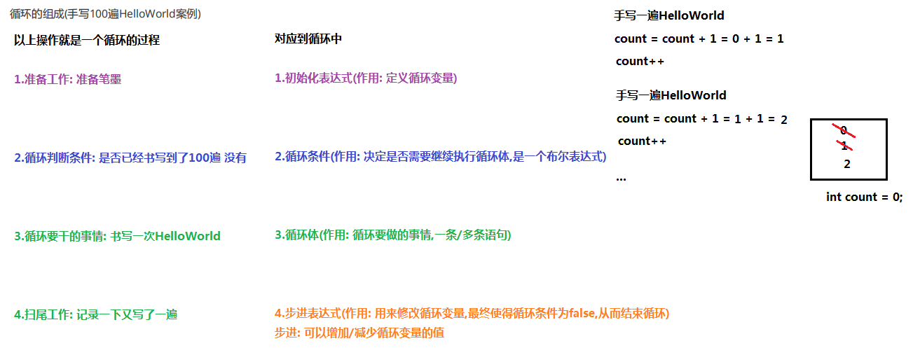
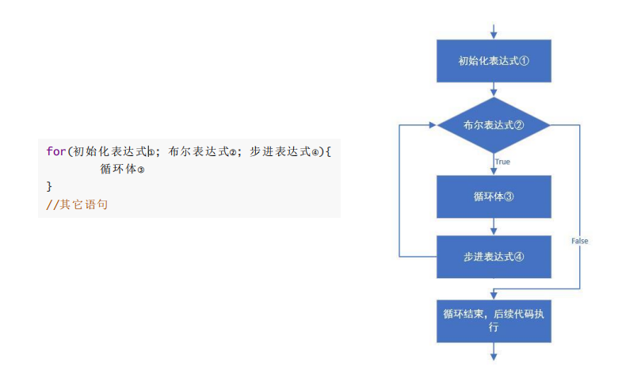
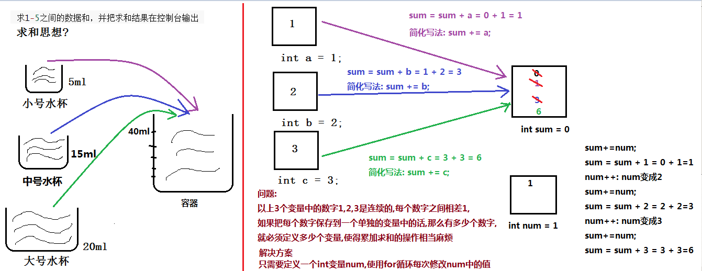
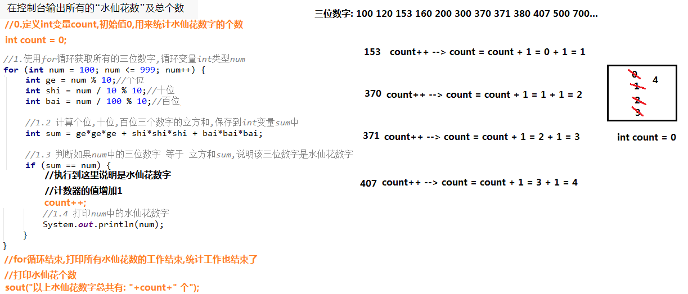
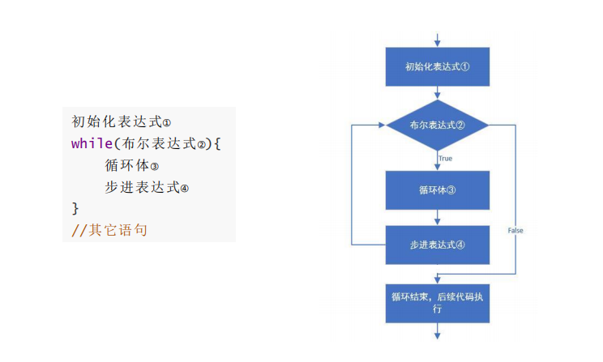
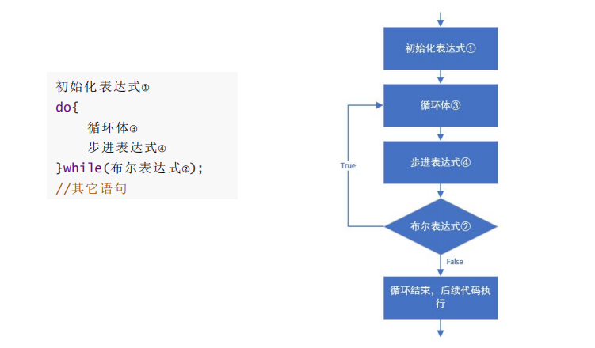

# day05 【循环语句】

##### 今日复习指南

```java
1.for循环(1.5个小时内完成,80%的内容搞定,while的重要程度比for要低)
	(1)Demo03ForSum5.java				求1-5的数字之和
    (2)Demo03ForSXHCount.java        	打印并统计所有的水仙花数字及个数
    
2.while语句(半个小时内完成,20%的内容搞定):
	(1)Demo02WhileZFCount.java			珠穆拉玛峰案例
	
3.其它知识(15分钟)
    (1)循环区别
    (2)死循环
```

##### 今日内容

```java
循环的概念和组成【理解】
for循环语句【重点中的重点】
while循环语句【重点】
do while循环语句【了解】
```

### 第一章 循环结构【理解】

##### 1.1 循环概述

```java
循环的概念: 重复性的执行某些固定的功能,当条件不成立时,结束循环
说白了: 条件成立执行操作,条件不成立停止操作
```

##### 1.2 循环组成

```java
1.循环的组成(手写100遍HelloWorld案例): 
	(1)【初始化表达式1】准备工作:笔墨伺候,最优先唯一执行一次的操作
	(2)【循环条件2】条件判断:每次书写前,判断一下,要不要写 
	(3)【循环体3】循环所要进行的操作:手写一个HelloWorld案例 
	(4)【步进表达式4】扫尾的工作:每写一次HelloWorld,计数(+1)
        
2.执行流程:	
	1,2(循环条件: true),3,4 --> 2(循环条件: true),3,4 --> ... --> 直到2(循环条件: false)结束循环
	
3.循环的分类:
	(1)for循环【重点中的重点】
	(2)while循环【重点】
	(3)do-while循环【了解】
	
```



### 第二章 循环语句1--for【必须掌握】

##### 2.1 **for循环语句介绍**

```java
1.for循环格式:	
	for(初始化表达式1;布尔表达式2;步进表达式4) {
        循环体3;
    }
	其它语句;

2.执行流程:
	1,2(循环条件: true),3,4 --> 2(循环条件: true),3,4 --> ... --> 直到布尔表达式2(循环条件: false)的结果为false时,结束for循环,执行for循环后面的其它语句

3.注意:
	(1)for和后面的()之间,以及()和{}之间,都是没有分号的
	(2)for和面的()中有3个表达式,被两个分号分隔,第三个步进表达式的后面没有分号的
    (3)循环体: 一条/多条语句
    
4.总结:
	(1)计数器变量和求和变量定义的位置，必须在循环外部
	(2)计数器变量和求和变量打印的位置,必须在循环结束后来打印
```

##### 图解分析：




##### 2.2 for循环练习1

```java
需求:
	在控制台输出5次HelloWorld 
	
public class Demo01ForHello {
    public static void main(String[] args) {

        for (int count = 1; count <= 5; count++) {

            System.out.println("HelloWorld...." + count);

        }

        System.out.println("----------------------------------");

        for (int times = 0; times < 5; times++) {
            System.out.println("HelloWorld...." + times);
        }

        System.out.println("main...end...");//模拟其它语句
    }
}
```

##### 2.3 for循环练习2

```java
需求:
	在控制台输出1-5和5-1的数据
	
public class Demo02For5 {
    public static void main(String[] args) {

        //在控制台输出1-5
        for (int num = 1; num <= 5; num++) {

            System.out.println(num);

        }
        System.out.println("----------------------------------");

        //在控制台输出5-1
        //for (int n = 5; n >= 1; n--) {
        for (int n = 5; n > 0; n--) {

            System.out.println(n);

        }
        System.out.println("main...end...");//模拟其它语句
    }
}

```

##### 2.4 for循环练习3

```java
需求:
	求1-5之间的数据和，并把求和结果在控制台输出
        
实现步骤:
	1.定义int变量sum,初始值为0,用来累加求和
	2.使用for循环获取1到5之间的数字,循环变量是int类型的n
	2.1 把循环变量n中的当前的数字累加到求和变量sum中
	3.for循环结束后,打印sum的值
```

```java
public class Demo03ForSum5 {
    public static void main(String[] args) {
        //1.定义int变量sum,初始值为0,用来累加求和
        int sum = 0;
        /*
            第一次: sum: 0   n: 1
                n <= 5 --> 1<=5 --> true,执行循环体
                sum = sum + n = 0 + 1 = 1  n++,n:2

            第二次: sum: 1   n: 2
                n <= 5 --> 2<=5 --> true,执行循环体
                sum = sum + n = 1 + 2 = 3  n++,n:3

            第三次: sum: 3   n: 3
                n <= 5 --> 3<=5 --> true,执行循环体
                sum = sum + n = 3 + 3 = 6  n++,n:4

            第四次: sum: 6   n: 4
                n <= 5 --> 4<=5 --> true,执行循环体
                sum = sum + n = 6 + 4 = 10  n++,n:5

            第五次: sum: 10   n: 5
                n <= 5 --> 5<=5 --> true,执行循环体
                sum = sum + n = 10 + 5 = 15  n++,n:6

            第六次: sum: 15   n: 6
                n <= 5 --> 6<=5 --> false,不再执行循环体,结束for循环
                执行for循环后面的输出语句,输出最终的结果sum的值
         */
        //2.使用for循环获取1到5之间的数字,循环变量是int类型的num
        for (int n = 1; n <= 5; n++) {
            //2.1 把循环变量n中的当前的数字累加到求和变量sum中
            sum = sum + n;//sum += n
        }
        //3.for循环结束后,打印sum的值
        System.out.println("1到5的数字之和: "+sum);
    }
}

```


图解分析:




##### 2.5 for循环练习4

```java
需求:
	求1-100之间的偶数和，并把求和结果在控制台输出
        
实现步骤:
	1.定义int变量sum,初始值0,用来累加求和
	2.使用for循环获取1到100之间的数字,循环变量int类型的num
	2.1 判断如果循环变量num中的当前数字是偶数: num%2==0
    2.2 把循环变量num中的当前的偶数数字累加到求和变量sum中: sum += num
    3.for循环结束后,打印sum的值
```

```java
public class Demo04ForSum100 {
    public static void main(String[] args) {
        //1.定义int变量sum,初始值0,用来累加求和
        int sum = 0;

        //2.使用for循环获取1到100之间的数字,循环变量int类型的num
        for (int num = 1; num <= 100; num++) {
            //2.1 判断如果循环变量num中的当前数字是偶数: num%2==0
            if (num % 2 == 0) {
                //2.2 把循环变量num中的当前的偶数数字累加到求和变量sum中: sum += num
                sum += num;
            }
        }
        //3.for循环结束后,打印sum的值
        System.out.println("1到100之间的偶数数字之和: "+sum);
        System.out.println("---------------------");

        //1.定义int变量sum2,初始值0,用来累加求和
        int sum2 = 0;

        //2.使用for循环获取1到100之间的偶数数字,循环变量int类型的num  2,4,6,8,10,12...
        for (int num = 0; num <= 100; /*num++,num++*/ /*num+=2*/ num=num+2) {
            //2.1 把循环变量num中的偶数数字累加到求和变量sum2中
            sum2 += num;
        }
        //3.for循环结束后,打印sum2的值
        System.out.println("1到100之间的偶数数字之和: "+sum2);
    }
}

```


##### 2.6 for循环练习5

```java
需求:
	键盘录入一个三位数字,获取个位,十位,百位,并输出
        
假设int变量num中存储三位数字	
    个位: num%10
    十位: num/10%10
    百位: num/100%10
    千位: num/1000%10
        
实现步骤:	
	1.创建键盘录入Scanner类的对象
	2.获取键盘录入的三位整数数字,保存到int变量num中
	3.判读如果是三位数字
	3.1 计算num中的三位数字的个位,十位,百位,分别保存到int变量ge,shi,bai中
	3.2 打印个位,十位,百位
	4.如果不是三位数字,给出提示信息
```

```java
public class Demo01PrintNum {
    public static void main(String[] args) {
        //1.创建键盘录入Scanner类的对象
        Scanner sc = new Scanner(System.in);

        //2.获取键盘录入的三位整数数字,保存到int变量num中
        System.out.println("请输入一个三位整数数字: ");
        int num = sc.nextInt();

        //3.判读如果是三位数字
        if (num >= 100 && num <= 999) {
            //3.1 计算num中的三位数字的个位,十位,百位,分别保存到int变量ge,shi,bai中
            int ge = num % 10;//个位
            int shi = num / 10 % 10;//十位
            int bai = num / 100 % 10;//百位

            //3.2 打印个位,十位,百位
            System.out.println("个位: " + ge);
            System.out.println("十位: " + shi);
            System.out.println("百位: " + bai);

        } else {
            //4.如果不是三位数字,给出提示信息
            System.out.println("您输入的数字: " + num + " 不是三位数字....");
        }
    }
}

```


##### 2.7 for循环练习6

```java
需求:
	在控制台输出所有的“水仙花数”
        
解释：什么是水仙花数？
	水仙花数，指的是一个三位数，个位、十位、百位的数字立方和等于原数
	例如 153 3*3*3 + 5*5*5 + 1*1*1 = 27 + 125 + 1 = 153
        
实现步骤:
	1.使用for循环获取所有的三位数字,循环变量int类型num
	1.1 计算num中当前三位数字的个位,十位,百位,分别保存到3个int变量ge,shi,bai中
	1.2 计算个位,十位,百位三个数字的立方和,保存到int变量sum中
    1.3 判断如果num中的三位数字 等于 立方和sum,说明该三位数字是水仙花数字
    1.4 打印num中的水仙花数字
```

```java
public class Demo02ForPrintSXH {
    public static void main(String[] args) {
        //1.使用for循环获取所有的三位数字,循环变量int类型num
        for (int num = 100; num <= 999; num++) {
            //1.1 计算num中当前三位数字的个位,十位,百位,分别保存到3个int变量ge,shi,bai中
            int ge = num % 10;//个位
            int shi = num / 10 % 10;//十位
            int bai = num / 100 % 10;//百位,如果确定num中是三位数字的话,%10可以省略

            //1.2 计算个位,十位,百位三个数字的立方和,保存到int变量sum中
            int sum = ge*ge*ge + shi*shi*shi + bai*bai*bai;

            //1.3 判断如果num中的三位数字 等于 立方和sum,说明该三位数字是水仙花数字
            if (sum == num) {
                //1.4 打印num中的水仙花数字
                System.out.println(num);
            }
        }
    }
}

```


##### 2.8 for循环练习7

```java
需求:
	在控制台输出所有的“水仙花数”及总个数
        
解释：什么是水仙花数？
	水仙花数，指的是一个三位数，个位、十位、百位的数字立方和等于原数
	例如 153 3*3*3 + 5*5*5 + 1*1*1 = 27 + 125 + 1 = 153
        
实现步骤:
	0.定义int变量count,初始值0,用来统计水仙花数字的个数
	1.使用for循环获取所有的三位数字,循环变量int类型num
	1.1 计算num中当前三位数字的个位,十位,百位,分别保存到3个int变量ge,shi,bai中
	1.2 计算个位,十位,百位三个数字的立方和,保存到int变量sum中
    1.3 判断如果num中的三位数字 等于 立方和sum,说明该三位数字是水仙花数字
    1.4 打印num中的水仙花数字
    1.5 计数器count的值增加1
    2.for循环结束,打印计数器count的值
```

##### 计数思想:



```java
public class Demo02ForSXHCount {
    public static void main(String[] args) {
        //0.定义int变量count,初始值0,用来统计水仙花数字的个数
        int count = 0;

        //1.使用for循环获取所有的三位数字,循环变量int类型num
        for (int num = 100; num <= 999; num++) {
            //1.1 计算num中当前三位数字的个位,十位,百位,分别保存到3个int变量ge,shi,bai中
            int ge = num % 10;//个位
            int shi = num / 10 % 10;//十位
            int bai = num / 100 % 10;//百位,如果确定num中是三位数字的话,%10可以省略

            //1.2 计算个位,十位,百位三个数字的立方和,保存到int变量sum中
            int sum = ge*ge*ge + shi*shi*shi + bai*bai*bai;

            //1.3 判断如果num中的三位数字 等于 立方和sum,说明该三位数字是水仙花数字
            if (sum == num) {
                //1.4 打印num中的水仙花数字
                System.out.println(num);

                //1.5 计数器count的值增加1
                count++;
            }

        }
        //2.for循环结束,打印计数器count的值
        System.out.println("以上水仙花数字总共有: "+count+" 个");
    }
}

```


### 第三章 循环语句2--while【重点】

##### 3.1 while循环语句介绍

```java
1.while循环格式:
	初始化表达式1;
	while(布尔表达式2;{
        循环体3;
        步进表达式4;
    }
	其它语句;

2.执行流程:
	1,2(循环条件:true),3,4 --> 2(循环条件:true),3,4 --> ... --> 直到布尔表达式2(循环条件:false)的结果为false时,结束while循环的执行,继续执行while后面的其它语句   
	
3.注意:
	(1)while和后面的()之间,以及()和{}之间,都是没有分号的
	(2)()中的布尔表达式后面,也是没有分号的
    (3)循环体: 一条/多条语句
    
```

##### 图解:




##### 3.2 while循环练习1

```java
需求:
	在控制台输出5次HelloWorld
public class Demo01WhileHello {
    public static void main(String[] args) {
        //1.初始化表达式
        int i = 1;
        //2.循环条件
        while(i<=5) {
            //3.循环体
            System.out.println("HelloWorld..."+i);
            //4.步进表达式
            i++;
        }
        System.out.println("main...end...");//模拟其它语句
    }
}	
```

##### 3.3 while循环练习2

```java
需求：
    世界最高山峰是珠穆朗玛峰(8844.43米=8844430毫米)，假如我有一张足够大的纸，它的厚度是0.1毫米。
	请问，我折叠多少次，可以折成珠穆朗玛峰的高度?
    折纸(折叠后的厚度是原有厚度的2倍,而不是平方的关系):
		原来: 0.1 paper	
		第一次: 0.1*2: 0.2 paper = paper * 2  
        第二次: 0.2*2: 0.4
        第三次: 0.4*2: 0.8
        第四次: 0.8*2: 1.6
        ...
                
实现步骤:
	1.定义int变量count,初始值0,用来统计折叠纸张的次数
	2.定义2个double变量zf(表示珠峰的高度)和paper(表示纸张的厚度),并根据题目需求进行初始化
	3.使用while循环,统计折叠纸张最后高度达到珠峰的高度的次数
		3.1 循环条件: 只要纸张的最终厚度  小于 珠峰的高度 就需要再次折叠纸张
		3.2 循环体(也是步进表达式): 
			3.2.1折叠一次纸张,纸张的厚度变成原来的两倍 paper*=2
            3.2.2计数器count的值增加1
    4.循环结束,打印count的值
```

```java
public class Demo02WhileZFCount {
    public static void main(String[] args) {
        //1.定义int变量count,初始值0,用来统计折叠纸张的次数
        int count = 0;

        //2.定义2个double变量zf(表示珠峰的高度)和paper(表示纸张的厚度),并根据题目需求进行初始化
        double zf = 8844430;//表示珠峰的高度
        double paper = 0.1;//表示纸张的厚度

        //3.使用while循环,统计折叠纸张最后高度达到珠峰的高度的次数
        //3.1 循环条件: 只要纸张的最终厚度  小于 珠峰的高度 就需要再次折叠纸张
        while(paper<zf) {
            //3.2 循环体(也是步进表达式):
            //3.2.1折叠一次纸张,纸张的厚度变成原来的两倍 paper*=2
            paper = paper*2;

            //3.2.2计数器count的值增加1
            count++;
            //System.out.println("第"+count+"次,折叠后纸张总厚度: "+paper);
        }
        //4.循环结束,打印count的值
        System.out.println("总共折叠: "+count+"次,纸张可以达到珠峰的高度");
        //1.34217728E7: 科学计数法 1.34217728 * 10的7次方 13421772
        //最终纸张厚度是13421772,然而珠峰高度8844430
        //System.out.println("最终折叠"+count+"次后,纸张的高度: "+paper);
    }
}

```


### 第四章 循环语句3--do-while

##### 4.1 do-while循环语句介绍

```java
1.do-while循环格式:
	初始化表达式1;
	do {
        循环体3;
        步进表达式4;
    } while(布尔表达式2);
	其它语句;

2.执行流程:
	1,3,4 --> 2(循环条件: true),3,4 --> 2(循环条件: true),3,4 --> ... --> 直到布尔表达式22(循环条件: false)的结果为false,结束do-while循环,执行do-while后面的其它语句	        

3.注意:
	(1)do和后面的{}之间,while和{}直接,以及while和()之间,都是没有分号的
	(2)while后面()的后面必须要写一个分号,不写的话属于语法格式错误
    (3)循环体: 一条/多条语句	
4.总结:
	因为代码是从上到下执行的,所以第一次执行循环体的时候,是没有判断条件的
	第一次会先执行循环体,然后再判断条件
```

##### 图解:



##### 4.2 do-while循环练习1

```java
do-while循环练习：
	在控制台输出5次HelloWorld
	
public class Demo01DoWhileHello {
    public static void main(String[] args) {
        int i = 1;

        do {

            System.out.println("HelloWorld..."+i);

            i++;

        } while(i<=5);

        System.out.println("main...end...");//模拟其它语句
    }
}

```


### **第五章** 循环语句其它知识【理解】

##### 5.1 循环语句的区别

```java
三种循环的区别总结
	1.建议使用的顺序: for,while,do-while 			
	2.循环次数确定的话,建议使用for,循环次数不确定建议使用while 【先了解: 后面有使用场景】
    	循环次数不确定需要先写成死循环的格式【while好看】    --------后天讲解
	3.do-while循环来讲的话,至少执行一次 
	4.while和do-while循环而言,循环结束后,初始化条件中定义的变量可以继续使用, 
		但是for循环的不能使用(在for循环内部定义初始化语句)
    

```

```java
以下说法正确的是:ABCEF
	A: for循环是先判断条件,后执行循环体
    B: while循环是先判断条件,后执行循环体
    C: do-while循环是先执行循环体,后判断条件
    D: for和while至少执行一次
    E: for和while可以一次都不执行
    F: do-while而言至少执行一次

```

```java
/*
    do-while循环来讲的话,至少执行一次

    以下说法正确的是:   ABCEF
        A: for循环是先判断条件,后执行循环体
        B: while循环是先判断条件,后执行循环体
        C: do-while循环是先执行循环体,后判断条件
        D: for和while至少执行一次
        E: for和while可以一次都不执行
        F: do-while而言至少执行一次
 */
public class Demo02LoopDiff {
    public static void main(String[] args) {
        /*
            for循环: 先判断循环条件,再决定是否执行循环体
            第一次: 先判断循环条件 3>5 结果是false,直接结束for循环
            总结:
                对于for循环而言,如果第一次循环条件结果为false的话,循环体一次都不执行
         */
        for (int i = 3; i > 5; i--) {
            System.out.println("HelloWorld...." + i);
        }

        /*
            while循环: 先判断循环条件,再决定是否执行循环体
            第一次: 先判断循环条件 3>5 结果是false,直接结束while循环
            总结:
                对于while循环而言,如果第一次循环条件结果为false的话,循环体一次都不执行
         */
        int j = 3;
        while (j > 5) {
            System.out.println("HelloWorld..." + j);
            j--;
        }
        /*
            do-while循环: 先执行循环体,再执行判断循环条件,根据判断条件的结果,再次决定是否需要重新执行循环体
            第一次: 先执行循环体输出结果"HelloWorld...3",然后k--,k的值变成2,最后判断while后面的条件 2>5 结果是false,
                    结束do-while循环了
            总结:
                对于do-while循环而言,循环体至少执行一次(原因: 先执行循环体后判断条件)
         */
        int k = 3;
        do {
            System.out.println("HelloWorld..." + k);
            k--;
        } while (k > 5);
    }
}

```

```java
/*
    while和do-while循环而言,循环结束后,初始化条件中定义的变量可以继续使用,
		但是for循环的不能使用(在for循环内部定义初始化语句,只能在for循环内部使用)
 */
public class Demo03LoopDiff {
    public static void main(String[] args) {

        for (int i = 1; i <= 3; i++) {
            System.out.println("Hello...for...in..." + i);
        }
        //错误: for循环()内部定义的循环变量i,只能在整个for循环内部使用,出了for循环就无法使用了
        //System.out.println("Hello...for...out..." + i);
        System.out.println("-----------------");

        int j = 1;
        while(j<=3) {
            System.out.println("Hello...while...in..." + j);
            j++;
        }
        //正确: 循环变量j,是在while外部定义的,所以while内部可以使用,while结束了,
        //在while循环的外部也可以使用
        System.out.println("Hello...while...out..." + j);
        System.out.println("-----------------");

        int k = 1;
        do {
            System.out.println("Hello...do...while...in..." + k);
            k++;
        }while(k<=3);
        //正确: 循环变量k,是在do-while外部定义的,所以do-while内部可以使用,do-while结束了,
        //在do-while循环的外部也可以使用
        System.out.println("Hello...do...while...out..." + k);
    }
}

```


##### 5.2 死循环

```java
死循环
	1.概念: 用不停止的循环,又叫做永真循环
	2.分类:
		(1)for的死循环格式:       for芬芬
	    	for(;;){
	        	...
	        }

	    (2)while的死循环格式:
	    	while(true){
	        	...
	        }

	    (3)do-while的死循环格式:
	    	do{
	        	...
	        }while(true);
		   
```

```java
public class Demo04DeadLoop {
    public static void main(String[] args) {
        /*for (int i = 5; i > 3; ) {
            System.out.println("Hello...");
        }*/
        /*for (; 5 > 3; ) {
            System.out.println("Hello...");
        }*/
        /*for (;true; ) {
            System.out.println("Hello...");
        }*/
        //for的死循环格式: 不写布尔表达式,默认值就是true
        /*for (; ;) {
            System.out.println("Hello...");
        }*/

        //while的死循环格式:
        /*while(true) {
            System.out.println("Hello...");
        }*/

        //do-while的死循环格式:
        do {
            System.out.println("Hello...");
        }while(true);
    }
}

```


##### 总结

```java
能够使用for循环完成一个范围的数据求和
	比如: 1到100的数字之和	
	//1.定义int变量sum,初始值0,用来累加求和
	int sum = 0;
	//2.使用for循环获取1到100之间的数字,循环变量int类型的num
	for(int num = 1;num<=100;num++) {
        //3.把num中的数字累加到求和变量sum中
        sum += num;
    }
	//4.for循环结束后,打印sum的值
	sout("sum = "+sum);

能够使用for循环完成统计水仙花个数
	水仙花: 必须是三位数字,个位,十位,百位数字的立方和 等于 该三位数字本身
	//1.定义int变量count,初始值0,用来统计水仙花数字的个数的
	int count = 0;
	//2.使用for循环获取所有的三位数字,循环变量int类型的num
	for(int num = 100;num<=999;num++) {
        //3.计算num中的当前三位数字的个位,十位,百位,分别保存到int变量ge,shi,bai中
        int ge = num%10;
        int shi = num/10%10;
        int bai = num/100%10;
        //4.计算当前三位数字的个位,十位,百位的立方和,保存到int变量sum中
        int sum = ge*ge*ge + shi*shi*shi + bai*bai*bai;
        //5.判断如果 当前三位数字的个位,十位,百位的立方和 sum 等于 当前三位数字num本身        
        if(sum == num) {
            //说明num中的三位数字就是水仙花数字,打印该数字
            sout(num);
            //计数器count的值增加1
            count++;
        }
    }
	//6.for循环结束后,打印count的值
	sout("count="+count);
	
能够知道三种循环的区别【了解中的了解】
	1.while 和 for 都是先判断条件后执行循环体,所以while和for的循环体可以一次都不执行
	2.do-while 是先执行循环体,后判断条件,所以do-while的循环体至少执行一次
	3.while和do-while在初始化表达式中定义的变量,while和do-while结束后,可以继续使用该变量
	4.for循环内部定义的循环变量,只能在for循环内部使用,出了for循环就可以继续使用了
	
能够使用while循环完成珠穆朗玛峰案例
	//1.定义int变量count,初始值0,用来统计折叠纸张的次数
	int count = 0;
	//2.定义2个double变量zf和paper,分别代表珠峰的高度和纸张的厚度,根据题目需求进行初始化
	double zf = 8844430;
	double paper = 0.1;
	//3.使用while循环,折叠纸张达到珠峰的高度,统计折叠的次数
	while(paper<zf) {//只要纸张的厚度  小于 珠峰的高度
        paper = paper*2;//折叠一次纸张
        count++;//计数器增加1
    }
	//4.while循环结束,打印count的值
	sout("count="+count);

```

