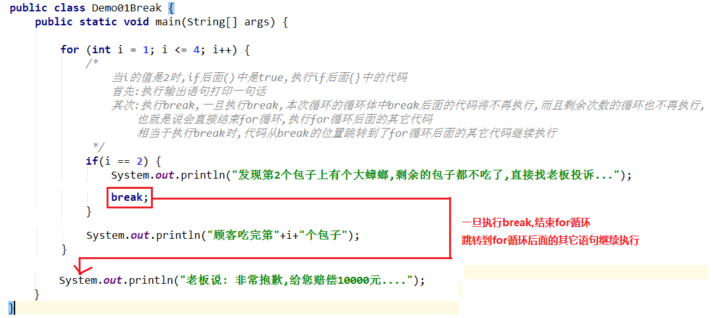
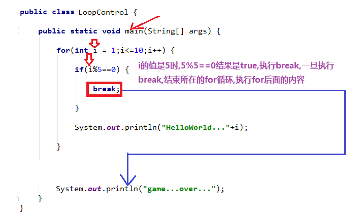
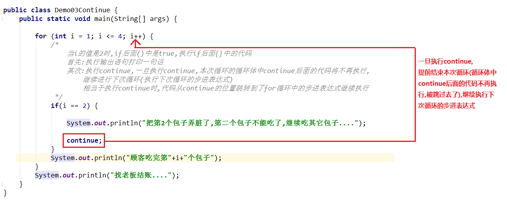
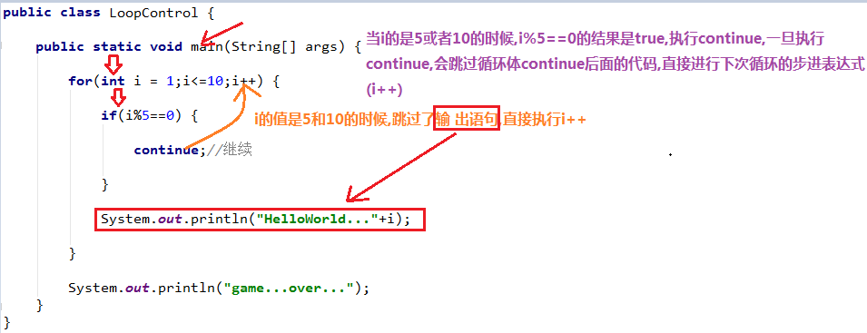
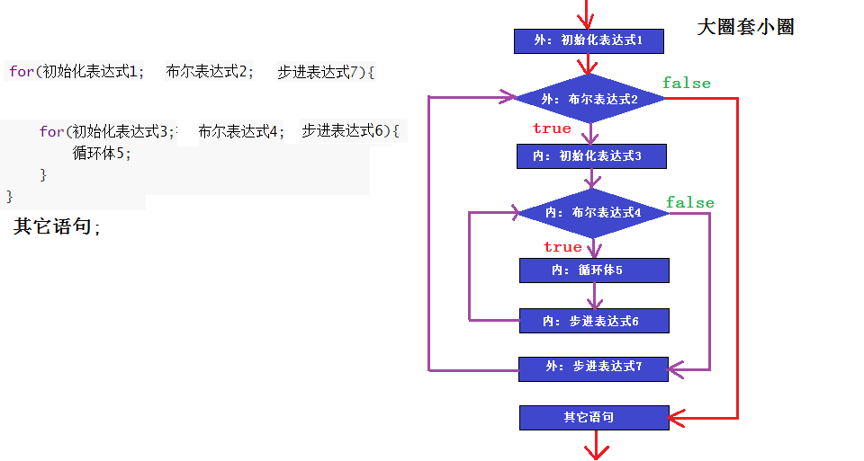
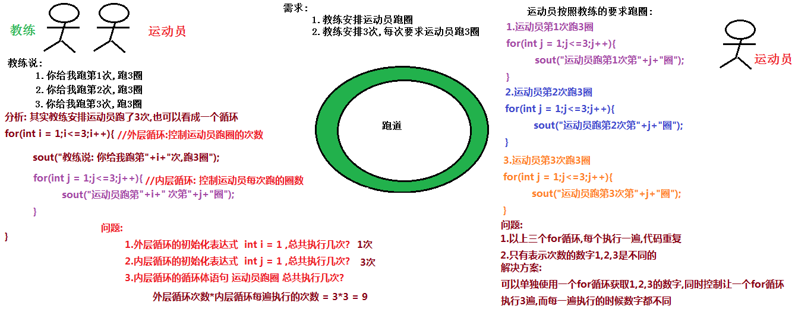
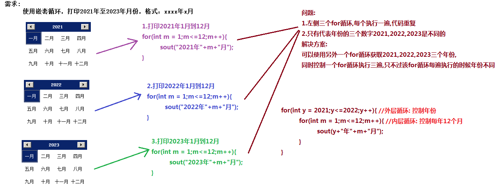
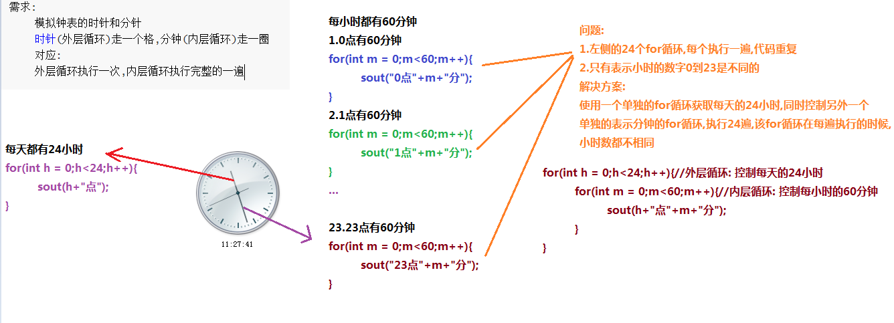
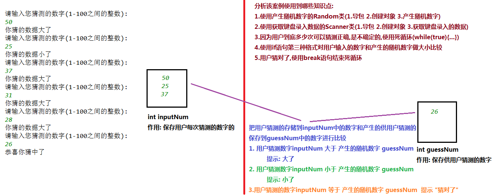

# day06 【循环跳转、循环嵌套、随机数】

##### 今日复习指南

```java
1.break和continue(0.5个小时内完成,20%的内容搞定)
	(1)Demo02Break.java	测试break的使用
	(2)Demo04Continue.java  测试continue的使用      

2.循环嵌套(半个小时内完成,20%的内容搞定):
	Demo01ForFor.java	测试循环嵌套的执行流程    教练安排运动员跑圈
        
3.随机数(半个小时内完成,20%的内容搞定):
    Demo01Random.java	随机数字的练习
    Demo02Random.java	随机数字的练习
    Demo03Random.java	随机数字的练习
        
4.猜数字游戏案例(1个小时内完成,40%的内容搞定):
	Demo05GuessNum.java
```


##### 今日内容

```java
跳出语句break，continue【重点】
循环嵌套【理解】
随机数字【重点：死格式】
猜数字案例【重点中的重点】
```

### 第一章 循环跳转【理解】

##### 1.1 break的介绍

```java
break作用:
	1.可以使用在switch语句中,用来结束switch语句
	2.可以使用在循环中,用来结束循环
		(1)本次循环的循环体不再执行
		(2)剩余的所有次数的循环也不再执行
		(3)相当于从执行break的位置,跳转到循环后面的其它代码执行
	3.break不能使用在除了switch和循环以外的任何值	
```

##### 1.2 break的使用

```java
public class Demo01Break {
    public static void main(String[] args) {

        for (int i = 1; i <= 4; i++) {
            /*
                当i的值是2时,if后面()中是true,执行if后面{}中的代码
                首先:执行输出语句打印一句话
                其次:执行break,一旦执行break,本次循环的循环体中break后面的代码将不再执行,而且剩余次数的循环也不再执行,
                    也就是说会直接结束for循环,执行for循环后面的其它代码
                    相当于执行break时,代码从break的位置跳转到了for循环后面的其它代码继续执行
             */
            if(i == 2) {
                System.out.println("发现第2个包子上有个大蟑螂,剩余的包子都不吃了,直接找老板投诉...");
                break;
            }
            System.out.println("顾客吃完第"+i+"个包子");
        }
        System.out.println("老板说: 非常抱歉,给您赔偿10000元....");
    }
}
```

##### 图解分析：



##### 1.3 break的练习

```java
/*
    break的练习
 */
public class Demo02Break {
    public static void main(String[] args) {

        for (int i = 1; i <= 10; i++) {
            /*
                当i的值是5时,if后面()中是true,执行if后面{}中的代码
                执行break,一旦执行break,本次循环的循环体中break后面的代码将不再执行,
                而且剩余次数的循环也不再执行,
                    也就是说会直接结束for循环,执行for循环后面的其它代码
                    相当于执行break时,代码从break的位置跳转到了for循环后面的其它代码继续执行
             */
            if (i % 5 == 0) {
                break;
            }

            System.out.println("HelloWorld...." + i);

        }

        System.out.println("main...end...");
    }
}

```

##### 图解分析：



##### 1.4 continue的介绍

```java
continue的作用:
	1.只能使用在循环当中
	2.不能使用在除循环以外的其它任何位置
	3.作用:提前结束本次循环继续进行下次循环
		(1)本次循环continue后面的代码不再执行
		(2)继续执行下次循环的步进表达式
    4.注意:
		(1)break影响的是整个循环,结束整个循环
		(2)continue只影响本次循环,剩余次数的循环不受影响
```


##### 1.5 continue的使用

```java
public class Demo03Continue {
    public static void main(String[] args) {

        for (int i = 1; i <= 4; i++) {
            /*
                当i的值是2时,if后面()中是true,执行if后面{}中的代码
                首先:执行输出语句打印一句话
                其次:执行continue,一旦执行continue,本次循环的循环体中continue后面的代码将不再执行,
                    继续进行下次循环(执行下次循环的步进表达式)
                    相当于执行continue时,代码从continue的位置跳转到了for循环中的步进表达式继续执行
             */
            if(i == 2) {

                System.out.println("把第2个包子弄脏了,第二个包子不能吃了,继续吃其它包子....");

                continue;
            }
            System.out.println("顾客吃完第"+i+"个包子");
        }
        System.out.println("找老板结账....");
    }
}

```

##### 图解分析：



##### 1.6 continue的练习

```java
public class Demo04Continue {
    public static void main(String[] args) {

        for (int i = 1; i <= 10; i++) {
            /*
                当i的值是5和10时,if后面()中是true,执行if后面{}中的代码
                执行continue,一旦执行continue,本次循环的循环体中continue后面的代码将被跳过,
                继续执行下次循环的步进表达式
             */
            if (i % 5 == 0) {

                continue;

            }

            System.out.println("HelloWorld..." + i);

        }

        System.out.println("main...end...");
    }
}
```

##### 图解分析：




### 第二章 循环扩展知识点【理解】

##### 2.1 循环嵌套的概念和格式

```java
1.概念: 使用一个循环作为另外一个循环的循环体,内部的循环称为内层循环,外部的循环称为外层循环

2.格式(for嵌套):	
	for(外初始化表达式1;外布尔表达式2;外步进表达式7) {
        for(内初始化表达式3;内布尔表达式4;内步进表达式6) {
            内循环体5;
        }
    }	
	其它语句8;

3.执行流程:	
	1(外层循环初始化表达式),2(外层循环条件:true),执行外层循环的循环体(内层循环)
        执行内层循环:
			3(内层循环初始化表达式),4(内层循环条件:true),5(内层循环体),6(内层循环步进表达式)
            --> 4(内层循环条件:true),5(内层循环体),6(内层循环步进表达式) 
            --> 4(内层循环条件:true),5(内层循环体),6(内层循环步进表达式) 
            ...
            --> 直到4(内层循环条件:false),结束内层循环,7(外步进表达式7)
    2(外层循环条件:true),执行外层循环的循环体(内层循环)
        执行内层循环:
			3(内层循环初始化表达式),4(内层循环条件:true),5(内层循环体),6(内层循环步进表达式)
            --> 4(内层循环条件:true),5(内层循环体),6(内层循环步进表达式) 
            --> 4(内层循环条件:true),5(内层循环体),6(内层循环步进表达式) 
            ...
            --> 直到4(内层循环条件:false),结束内层循环,7(外步进表达式7)
    ...
    
    直到2(外层循环条件: false),结束外层循环,执行外层循环后面的其它语句8
```

##### 执行流程图解:



```java
/*
    练习: 教练安排运动员跑圈,总共跑3次,每次跑3圈

    问题:
        1.外层循环的初始化表达式  int i = 1 ,总共执行几次? 1次	
        2.内层循环的初始化表达式  int j = 1 ,总共执行几次? 3次
        3.内层循环的循环体语句 运动员跑圈 总共执行几次?      9次     
			外层循环次数*内层循环每遍执行的次数 = 3*3 = 9
    总结: 外层循环执行一次,内层循环要执行完整的一遍(从初始化表达式开始)
 */
public class Demo01ForFor {
    public static void main(String[] args) {
        /*
            外层for循环第一次:
                i: 1 i <= 3 --> 1<=3 --> true 执行循环体(内层循环)
                内层for循环:
                    j: 1,2,3 j<=3 --> true 执行内层循环的循环体 打印运动员跑圈
                    j: 4 j<=3 --> false 结束内层循环,执行外层循环步进表达式i++,i的值变成2

            外层for循环第二次:
                i: 2 i <= 3 --> 2<=3 --> true 执行循环体(内层循环)
                内层for循环:
                    j: 1,2,3 j<=3 --> true 执行内层循环的循环体 打印运动员跑圈
                    j: 4 j<=3 --> false 结束内层循环,执行外层循环步进表达式i++,i的值变成3

            外层for循环第三次:
                i: 3 i <= 3 --> 3<=3 --> true 执行循环体(内层循环)
                内层for循环:
                    j: 1,2,3 j<=3 --> true 执行内层循环的循环体 打印运动员跑圈
                    j: 4 j<=3 --> false 结束内层循环,执行外层循环步进表达式i++,i的值变成4

            外层for循环第四次:
                i: 4 i <= 3 --> 4<=3 --> false 不再执行循环体,结束外层循环
         */
        for (int i = 1; i <= 3; i++) {//外层for循环: 控制运动员跑的次数
            System.out.println("教练说: 你给我跑第"+i+"次,跑3圈");
            for(int j = 1;j<=3;j++){//内层for循环: 控制运动员每次跑的圈数
                System.out.println("       运动员跑第"+i+"次第"+j+"圈");
            }
        }      

    }
}

```


##### 循环嵌套概念图解:




##### 2.2 循环嵌套打印月份

```java
需求:
	使用嵌套循环，打印2021年至2023年月份，格式：xxxx年x月

/*
    需求:
	    使用嵌套循环，打印2021年至2023年月份，格式：xxxx年x月

    问题:
        1.外层循环的初始化表达式  int y = 2021 ,总共执行几次? 1次
        2.内层循环的初始化表达式  int m = 1 ,总共执行几次? 3次
        3.内层循环的循环体语句 输出年月 总共执行几次?      36次
			外层循环次数*内层循环每遍执行的次数 = 3*12 = 36
    总结: 外层循环执行一次,内层循环要执行完整的一遍(从初始化表达式开始)
 */
public class Demo02PrintMonth {
    public static void main(String[] args) {

        for(int y = 2021;y<=2023;y++) {//外层循环: 控制年份
            for(int m = 1;m<=12;m++) {//内层循环: 控制每年都有12个月
                System.out.println(y+"年"+m+"月");
            }
        }
        System.out.println("main...end...");//模拟其它语句
    }
}
```

##### 图解分析:



##### 2.3 循环嵌套模拟钟表

```java
需求:
	模拟钟表的时针和分针
	时针(外层循环)走一个格,分钟(内层循环)走一圈
	对应:
	外层循环执行一次,内层循环执行完整的一遍
/*
    需求:
        模拟钟表的时针和分针
        时针(外层循环)走一个格,分钟(内层循环)走一圈
        对应:
        外层循环执行一次,内层循环执行完整的一遍

    问题:
        1.外层循环的初始化表达式  int h = 0 ,总共执行几次? 1次
        2.内层循环的初始化表达式  int m = 0 ,总共执行几次? 24次
        3.内层循环的循环体语句 输出时间 总共执行几次?      1440次
			外层循环次数*内层循环每遍执行的次数 = 24*60 = 1440
    总结: 外层循环执行一次,内层循环要执行完整的一遍(从初始化表达式开始)
 */
public class Demo03PrintClock {
    public static void main(String[] args) {
        //int count = 0;
        for(int h = 0;h<24;h++) {//外层循环: 控制每天的24小时
            for(int m = 0;m<60;m++) {//内层循环: 控制每小时的60分钟
                System.out.println(h+"点"+m+"分");
                //count++;
            }
        }
        System.out.println("main...end...");//模拟其它语句
        //System.out.println("main...end..."+count);//模拟其它语句

    }
}

```

##### 图解分析:



### 第三章 随机数【重点】

##### 3.1 随机数Random的介绍

```java
1.概念: java.util.Random类,就是jdk中已经定义好的用来产生随机数字的

2.随机数Random类的使用步骤:
	java中的引用类型的使用有3个固定的步骤,而Random类也属于引用类型,所以也有3个固定的步骤:
	(1)导包(找到我们要使用的类)
        格式: import 包名.类名;
		注意: 
			a.如果当前类和要使用的类在同一个包中,不需要导包
			b.java.lang包中的内容不用导包
			c.导包的快捷键: alt + 回车
        键盘录入Scanner类的导包: import java.util.Scanner;
		随机数字Random类的导包: import java.util.Random;

	(2)创建对象
		格式: 类名 对象名 = new 类名(参数...);
		类名: class关键字后面的名字
		对象名: 就是一个标识符,只要符合表示符的命名规范就可以
		创建键盘录入Scanner类的对象:
			Scanner sc = new Scanner(System.in);
			注意: ()中的System.in目前是固定写法,后面会讲
			sc.nextInt(): 获取键盘录入的整数数字
			sc.nextDouble(): 获取键盘录入的小数数字
			
		创建随机数Random类的对象:
			Random r = new Random();
			注意:()中什么都不用写,目前是固定格式,后面会讲
	(3)使用:
		r.nextInt(): 产生一个整数范围(正负21亿)内的随机整数数字
		r.nextInt(整数数字/int类型变量 n): 产生一个0到n之间的随机整数数字,但是包含0,不包含n
		举例:
			r.nextInt(10): 产生一个0到10之间的随机整数数字,但是包含0,不包含10 [0,10) ==>[0,9]
			r.nextInt(100): 产生一个0到100之间的随机整数数字,但是包含0,不包含100 
											[0,100) ==>[0,99]
3.练习:
	(1)产生10个int范围内的整数数字
    (2)产生10个0到100之间(包含0,但是不包含100)的整数数字
    (3)产生10个1到100之间(包含1,包含100)的整数数字	
    (4)产生10个88到188之间(包含88,包含188)的整数数字    
```

##### 3.2 Random类的使用

```java
/*
    Random类的练习
        (1)产生10个int范围内的整数数字
        (2)产生10个0到100之间(包含0,但是不包含100)的整数数字
 */
public class Demo01Random {
    public static void main(String[] args) {
        //创建产生随机数字的Random类的对象
        Random r = new Random();
        //(1)产生10个int范围内的整数数字
        for (int i = 0; i < 10; i++) {
            //产生一个int范围内的随机数字,保存到int变量num中
            int num = r.nextInt();
            System.out.println(num);
        }
        System.out.println("------------");
        //(2)产生10个0到100之间(包含0,但是不包含100)的整数数字
        for (int i = 0; i < 10; i++) {
            //产生一个0到100之间(包含0,但是不包含100)的随机数字,保存到int变量num中
            int num = r.nextInt(100);
            System.out.println(num);
        }
        System.out.println("------------");
        //证明一定可以产生0,一定不能产生100
        while(true) {
            //产生一个0到100之间(包含0,但是不包含100)的随机数字,保存到int变量num中
            int num = r.nextInt(100);
            System.out.println(num);
            //if (num == 0) {//证明一定可以产生0
            if (num == 100) {//证明一定不可以产生100
                break;
            }
        }
    }
}

```

```java
/*
    Random类的练习
        (1)产生10个1到5之间(包含1,包含5)的整数数字
        (2)产生10个1到100之间(包含1,包含100)的整数数字
 */
public class Demo02Random {
    public static void main(String[] args) {
        //创建产生随机数字的Random类的对象
        Random r = new Random();
        /*
            //产生1个1到5之间(包含1,包含5)的整数数字

            可以先产生: 0,1,2,3,4            [0,4] --> [0,5) --> r.nextInt(5)
            再加1:            +1                                  +1
            ---------------------           --------------------------------
            结果:      1,2,3,4,5              r.nextInt(5) + 1
         */
        for (int i = 0; i < 10; i++) {
            //产生1个1到5之间(包含1,包含5)的整数数字
            //[1,5] --> [0,4] + 1 --> [0,5) + 1 --> r.nextInt(5) + 1
            int num = r.nextInt(5) + 1;
            System.out.println(num);
        }
        System.out.println("--------------------");

        //(2)产生10个1到100之间(包含1,包含100)的整数数字
        for (int i = 0; i < 10; i++) {
            //产生1个1到100之间(包含1,包含100)的整数数字
            //[1,100] --> [0,99] + 1 --> [0,100) + 1
            int num = r.nextInt(100) + 1;
            System.out.println(num);
        }
    }
}

```

```java
/*
    Random类的练习
        产生10个88到188之间(包含88,包含188)的整数数字

    自己证明该代码确实可以产生最小值88,也确实可以产生最大值188
 */
public class Demo03Random {
    public static void main(String[] args) {
        //创建产生随机数字的Random类的对象
        Random r = new Random();
        //产生10个88到188之间(包含88,包含188)的整数数字
        for (int i = 0; i < 100; i++) {
            //产生1个88到188之间(包含88,包含188)的整数数字
            //[88,188] --> [0,100] + 88 --> [0,101) + 88
            int num = r.nextInt(101) + 88;
            System.out.println(num);
        }

    }
}

```


##### 3.3 Random练习-猜数字

```java
1.需求：程序自动生成一个1-100之间(包含1,包含100)的数字，使用程序实现猜出这个数字是多少？
    
2.效果：
	如果猜的数字比真实数字大，提示你猜的数据大了
	如果猜的数字比真实数字小，提示你猜的数据小了
	如果猜的数字与真实数字相等，提示恭喜你猜中了

3.使用的知识点:    
     1.使用产生随机数字的Random类(1.导包 2.创建对象 3.产生随机数字)
	2.使用获取键盘录入数据的Scanner类(1.导包 2.创建对象 3.获取键盘录入的数据)
	3.因为用户到底多少次可以猜测正确,是不确定的,使用死循环(while(true){...})
	4.使用if语句第三种格式对用户输入的数字和产生的随机数字做大小比较
	5.用户猜对了,使用break语句结束死循环 
    
4.实现步骤:
	(1)创建产生随机数字的Random类的对象
	(2)产生一个1-100之间(包含1,包含100)的数字,保存到int变量guessNum中,以供用户猜测
	(3)创建键盘录入Scanner类的对象
	(4)获取键盘录入的用户猜测的数字,保存到int变量inputNum中
	(5)使用if语句的第三种格式对用户猜测的inputNum中的数字 和 产生的 guessNum中的数字进行大小比较
		a.如果 用户猜测的inputNum中的数字 大于 产生的 guessNum中的数字
			提示 "你猜的数据大了"
        b.如果 用户猜测的inputNum中的数字 小于 产生的 guessNum中的数字
			提示 "你猜的数据小了"
        c.如果 用户猜测的inputNum中的数字 等于 产生的 guessNum中的数字
        	提示 "恭喜你猜中了"

```

##### 图解分析:



##### 实现代码:

```java
public class Demo04GuessNum {
    public static void main(String[] args) {
        //(1)创建产生随机数字的Random类的对象
        Random r = new Random();

        //(2)产生一个1-100之间(包含1,包含100)的数字,保存到int变量guessNum中,以供用户猜测
        //[1,100] --> [0,99] +1 --> [0,100) + 1
        int guessNum = r.nextInt(100) + 1;

        //(3)创建键盘录入Scanner类的对象
        Scanner sc = new Scanner(System.in);

        //(4)获取键盘录入的用户猜测的数字,保存到int变量inputNum中
        System.out.println("请输入您猜测的数字(1-100之间的整数):");
        int inputNum = sc.nextInt();

        //(5)使用if语句的第三种格式对用户猜测的inputNum中的数字 和 产生的 guessNum中的数字进行大小比较
        if (inputNum > guessNum) {
            //a.如果 用户猜测的inputNum中的数字 大于 产生的 guessNum中的数字
            //提示 "你猜的数据大了"
            System.out.println("你猜的数据大了");
        } else if (inputNum < guessNum) {
            //b.如果 用户猜测的inputNum中的数字 小于 产生的 guessNum中的数字
            //提示 "你猜的数据小了"
            System.out.println("你猜的数据小了");
        } else {
            //c.如果 用户猜测的inputNum中的数字 等于 产生的 guessNum中的数字
            //提示 "恭喜你猜中了"
            System.out.println("恭喜你猜中了");
        }
    }
}

```


```java

1.需求：程序自动生成一个1-100之间(包含1,包含100)的数字，使用程序实现猜出这个数字是多少？
    
2.效果：
	如果猜的数字比真实数字大，提示你猜的数据大了
	如果猜的数字比真实数字小，提示你猜的数据小了
	如果猜的数字与真实数字相等，提示恭喜你猜中了

3.使用的知识点:    
     1.使用产生随机数字的Random类(1.导包 2.创建对象 3.产生随机数字)
	2.使用获取键盘录入数据的Scanner类(1.导包 2.创建对象 3.获取键盘录入的数据)
	3.因为用户到底多少次可以猜测正确,是不确定的,使用死循环(while(true){...})
	4.使用if语句第三种格式对用户输入的数字和产生的随机数字做大小比较
	5.用户猜对了,使用break语句结束死循环 
    
4.实现步骤:
	(1)创建产生随机数字的Random类的对象
	(2)产生一个1-100之间(包含1,包含100)的数字,保存到int变量guessNum中,以供用户猜测
	(3)创建键盘录入Scanner类的对象
	(4)用户猜测数据是一个循环的过程,多少次可以猜对是不确定,也就是说循环次数不确定,
		使用死循环while(true),循环体是步骤(5)和(6)
	(5)获取键盘录入的用户猜测的数字,保存到int变量inputNum中
	(6)使用if语句的第三种格式对用户猜测的inputNum中的数字 和 产生的 guessNum中的数字进行大小比较
		a.如果 用户猜测的inputNum中的数字 大于 产生的 guessNum中的数字
			提示 "你猜的数据大了"
        b.如果 用户猜测的inputNum中的数字 小于 产生的 guessNum中的数字
			提示 "你猜的数据小了"
        c.如果 用户猜测的inputNum中的数字 等于 产生的 guessNum中的数字
        	提示 "恭喜你猜中了",同时结束死循环while(true)
```

```java
public class Demo05GuessNum {
    public static void main(String[] args) {
        //(1)创建产生随机数字的Random类的对象
        Random r = new Random();

        //(2)产生一个1-100之间(包含1,包含100)的数字,保存到int变量guessNum中,以供用户猜测
        //[1,100] --> [0,99] +1 --> [0,100) + 1
        int guessNum = r.nextInt(100) + 1;

        //(3)创建键盘录入Scanner类的对象
        Scanner sc = new Scanner(System.in);

        //(4)用户猜测数据是一个循环的过程,多少次可以猜对是不确定,也就是说循环次数不确定,
        //使用死循环while(true),循环体是步骤(5)和(6)
        while(true) {
            //(5)获取键盘录入的用户猜测的数字,保存到int变量inputNum中
            System.out.println("请输入您猜测的数字(1-100之间的整数):");
            int inputNum = sc.nextInt();

            //(6)使用if语句的第三种格式对用户猜测的inputNum中的数字 和 产生的 guessNum中的数字进行大小比较
            if (inputNum > guessNum) {
                //a.如果 用户猜测的inputNum中的数字 大于 产生的 guessNum中的数字
                //提示 "你猜的数据大了"
                System.out.println("你猜的数据大了");
            } else if (inputNum < guessNum) {
                //b.如果 用户猜测的inputNum中的数字 小于 产生的 guessNum中的数字
                //提示 "你猜的数据小了"
                System.out.println("你猜的数据小了");
            } else {
                //c.如果 用户猜测的inputNum中的数字 等于 产生的 guessNum中的数字
                //提示 "恭喜你猜中了",同时结束死循环while(true)
                System.out.println("恭喜你猜中了");
                break;//结束循环
            }
        }
    }
}
```


##### 总结

```java
能够知道循环嵌套的执行流程
	外层循环第1次: 
		i: 1 i<=2 --> 1<=2 --> true 执行外层循环的循环体(内层循环)
            内层循环:
				j: 1,2,3,4 j<=4 --> true 执行内层循环的循环体,输出"Hello"
                j: 5 j<=4 --> false 结束内层for循环,执行外层循环步进表达式i++,i的值变成2
    外层循环第2次:
		i: 2 i<=2 --> 2<=2 --> true 执行外层循环的循环体(内层循环)
            内层循环:
				j: 1,2,3,4 j<=4 --> true 执行内层循环的循环体,输出"Hello"
                j: 5 j<=4 --> false 结束内层for循环,执行外层循环步进表达式i++,i的值变成3
    
    外层循环第3次:
		i: 3 i<=2 --> 3<=2 --> false 不再执行外层循环的循环体(内层循环),直接结束外层循环,执行
        外层for循环后面的其它语句 
	for(int i = 1;i<=2;i++) {
		for(int j = 1;j<=4;j++) {
			sout("Hello");
		}
	}
	其它语句;

能够知道break和continue的作用
	1.break的作用:
		(1)用在switch语句中,用来结束switch语句
		(2)用在循环中,用来结束整个循环,相当于从break的位置跳转到循环后面的其它代码执行
	2.continue的作用:
		(1)只能用在循环中
		(2)提前结束本次循环,继续进行下一次循环(步进表达式)
            一旦执行continue,本次循环的循环体中continue后面的代码将不再执行,
			直接执行下次循环的步进表达式
			
能够完成猜数字小游戏程序	
```

