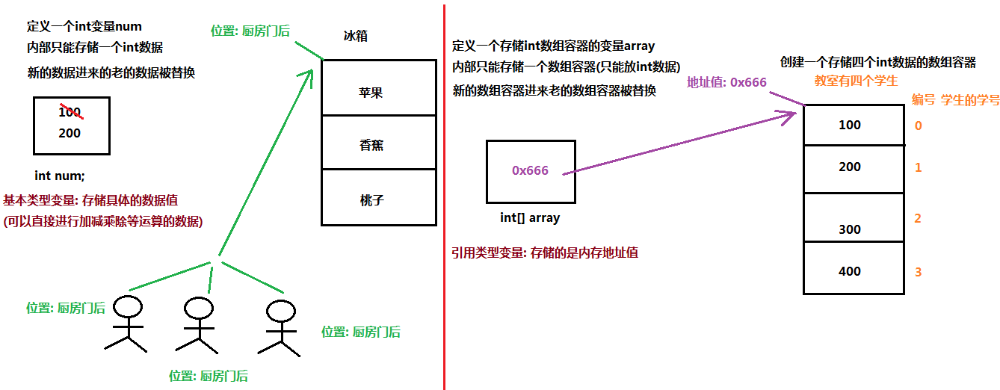
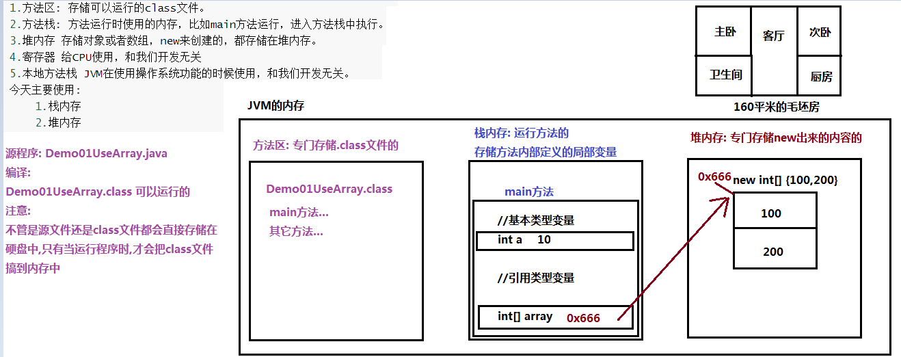
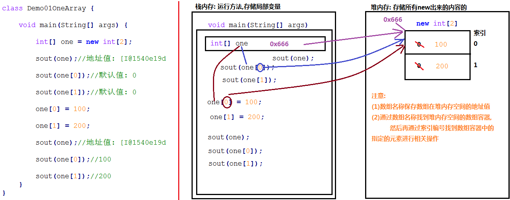
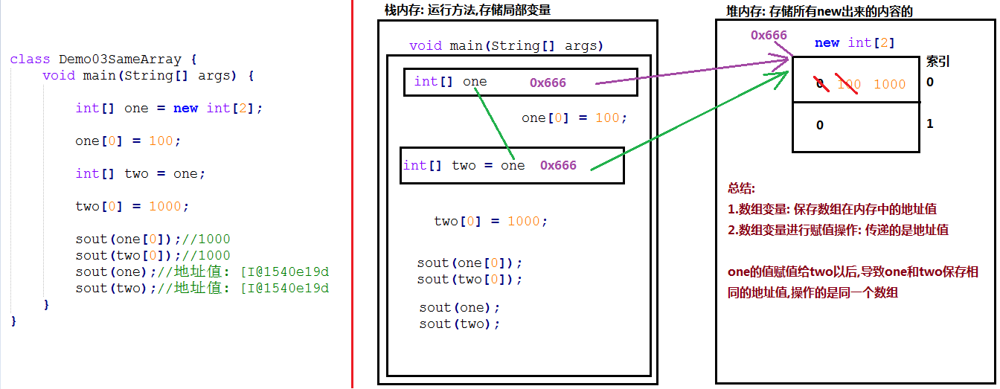
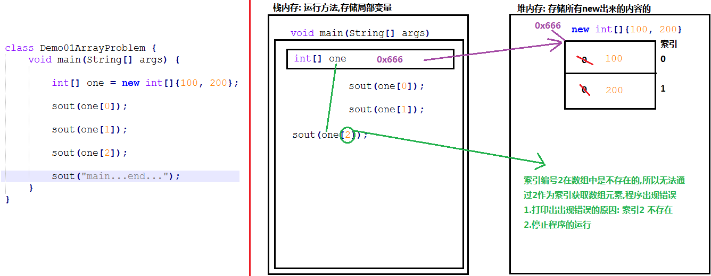
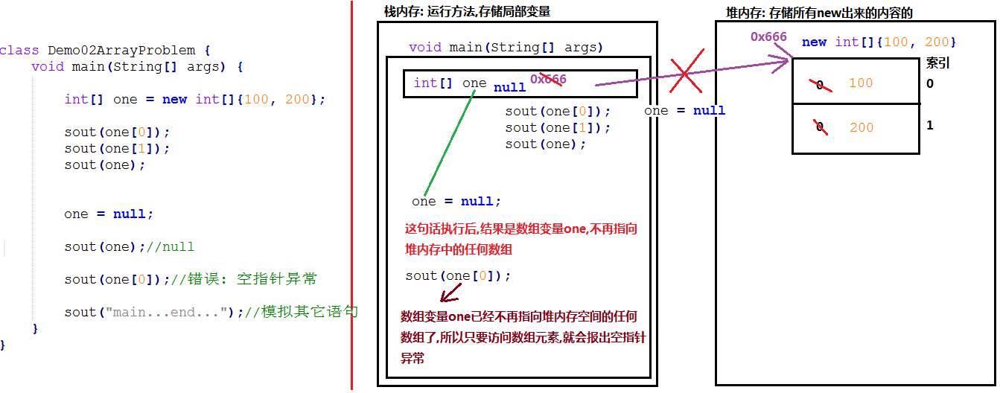
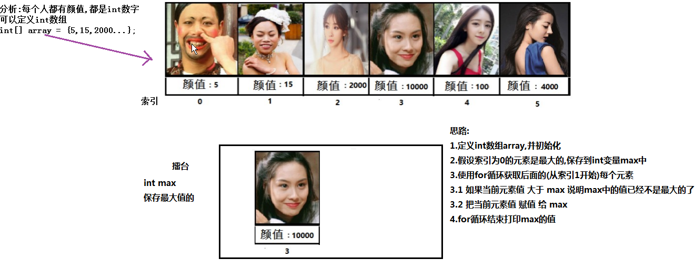
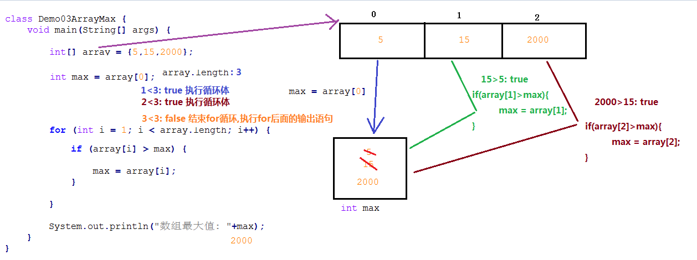

# day07 【数组】

##### 今日复习指南

```java
1.简化格式初始化数组的使用(0.5个小时内完成,多写几遍)
	itheima02包中 Demo01UseArray.java    
    
2.数组的遍历(0.5个小时内完成,多写几遍)
    itheima04包中 Demo01EachArray.java
    
3.数组的最大值(1个小时,多写几遍)
    itheima04包中 Demo03ArrayMax.java
```


##### 今日内容

```java
数组的概念和数组变量的定义【重点】
数组的初始化及使用【重点的重点】		---------------最核心的内容--------------
数组的内存图【理解】
数组的常见问题【理解】
数组的练习【重点的重点】			   ---------------最核心的内容--------------
    
快捷键：
    生产输出语句： 表达式.sout
    数组遍历:
    	数组名.fori: 正着遍历
    	数组名.forr: 倒着遍历
```

### 第一章 数组定义和访问【理解】

##### 1.1 容器的概念

```java
一个变量中只能存储一个数据,新的数据进来,老的数据将被替换,如果需要存储多个数据,需要使用容器

容器概念
	容器：是将多个数据存储到一起，每个数据称为该容器的元素。
	生活中的容器：水杯，衣柜，鞋柜, 教室

数组：
	1.概念： java中的数组就是一个容器,可以用来存储多个数据,但是多个数据的类型必须要一致
    2.特点：
    	(1)可以用来存储多个数据
    	(2)多个数据的类型必须要一致
    	(3)数组的长度一旦确定,永远不可以发生改变
    	    
public class Demo01Box {		//------此代码不用敲------
    public static void main(String[] args) {
        
        //比如我们班有80个学生需要参加考试,每个学生对应一个成绩(整数)
        //可以定义80个int变量
        int a = 80;
        int b = 90;
        int c = 70;
        int d = 50;
        int e = 85;
        int f = 95;
        int g = 59;
        int h = 63;

        //需要求总分
        int sum = a + b + c + d + e + f + g + h;

        //需要求平均分
        int avg = sum/80;

        //需要求最高分和最低分: 实现起来非常麻烦


    }
}
           
```

##### 1.2 数组变量的定义

```java
数组变量: 是一个变量,只能存储一个数据,只不过数组变量内部只能存储的是一个数组容器

1.数组变量定义格式一：		推荐使用
	数据类型[] 数组名称;

2.数组变量定义格式二：		不推荐使用的		
	数据类型 数组名称[];
	
1.定义一个存储int类型数组的变量arrayA
2.定义一个存储double类型数组的变量arrayB
3.定义一个存储char类型数组的变量arrayC

int[] arrayA: 
	这里只是定义一个可以存储一个数组容器的变量,但是目前该变量arrayA中还没有存储具体的数组容器呢
	可以把arrayA理解为门牌,但是该门牌还没有对应的具体的教室
```

```java
public class Demo02Array {
    public static void main(String[] args) {
        //int num;
        //错误: 变量没有值,是不能使用的
        //System.out.println(num);

        //(1)定义一个存储int类型数组的变量arrayA
        //int类型数组: 只能存储int数据的数组容器
        int[] arrayA;
        //arrayA只是一个可以存储一个数组容器的变量,但是目前该变量arrayA中还没有存储具体的数组容器呢
        //System.out.println(arrayA);

        //(2)定义一个存储double类型数组的变量arrayB
        //double类型数组: 只能存储double数据的数组容器
        //double[] arrayB;
        double arrayB[];

        //(3)定义一个存储char类型数组的变量arrayC
        //char类型数组: 只能存储char数据的数组容器
        char[] arrayC;
    }
}

```


##### 图解:



##### 1.3 数组的第一种初始化方式

```java
数组的第一种初始化方式(动态初始化: 指定数组长度)
	1.格式:    	
		数据类型[] 数组名称 = new 数据类型[长度];

    2.格式解释:    	
		(1)左侧数据类型: 表示数组容器中可以存储什么类型的数据
		(2)左侧[]: 表示数组
		(3)数组名称: 就是一个标识符(要符标识符规范),给数组容器起个名字,方便使用数组
		(4)=: 代表赋值操作,就是把右侧的具体的数组容器,存储到左侧的数组变量中(只需要存储地址值)
        (5)new: 代表创建数组(为数组容器开辟内存空间)的过程
        (6)右侧[]中的长度: 必须是一个int类型的数据(常量/变量),代表数组中可以存储的元素的个数
3.练习:
	(1)创建一个int类型的数组,可以存储3个int数据,给该数组起个名称叫做arrayA
    (2)创建一个double类型的数组,可以存储7个double数据,给该数组起个名称叫做arrayB
    (3)创建一个char类型的数组,可以存储5个char数据,给该数组起个名称叫做arrayC      
 
 		int[] arrayA = new int[3];
            =左侧int[] arrayA: 是定义一个可以存储int类型数组容器的变量
            =右侧new int[3]: 才是一个可以存储3个int数据的数组容器
            =: 代表赋值操作,把右侧的数组容器的内存地址值存储到=右侧的数组变量中
```

```java
public class Demo03Array {
    public static void main(String[] args) {
        //(1)创建一个int类型的数组,可以存储3个int数据,给该数组起个名称叫做arrayA
        int[] arrayA = new int[3];

        //(2)创建一个double类型的数组,可以存储7个double数据,给该数组起个名称叫做arrayB
        double[] arrayB = new double[7];

        //(3)创建一个char类型的数组,可以存储5个char数据,给该数组起个名称叫做arrayC
        char[] arrayC = new char[5];
    }
}
```


##### 1.4 数组的第二种初始化方式

```java
数组的第二种初始化方式(标准格式静态初始化: 指定元素)
	1.格式:
    	数据类型[] 数组名称 = new 数据类型[]{元素1,元素2,元素3...元素n};

    2.注意:    	
		(1){}中的多个元素之间用逗号分隔,最后一个元素后面没有逗号
		(2)右侧[]中不能写长度,只要写就报错,jvm会根据{}中的元素数量推导出长度来
		
    3.练习:
    	(1)创建一个int类型的数组,可以存储多个int数据100,200,300,给该数组起个名称叫做arrayA
        (2)创建一个double类型的数组,可以存储多个double数据1.1,2.2,3.3,4.4,5.5,6.6,7.7,给该数组起个名称叫做arrayB
        (3)创建一个char类型的数组,可以存储多个char数据'真','的','好','想','你',给该数组起个名称叫做arrayC
             
```

```java
public class Demo04Array {
    public static void main(String[] args) {
        //(1)创建一个int类型的数组,可以存储多个int数据100,200,300,给该数组起个名称叫做arrayA
        int[] arrayA = new int[]{100, 200, 300};

        //(2)创建一个double类型的数组,可以存储多个double数据1.1,2.2,3.3,4.4,5.5,6.6,7.7,给该数组起个名称叫做arrayB
        double[] arrayB = new double[]{1.1, 2.2, 3.3, 4.4, 5.5, 6.6, 7.7};

        //(3)创建一个char类型的数组,可以存储多个char数据'真','的','好','想','你',给该数组起个名称叫做arrayC
        char[] arrayC = new char[]{'真', '的', '好', '想', '你'};
    }
}
```


##### 1.5 数组的第三种初始化方式

```java
数组的第三种初始化方式(简化格式静态初始化: 指定元素)
	1.格式:   	
		数据类型[] 数组名称 = {元素1,元素2,元素3...元素n};
    2.练习:
    	(1)创建一个int类型的数组,可以存储多个int数据100,200,300,给该数组起个名称叫做arrayA
        (2)创建一个double类型的数组,可以存储多个double数据1.1,2.2,3.3,4.4,5.5,6.6,7.7,给该数组起个名称叫做arrayB
        (3)创建一个char类型的数组,可以存储多个char数据'真','的','好','想','你',给该数组起个名称叫做arrayC

    3.注意:
    	(1){}中的多个元素之间用逗号分隔,最后一个元素后面没有逗号
            (2)右侧不需要写长度,jvm根据{}中元素的数量推导出数组的长度
            (3)虽然没有写new,但是底层仍然有new的过程
            (4)动态初始化方式和标准格式静态初始化方式都可以分两步完成
            (5)java中语法规定,简化格式静态初始化不能分两步完成
```

```java
public class Demo05Array {
    public static void main(String[] args) {
        //(1)创建一个int类型的数组,可以存储多个int数据100,200,300,给该数组起个名称叫做arrayA
        int[] arrayA = {100, 200, 300};

        //(2)创建一个double类型的数组,可以存储多个double数据1.1,2.2,3.3,4.4,5.5,6.6,7.7,给该数组起个名称叫做arrayB
        double[] arrayB = {1.1, 2.2, 3.3, 4.4, 5.5, 6.6, 7.7};

        //(3)创建一个char类型的数组,可以存储多个char数据'真','的','好','想','你',给该数组起个名称叫做arrayC
        char[] arrayC = {'真', '的', '好', '想', '你'};

        int[] array;//定义int类型数组变量

        array = new int[3];//把长度为3的int数组存储到变量array中
        //System.out.println(array);
        array = new int[]{100,200,300};

        int[] arr;
        //arr = {100,200,300,500};//错误: java中语法规定不允许
    }
}

```


##### 1.6 数组的使用

```java
/*
    数组的使用
        1.数组变量名称: 保存数组容器在内存空间的地址值,是一个十六进制的整数数字
        2.索引编号:
            (1)数组中的每个数据,被称为数组元素
            (2)数组为内部的每个元素进行标号,称为索引/角标.但是索引编号从0开始,到最大索引(数组长度 减 1)
            (3)索引编号必须是一个int类型的数字

        3.数组元素的使用:
            数组名称[索引编号]
            比如:
                array[0]: 代表的是数组array中索引编号是0的元素
                array[2]: 代表的是数组array中索引编号是2的元素

        4.获取数组长度(数组中存储元素的个数)
            每个数组内部都有一个length属性,用于获取数组的长度,其实是一个int数据
            数组名称.length: 获取数组的长度,是一个int数据
            注意: length后面是没有()的
 */
public class Demo01UseArray {
    public static void main(String[] args) {
        int num = 10;
        //创建int数组array,并采用简化格式静态初始化初始化
        int[] array = {10, 20, 30};//元素10的索引编号是0,元素20的索引编号是1,元素30的索引编号是2

        System.out.println(array);//数组在内存中的地址值: [I@1540e19d

        //打印10
        System.out.println(array[0]);//打印数组array中索引编号是0的元素值: 10

        //打印20
        System.out.println(array[1]);//打印数组array中索引编号是1的元素值: 20

        //打印30
        System.out.println(array[2]);//打印数组array中索引编号是2的元素值: 30
        System.out.println("----------------");

        //把10修改成100
        array[0] = 100;//把int数字100存储到数组array中的索引为0的元素中,原有数据10被覆盖/替换

        //把20修改成200
        array[1] = 200;//把int数字200存储到数组array中的索引为1的元素中,原有数据20被覆盖/替换

        //把30修改成300
        array[2] = 300;//把int数字300存储到数组array中的索引为2的元素中,原有数据30被覆盖/替换

        //打印100
        System.out.println(array[0]);//打印数组array中索引编号是0的元素值: 100

        //打印200
        System.out.println(array[1]);//打印数组array中索引编号是1的元素值: 200

        //打印300
        System.out.println(array[2]);//打印数组array中索引编号是2的元素值: 300

        //获取数组长度
        int count = array.length;
        System.out.println("数组的长度: " + count);
        System.out.println("数组的长度: " + array.length);
        /*
            使用array[...]形式代表获取数组元素,[]中必然要写一个int数字
            但是我们写的是 array.length - 1,先计算array.length的结果3,3-1结果是2
            array[array.length - 1] --> array[2]
        */
        System.out.println(array[array.length - 1]);//300
    }
}

```


### 第二章 数组原理内存图【理解】

##### 2.1 java中的内存分配

```java
1.方法区: 存储可以运行的class文件。
2.方法栈: 方法运行时使用的内存，比如main方法运行，进入方法栈中执行。
3.堆内存 存储对象或者数组，new来创建的，都存储在堆内存。
4.寄存器 给CPU使用，和我们开发无关							  不关心
5.本地方法栈 JVM在使用操作系统功能的时候使用，和我们开发无关。		不关心

今天主要使用:
	1.栈内存: 运行方法的,存储方法中定义的变量的
	2.堆内存: 存储的是所有new出来的内容
        
```

##### 图解:



##### 2.2 一个数组内存图

```java
/*
    一个数组的内存图解
        1.动态初始化创建数组(指定长度),元素有默认值
            基本类型:
                (1)整数数组: 元素默认值为0
                (2)小数数组: 元素默认值为0.0
                (3)字符数组: 元素默认值为空白字符
                (4)布尔数组: 元素默认值为false
            引用类型: 元素默认值都是null

        2.注意:
            (1)数组名称保存数组在堆内存空间的地址值
            (2)通过数组名称找到堆内存空间的数组容器,
                然后再通过索引编号找到数组容器中的指定的元素进行相关操作
*/
public class Demo01OneArray {
    public static void main(String[] args) {
        //创建int数组one,指定长度2
        int[] one = new int[2];
        System.out.println(one);//地址值: [I@1540e19d
        System.out.println(one[0]);//默认值: 0
        System.out.println(one[1]);//默认值: 0

        one[0] = 100;

        one[1] = 200;

        System.out.println(one);//地址值: [I@1540e19d
        System.out.println(one[0]);//100
        System.out.println(one[1]);//200
    }
}
```

##### 图解:



##### 2.3 两个数组内存图

```java
/*
    两个数组的内存图解
        1.注意:
            (1)数组名称保存数组在堆内存空间的地址值
            (2)通过数组名称找到堆内存空间的数组容器,
                然后再通过索引编号找到数组容器中的指定的元素进行相关操作
        2.两个数组的理解:
              相当于在北京昌平购买了一套两居室的房子,one是打开北京昌平两居室的房子的钥匙
              相当于在北京延庆购买了一套两居室的房子,two是打开北京延庆两居室的房子的钥匙

              钥匙one: 你自己拿着
              钥匙two: 你对象拿着
*/
public class Demo02TwoArray {
    public static void main(String[] args) {
        //创建int数组one,指定长度2
        //相当于在北京昌平购买了一套两居室的房子,one是打开北京昌平两居室的房子的钥匙
        int[] one = new int[2];
        System.out.println(one);//地址值: [I@1540e19d
        System.out.println(one[0]);//默认值: 0
        System.out.println(one[1]);//默认值: 0

        one[0] = 100;

        one[1] = 200;

        System.out.println(one);//地址值: [I@1540e19d
        System.out.println(one[0]);//100
        System.out.println(one[1]);//200

        //创建int数组one,指定长度2
        //相当于在北京延庆购买了一套两居室的房子,two是打开北京延庆两居室的房子的钥匙
        int[] two = new int[2];
        System.out.println(two);//地址值: [I@677327b6
        System.out.println(two[0]);//默认值: 0
        System.out.println(two[1]);//默认值: 0

        two[0] = 1000;

        two[1] = 2000;

        System.out.println(two);//地址值: [I@677327b6
        System.out.println(two[0]);//1000
        System.out.println(two[1]);//2000
    }
}
```

##### 图解:省略,就是把一个对象的内存图复制两份,每个数组之间没有任何关系

##### 2.4 两个变量指向一个数组

```java
/*
    一个数组两个引用的内存图解
        1.注意:
            (1)数组名称保存数组在堆内存空间的地址值
            (2)通过数组名称找到堆内存空间的数组容器,
                然后再通过索引编号找到数组容器中的指定的元素进行相关操作

        2.一个数组两个引用的理解:
             数组变量one中保存数组在内存空间的地址值,把数组变量one赋值给一个新的数组变量two,
            导致数组变量one和two保存的是相同的地址值,操作的就是堆内存中的同一个数组

            one是打开北京昌平的两居室房子的钥匙,通过钥匙one配了一把新的钥匙two
            所以钥匙one和钥匙two打开的都是北京昌平两居室的房子
            钥匙one: 你自己拿着
            钥匙two: 你对象拿着

        3.总结:
            数组变量保存数组在内存中的地址值,所以使用数组变量进行赋值时,传递的是地址值
            包括后面使用数组作为方法参数和返回值时,传递和返回的都是地址值 ----后面讲解
*/
public class Demo03SameArray {
    public static void main(String[] args) {
        //创建int数组one,指定长度2

        //相当于在北京昌平购买了一套两居室的房子,one是打开北京昌平两居室的房子的钥匙
        int[] one = new int[2];

        one[0] = 100;
        /*
            数组变量one中保存数组在内存空间的地址值,把数组变量one赋值给一个新的数组变量two,
            导致数组变量one和two保存的是相同的地址值,操作的就是堆内存中的同一个数组

            one是打开北京昌平的两居室房子的钥匙,通过钥匙one配了一把新的钥匙two
            所以钥匙one和钥匙two打开的都是北京昌平两居室的房子
            钥匙one: 你自己拿着
            钥匙two: 你对象拿着

         */
        int[] two = one;

        two[0] = 1000;

        System.out.println(one[0]);//1000
        System.out.println(two[0]);//1000
        System.out.println(one);//地址值: [I@1540e19d
        System.out.println(two);//地址值: [I@1540e19d
    }
}
```

##### 图解:




### 第三章 数组操作的常见问题【了解】

##### 3.1 数组越界异常

```java
数组操作的常见问题一:
数组索引越界(超出了范围)异常
	1.问题描述: 
		java中使用一个类java.lang.ArrayIndexOutOfBoundsException描述数组索引越界异常这种问题

	2.产生原因:
    	访问数组元素时,给出的索引编号超出了数组索引编号的范围(从0开始,到数组长度 减 1)

    3.解决方案:
    	找到索引越界的代码位置,进行修改,让索引在合理的范围之内
		            

```

```java
public class Demo01ArrayProblem {
    public static void main(String[] args) {
        //创建int数组one,并初始化
        int[] one = new int[]{100, 200};
        System.out.println(one[0]);
        System.out.println(one[1]);
        System.out.println(one[2]);//报错,停止运行: 索引2是不存在的,无法获取索引2对应的元素

        System.out.println("main...end...");//模拟其它语句
    }
}

```


图解:



##### 3.2 数组空指针异常

```java
数组操作的常见问题二:
空指针异常
	1.问题描述: java中使用一个类java.lang.NullPointerException描述空指针异常问题

    2.产生原因:
    	null是引用类型的空常量,可以给任意引用类型变量赋值,一旦赋值给某个引用变量后,
        说明该引用变量已经不再执行堆内存的任何空间,也就不能通过该引用变量操作堆内存空间中的内容

        数组变量one被赋值为null后,说明该数组变量one,不再执行堆内存空间的任何数组,
        也就不能再通过数组变量one访问堆内存空间中的数组元素,一旦访问,就会报出空指针异常

 	3.解决方案:
    	(1)不要使用为null的引用变量,访问堆内存空间的内容
        (2)找到引用变量值为null的位置,进行修改不让它的是null,让变量重新指向堆内存空间
		           
```

```java
public class Demo02ArrayProblem {
    public static void main(String[] args) {
        //创建int数组one,并初始化
        int[] one = new int[]{100, 200};

        System.out.println(one[0]);
        System.out.println(one[1]);
        System.out.println(one);//地址值: [I@1540e19d

        //把null赋值给数组变量one
        one = null;
        System.out.println(one);//null

        System.out.println(one[0]);//错误: 空指针异常

        System.out.println("main...end...");//模拟其它语句
    }
}

```


##### 图解:



### 第四章 数组练习【重点】

##### 4.1 数组遍历

```java
数组遍历：
	就是将数组中的每个元素分别获取出来，就是遍历。遍历也是数组操作中的基石。
	
public class Demo01EachArray {
    public static void main(String[] args) {
        //定义int数组array,并采用简化格式静态初始化
        int[] array = {100, 200, 300};//100的索引是0,200的索引是1,300的索引是2
        System.out.println(array[0]);//打印数组array中索引编号为0的元素值: 100
        System.out.println(array[1]);//打印数组array中索引编号为1的元素值: 200
        System.out.println(array[2]);//打印数组array中索引编号为2的元素值: 300
        System.out.println("----------");

        //发现以上代码重复了,只有表示索引的int数字0,1,2是不同的
        //解决方案: 可以使用for循环获取表示索引的数字0,1,2
        for (int i = 0; i < 3; i++) {
            //System.out.println("索引编号: "+i+" ,对应的元素值: "+array[i]);
            System.out.println(array[i]);
        }
        System.out.println("----------");

        //发现以上for循环中结束条件数字3写死了,可以使用数组长度代替
        //array.length: 3
        for (int i = 0; i < array.length; i++) {
            System.out.println(array[i]);
        }
        System.out.println("----------");

        //array.length - 1: 3 - 1 --> 2
        for (int i = 0; i <= array.length - 1; i++) {
            System.out.println(array[i]);
        }

    }
}
```


##### 4.2 求三个int数字的最大值

```java
需求:
	求三个int数字的最大值

实现步骤:
	1.定义3个int变量a,b,c,并分别初始化
	2.假设变量a的值是最大的,保存到int变量max中
	3.判断 如果 变量b的值 大于 max中的值,说明max中的值已经不是最大的了,把b的值赋值给max
	4.判断 如果 变量c的值 大于 max中的值,说明max中的值已经不是最大的了,把c的值赋值给max
	5.打印max的值
```

```java
public class Demo02Max {
    public static void main(String[] args) {
        //1.定义3个int变量a,b,c,并分别初始化
        int a = 10, b = 20, c = 30;

        //2.假设变量a的值是最大的,保存到int变量max中
        int max = a;

        //3.判断 如果 变量b的值 大于 max中的值,说明max中的值已经不是最大的了,把b的值赋值给max
        if (b > max) {
            max = b;
        }
        //4.判断 如果 变量c的值 大于 max中的值,说明max中的值已经不是最大的了,把c的值赋值给max
        if (c > max) {
            max = c;
        }
        //5.打印max的值
        System.out.println("最大值: "+max);
    }
}

```


图解:


##### 4.3 数组获取最大值元素

```java
需求:
	求int数组元素最大值
        
实现步骤:
	1.定义int数组array,并初始化
	2.假设索引为0的元素是最大的,保存到int变量max中
	3.使用for循环获取后面的(从索引1开始)每个元素
	3.1 如果当前元素值 大于 max 说明max中的值已经不是最大的了
	3.2 把当前元素值 赋值 给 max
	4.for循环结束打印max的值
注意:
	1.求和变量,奇数变量,都需要在循环前面定义,循环结束后使用
    2.求最大值变量,求最小值变量,都需要在循环前面定义,循环结束后使用
```

```java
public class Demo03ArrayMax {
    public static void main(String[] args) {
        //1.定义int数组array,并初始化
        int[] array = {5, 15, 2000, 10000, 100, 4000};

        //2.假设索引为0的元素是最大的,保存到int变量max中
        int max = array[0];

        //3.使用for循环获取后面的(从索引1开始)每个元素
        for (int i = 1; i < array.length; i++) {
            //3.1 如果当前元素值 大于 max 说明max中的值已经不是最大的了
            if (array[i] > max) {
                //3.2 把当前元素值 赋值 给 max
                max = array[i];
            }
        }
        //4.for循环结束打印max的值
        System.out.println("数组元素最大值: "+max);
    }
}

```


##### 图解分析:



##### 执行流程:



##### 总结

```java
能够知道数组变量的定义格式
	int[] arrayA;//推荐使用格式
	int arrayB[];//不推荐使用
	
能够使用两种方式完成数组元素的初始化	
	//1.默认初始化: 指定数组长度
	int[] arrayA = new int[3];
	//2.标准格式静态初始化: 指定元素
	int[] arrayB = new int[]{10,20,30};
	//3.简化格式静态初始化: 指定元素
	int[] arrayC = {10,20,30};

能够知道数组在内存中的初始化过程(了解)
能够完成数组的遍历操作
	//1.创建int数组array,并初始化
	int[] array = {10,20,30};
	//2.使用for循环遍历数组
	for(int i = 0;i<array.length;i++){
        sout(array[i]);
    }
	for(int i = 0;i<= ray.length - 1;i++){
        sout(array[i]);
    }
能够完成数组的获取最值操作
	//1.创建int数组array,并初始化
	int[] array = {10,20,30};
	//2.假设索引0元素是最大的,保存到int变量max中
	int max = array[0];
	//3.使用for循环获取后面的每个元素
	for(int i = 1;i<array.length;i++) {
        //3.1 如果当前元素 大于 max,说明max中的值已经不是最大的了
        if(array[i] > max) {
            //3.2 把当前元素值 赋值 给 max
            max = array[i];
        }
    }
	//4.for循环结束,打印max
	sout("max="+max);
```

