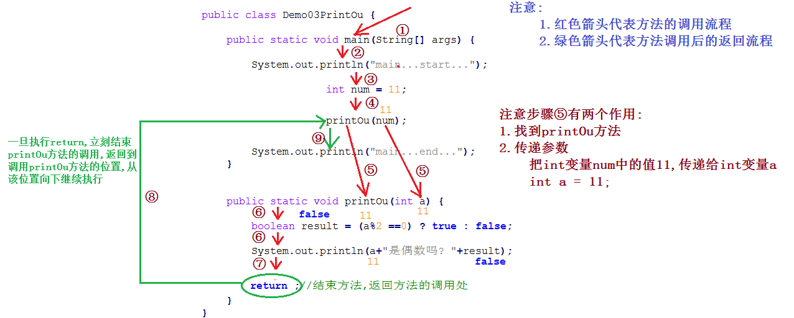

# day08 【方法】

##### 今日复习指南

```java
1.有参数无返回值方法的定义和调用(0.5个小时内完成,多写几遍)	
    itheima03包中Demo01PrintMax.java  打印两个int数字的最大值
    itheima03包中Demo02PrintOu.java   打印一个int数字是否是偶数    
    
2.有参数有返回值方法的定义和调用(1.5个小时内完成,多写几遍)   
    itheima04包中Demo01GetMax.java  获取两个int数字的最大值
    itheima04包中Demo02GetOu.java   获取一个int数字是否是偶数
    
3.其它知识
    (1)方法的调用方式
    (2)形参和实参的区别
    (3)方法定义和调用的注意事项
```


##### 今日内容

```java
方法的概念【重要】
无参数无返回值方法的定义和调用【重要】
有参数无返回值方法的定义和调用【重要】
有参数有返回值方法的定义和调用【重要重要重要重要重要】
```

### 第一章 方法入门【理解】

##### 1.1 方法引入

```java
/*
    代码功能:模拟游戏中打怪物的场景

    发现问题:
        打怪物的代码是相同的,打了3次怪物,写了3次相同的代码,导致程序代码冗余,阅读性差

    怎么解决问题呢?
      1.能否将发射炮弹的代码,做成一个方法/功能
      2.使用的时候直接调用即可
	========================================================================
				这个代码大家不用写,直接拷贝
	========================================================================
 */
public class Demo01NoMethod {
    /*
        main是一个主方法,由JVM调用,是程序的入口
            1.public static:修饰符,目前固定写法
            2.void:返回值类型,表示方法内部的代码执行完毕,没有最终的结果,返回给调用者
            3.main:方法名称:固定写法
            4.String[] args:方法的参数
    */
    public static void main(String[] args) {
        System.out.println("游戏开始...");

        System.out.println("看到了一个怪物...血牙野猪...");
        System.out.println("准备发射5发炮弹");
        System.out.println("发射第1发炮弹* * * *");
        System.out.println("发射第2发炮弹* * * *");
        System.out.println("发射第3发炮弹* * * *");
        System.out.println("发射第4发炮弹* * * *");
        System.out.println("发射第5发炮弹* * * *");
        System.out.println("发射5发炮弹结束");
        System.out.println("...血牙野猪被打倒...");

        System.out.println("...走啊走啊走啊走...");
        System.out.println("看到了一个怪物...黄金虎鲨...");
        System.out.println("准备发射5发炮弹");
        System.out.println("发射第1发炮弹* * * *");
        System.out.println("发射第2发炮弹* * * *");
        System.out.println("发射第3发炮弹* * * *");
        System.out.println("发射第4发炮弹* * * *");
        System.out.println("发射第5发炮弹* * * *");
        System.out.println("发射5发炮弹结束");
        System.out.println("...黄金虎鲨被打倒...");

        System.out.println("...走啊走啊走啊走...");
        System.out.println("看到了一个怪物...吞天巨狼...");
        System.out.println("准备发射5发炮弹");
        System.out.println("发射第1发炮弹* * * *");
        System.out.println("发射第2发炮弹* * * *");
        System.out.println("发射第3发炮弹* * * *");
        System.out.println("发射第4发炮弹* * * *");
        System.out.println("发射第5发炮弹* * * *");
        System.out.println("发射5发炮弹结束");
        System.out.println("...吞天巨狼被打倒...");
        System.out.println("...走啊走啊走啊走...");

        System.out.println("游戏结束...");
    }
}
```

```java
/*
    代码功能:模拟游戏中打怪物的场景

    发现问题:
        打怪物的代码是相同的,打了3次怪物,写了3次相同的代码,导致程序代码冗余,阅读性差

    怎么解决问题呢?
      1.能否将发射炮弹的代码,做成一个方法/功能
      2.使用的时候直接调用即可
	========================================================================
				这个代码大家不用写,直接拷贝
	========================================================================

	注意:
	    (1)方法定义完毕后,不调用是不会执行的
	    (2)调用格式:
	        方法名称(参数列表...)
        (3)方法定义完毕后,可以调用任意多次

 */
public class Demo02UseMethod {
    /*
        main是一个主方法,由JVM调用,是程序的入口
            1.public static:修饰符,目前固定写法
            2.void:返回值类型,表示方法内部的代码执行完毕,没有最终的结果,返回给调用者
            3.main:方法名称:固定写法
            4.String[] args:方法的参数
    */
    public static void main(String[] args) {

        System.out.println("游戏开始...");

        System.out.println("看到了一个怪物...血牙野猪...");

        //调用发射炮弹的方法
        fire();

        System.out.println("...血牙野猪被打倒...");

        System.out.println("...走啊走啊走啊走...");
        System.out.println("看到了一个怪物...黄金虎鲨...");

        //调用发射炮弹的方法
        fire();

        System.out.println("...黄金虎鲨被打倒...");

        System.out.println("...走啊走啊走啊走...");
        System.out.println("看到了一个怪物...吞天巨狼...");

        //调用发射炮弹的方法
        fire();

        System.out.println("...吞天巨狼被打倒...");
        System.out.println("...走啊走啊走啊走...");

        System.out.println("游戏结束...");
    }

    //模拟main方法,定义发射炮弹的方法: fire
    public static void fire() {
        System.out.println("准备发射5发炮弹");
        for (int i = 1; i <= 5; i++) {
            System.out.println("发射第"+i+"发炮弹* * * *");
        }
        System.out.println("发射5发炮弹结束");

        return ;//结束方法返回到方法的调用处
    }
}
```


图解:


##### 1.2 方法的概念和格式

```java
1.方法的概念:	
	就是将具有独立功能的代码块组织成为一个整体，使其具有特殊功能的代码集
	将具有特殊功能的一段代码,使用大括号{}括起来,再添加必要的修饰符,起个名字,方便使用
	
2.方法的格式:
	修饰符 返回值类型 方法名称(参数列表...){
        方法体;//方法的功能代码;
        return 结果数据/返回值; 或者 写 return ;
    }

3.格式解释:
	(1)修饰符: public static 目前固定写法,先记住
	(2)返回值类型: 
		方法的功能代码执行完毕后,产生的需要返还给方法的调用者的结果数据的具体类型
		目前方法的功能代码执行完毕后,没有结果数据返还给调用这,方法内部没有返回值,返回值类型固定写为void
		没有返回值的方法,返回值类型必须固定写为void(不能不写,也不能写成其它的)
    (3)方法名称: 就是给方法起个名字(标识符: 符合标识符的命名规范,建议使用小驼峰规则),方便调用方法
    (4)参数列表: 目前定义方法没有参数,不需要写参数列表,但是必须保留()
    (5)方法体: 完成特殊功能的一条/多条语句
    (6)return 结果数据/返回值; 或者 写 return ;
		如果方法的返回值类型写为void,return 后面必须只能写分号	return ; 建议可以省略
		return ;的作用: 结束方法,返回到方法的调用处
		
			
```


##### 1.3 无返回值无参数方法的定义和调用

```java
1.练习:
	定义方法method,方法内部输出一句话"我是一个方法"
```

```java
/*
    无返回值无参数方法的定义和调用
        1.无返回值
            方法的功能代码执行完毕后,没有具体的结果数据返还给方法的调用者/处,
            此时方法内部只能写return ;而且返回值类型必须固定写为void
            没有返回值的方法,返回值类型固定写为void

        2.无参数
            方法没有参数,不需要写参数列表,但是必须保留()

        3.注意:
            (1)方法定义完毕后,不调用是不会执行的
            (2)调用格式:
                方法名称(参数列表...)
            (3)方法定义完毕后,可以调用任意多次

        4.练习:
	        定义方法method,方法内部输出一句话"我是一个方法"
 */
public class Demo01PrintMethod {
    public static void main(String[] args) {

        System.out.println("main...start...");

        //调用方法method
        method();

        System.out.println("main...end...");
    }
    //定义方法method,方法内部输出一句话"我是一个方法"
    public static void method() {

        System.out.println("我是一个方法");

        return ;//结束方法,返回到方法的调用处
    }
}

```


##### 1.4 无返回值无参数方法的调用图解


##### 1.5 无参数无返回值的方法练习-打印最大值

```java
需求:
	定义一个方法，打印该方法内部的两个数据(方法内部定义的变量)的最大值

```

```java
/*
    无返回值无参数方法的定义和调用
        1.无返回值
            方法的功能代码执行完毕后,没有具体的结果数据返还给方法的调用者/处,
            此时方法内部只能写return ;而且返回值类型必须固定写为void
            没有返回值的方法,返回值类型固定写为void

        2.无参数
            方法没有参数,不需要写参数列表,但是必须保留()

        3.注意:
            (1)方法定义完毕后,不调用是不会执行的
            (2)调用格式:
                方法名称(参数列表...)
            (3)方法定义完毕后,可以调用任意多次

        4.练习:
	        定义一个方法，打印该方法内部的两个数据(方法内部定义的变量)的最大值
 */
public class Demo02PrintMax {
    public static void main(String[] args) {

        System.out.println("main...start...");

        //调用方法printMax
        printMax();

        System.out.println("main...end...");

    }

    //定义一个方法，打印该方法内部的两个数据(方法内部定义的变量)的最大值
    public static void printMax() {

        int a = 10;

        int b = 20;

        int max = (a > b) ? a : b;

        System.out.println("最大值: " + max);

        return ;//结束方法,返回到方法的调用处
    }
}

```


图解:


##### 1.6 无参数无返回值的方法练习-打印数字是否是偶数

```java
需求:
	定义一个方法，打印输出该方法内部的数据(方法内部定义的变量)是否是偶数

```

```java
/*
    无返回值无参数方法的定义和调用
        1.无返回值
            方法的功能代码执行完毕后,没有具体的结果数据返还给方法的调用者/处,
            此时方法内部只能写return ;而且返回值类型必须固定写为void
            没有返回值的方法,返回值类型固定写为void

        2.无参数
            方法没有参数,不需要写参数列表,但是必须保留()

        3.注意:
            (1)方法定义完毕后,不调用是不会执行的
            (2)调用格式:
                方法名称(参数列表...)
            (3)方法定义完毕后,可以调用任意多次

        4.练习:
	        定义一个方法，打印输出该方法内部的数据(方法内部定义的变量)是否是偶数
 */
public class Demo03PrintOu {
    public static void main(String[] args) {

        System.out.println("main...start...");

        //调用方法printOu
        printOu();

        System.out.println("main...end...");

    }

    //定义一个方法，打印输出该方法内部的数据(方法内部定义的变量)是否是偶数

    public static void printOu() {

        int num = 10;

        boolean result = (num % 10 == 0) ? true : false;

        System.out.println("是偶数吗? "+result);

        return ;//结束方法,返回到方法的调用处
    }
}

```


### 第二章 方法详解【理解】

##### 2.1 方法的格式详解

```java
1.方法的概念:	
	就是将具有独立功能的代码块组织成为一个整体，使其具有特殊功能的代码集
	将具有特殊功能的一段代码,使用大括号{}括起来,再添加必要的修饰符,起个名字,方便使用
	
2.方法的格式:
	修饰符 返回值类型 方法名称(参数列表...){
        方法体;//方法的功能代码;
        return 结果数据/返回值;
    }
	注意:
		(1)如果方法没有参数,不需要写参数列表,但是必须保留()
        (2)方法内部没有结果数据返回,返回值类型必须写为void
        (3)返回值类型为void的方法内部只能写return ; 建议省略

3.格式解释:
	(1)修饰符: public static 目前固定写法,先记住
	(2)返回值类型: 你调用我的方法时,方法内部功能代码执行完毕后,会给你(调用者)一个什么样子的数据
		方法的功能代码执行完毕后,产生的需要返还给方法的调用者的结果数据的具体类型
		举例: 告诉调用这方法结束后,返回的结果数据是什么类型的?
            比如方法内部写 return 100;		返回值类型写为 int	
			比如方法内部写 return 6.6;		返回值类型写为 double
			比如方法内部写 return true;	返回值类型写为 boolean
			
    (3)方法名称: 就是给方法起个名字(标识符: 符合标识符的命名规范,建议使用小驼峰规则),方便调用方法
    (4)参数列表: 你调用我的方法时,需要传递给我方法几个什么样的数据
    	本质: 就是定义一个/多个变量	数据类型1 变量名称1,数据类型2 变量名称2...
    	方法参数列表举例:
			()							调用方法()
			(int a)						调用方法(100)
            (int a,int b)				调用方法(100,200)
            (int a,double b,boolean c)  调用方法(100,6.6,true)
                
    (5)方法体: 完成特殊功能的一条/多条语句
    (6)return 结果数据/返回值;
		a.结束方法
		b.把结果数据/返回值,返回给方法的调用处
					
4.方法的理解(工厂/机器): 
	生产汽车的工厂:
		原材料:	发动机,变速箱,底盘,轮胎... 
		产出物:	BMWLi750, S600, T700...
	
    榨汁机:
		原材料:	水果,水,冰糖,冰块...
        产出物: 	果汁
        
    原材料是进入工厂/机器的东西,相当于调用方法时传递到方法内部的参数	对应到定义方法时 指定的 参数列表
    产出物是从工厂/机器中出来的东西,相当于调用方法功能代码执行完毕的返回值  对应到定义方法时的 返回值类型
            
5.定义方法的三要素:
	(1)方法名称
    (2)参数列表
    (3)返回值类型
    
```


##### 2.2 无返回值有参数的方法练习-打印最大值

```java
需求:
	 定义一个方法用于打印两个int数中的较大数，数据来自于方法参数
```

```java
/*
    无返回值有参数的方法练习-打印最大值
        1.无返回值
            经验分享:
                如果在题目需求中能够明确看到打印/输出/遍历二字,说明方法不需要返回结果数据,直接打印结果即可
                方法内部不需要返回值,返回值类型必须写为void

        2.有参数
            经验分享: 如果题目需求中有不确定的东西,就需要定义参数列表

        3.注意:
            (1)方法定义完毕后,不调用是不会执行的
            (2)调用格式:
                方法名称(参数列表...)
            (3)方法定义完毕后,可以调用任意多次

        4.练习:
	        定义一个方法用于打印两个int数中的较大数，数据来自于方法参数

	    5.三要素:
	        (1)方法名称:    printMax
	        (2)参数列表:    int a,int b
	        (3)返回值类型:  void
 */
public class Demo01PrintMax {
    public static void main(String[] args) {

        System.out.println("main...start...");

        //调用方法printMax: 传递常量
        printMax( 10 , 20 );

        System.out.println("main...end...");

    }

    //定义一个方法用于打印两个int数中的较大数，数据来自于方法参数
    /*
        你调用我的方法printOu时,必须给我传递两个int数据,
        我方法内部功能代码执行完毕后,没有结果数据返回给你,内部会直接打印结果数据
        你: 代表方法的调用者
        我: 方法本身
     */
    public static void printMax(int a, int b) {

        int max = (a > b) ? a : b;

        System.out.println("最大值: "+max);

        return ;//结束方法,返回到方法的调用处
    }
}

```


图解:


##### 2.3 无返回值有参数的方法练习-打印数字是否是偶数

```java
需求:
	 定义一个方法，该方法接收一个int参数，方法内部打印输出该数据是否是偶数

```

```java
/*
    无返回值有参数的方法练习-打印数字是否是偶数
        1.无返回值
            经验分享:
                如果在题目需求中能够明确看到打印/输出/遍历二字,说明方法不需要返回结果数据,直接打印结果即可
                方法内部不需要返回值,返回值类型必须写为void

        2.有参数
            经验分享: 如果题目需求中有不确定的东西,就需要定义参数列表

        3.注意:
            (1)方法定义完毕后,不调用是不会执行的
            (2)调用格式:
                方法名称(参数列表...)
            (3)方法定义完毕后,可以调用任意多次

        4.练习:
	        定义一个方法，该方法接收一个int参数，方法内部打印输出该数据是否是偶数

	    5.三要素:
	        (1)方法名称:    printOu
	        (2)参数列表:    int num
	        (3)返回值类型:  void
 */
public class Demo02PrintOu {
    public static void main(String[] args) {

        System.out.println("main...start...");

        //调用printOu方法: 传递常量
        printOu(10 );

        //调用printOu方法: 传递变量
        int a = 11;

        printOu(a);

        System.out.println("main...end...");

    }

    //定义一个方法，该方法接收一个int参数，方法内部打印输出该数据是否是偶数
    public static void printOu(int num) {

        boolean result = (num % 2 == 0) ? true : false;

        System.out.println(num+"是偶数吗? "+result);

        return ;//结束方法的调用,返回到方法的调用处
    }

}

```


图解分析:**



##### 2.4 有返回值有参数的方法练习-获取最大值

```java
需求:
	设计一个方法可以获取两个int数的较大值，数据来自于参数

```

```java
/*
    有返回值有参数的方法练习-获取最大值
        1.有返回值
            经验分享:
                如果在题目需求中能够明确看到获取/返回/判断二字,说明方法内部需要返回结果数据,就必须定义返回值类型


        2.有参数
            经验分享: 如果题目需求中有不确定的东西,就需要定义参数列表

        3.注意:
            (1)方法定义完毕后,不调用是不会执行的
            (2)调用格式:
                方法名称(参数列表...)
            (3)方法定义完毕后,可以调用任意多次

        4.练习:
	        设计一个方法可以获取两个int数的较大值，数据来自于参数

	    5.三要素:
	        (1)方法名称:    getMax
	        (2)参数列表:    int a,int b
	        (3)返回值类型:  int
 */
public class Demo01GetMax {
    public static void main(String[] args) {

        System.out.println("main...start...");

        //调用方法getMax: 传递常量
        int result = getMax(10 , 20 );

        System.out.println("最大值: "+result);


        int m = 10;
        int n = 20;

        //调用方法getMax: 传递变量
        int result2 = getMax(m , n );
        System.out.println(m+"和"+n+"的最大值: "+result2);

        System.out.println("main...end...");

    }

    //设计一个方法可以获取两个int数的较大值，数据来自于参数
    /*
        你调用我的方法getMax时,必须给我传递两个int数据,
        我方法内部功能代码执行完毕后,会返还给你一个int类型的结果数据
        你: 代表方法的调用者
        我: 方法本身
     */
    public static int getMax(int a , int b ) {

        int max = (a > b) ? a : b;

        return max;//结束方法的调用,把max中的结果数据返回给方法的调用者
    }
}

```


##### 图解分析:


##### 2.5 有返回值有参数的方法练习-获取数字是否是偶数

```java
需求:
	定义一个方法，该方法接收一个int参数，判断该数据是否是偶数，并返回真假值
	

```

```java
/*
    有返回值有参数的方法练习-获取数字是否是偶数
        1.有返回值
            经验分享:
                如果在题目需求中能够明确看到获取/返回/判断二字,说明方法内部需要返回结果数据,就必须定义返回值类型


        2.有参数
            经验分享: 如果题目需求中有不确定的东西,就需要定义参数列表

        3.注意:
            (1)方法定义完毕后,不调用是不会执行的
            (2)调用格式:
                方法名称(参数列表...)
            (3)方法定义完毕后,可以调用任意多次

        4.练习:
	        定义一个方法，该方法接收一个int参数，判断该数据是否是偶数，并返回真假值

	    5.三要素:
	        (1)方法名称:    getOu
	        (2)参数列表:    int num
	        (3)返回值类型:  boolean
 */
public class Demo02GetOu {
    public static void main(String[] args) {

        System.out.println("main...start...");

        //调用方法getMax: 传递常量
        boolean result = getOu(10);
        System.out.println("是否是偶数? "+result);

        //调用方法getMax: 传递变量
        int num = 11;
        boolean result2 = getOu(num);
        System.out.println(num+"是偶数数字吗? "+result2);

        System.out.println("main...end...");

    }

    //定义一个方法，该方法接收一个int参数，判断该数据是否是偶数，并返回真假值
    /*
        你调用我的方法getOu时,必须给我传递一个int数据,
        我方法内部功能代码执行完毕后,会返还给你一个boolean类型的结果数据
        你: 代表方法的调用者
        我: 方法本身
     */
    public static boolean getOu(int num) {

        boolean result = (num % 2 == 0) ? true : false;

        return result;
    }
}

```


##### 图解分析:


##### 2.6 方法的注意事项

```java
/*
    方法的注意事项一
        1.方法不能嵌套定义(在定义方法的内部又定义了其它方法),可以调用其它方法
        2.方法可以嵌套调用
        3.定义方法时参数列表根据需求确定(可以有0个/1个/2个/3个...)
        4.如果方法需要参数列表,参数列表中定义的变量的类型根据需求确定
            可以是基本类型/引用类型

        5.定义方法时返回值类型根据需求确定
            如果没有返回值,返回值类型固定写为void

        6.如果分析后发现方法需要返回值类型,那么返回值类型也可以是基本类型/引用类型

        7.不管方法的返回值类型基本类型还是引用类型,返回的结果数据只能有一个,不能有多个
            如果需要返回多个数据,那么必须把多个数据放入数组/集合(就业班讲)中,返回一个数组/集合


 */
public class Demo01MethodNotice {
    public static void main(String[] args) {
        a();

        //调用方法获取int数字,保存到int变量num中
        int num = getNum();

        //调用方法传递int数字
        printNum(num);

        //以上两行方法的调用,可以合并成一行
        //2.方法可以嵌套调用
        printNum(getNum());
    }
    //1.方法不能嵌套定义(在定义方法的内部又定义了其它方法),可以调用其它方法
    public static void a() {
        //错误: 不能在方法内部,再定义其它方法
        /*public static void b() {

        }*/
        System.out.println("a...");
        c();
        return ;
    }

    public static void c() {
        System.out.println("c...");
        return ;
    }

    //2.方法可以嵌套调用
    //定义方法内部返回int数字
    public static int getNum() {
        return 100;
    }

    //定义方法定义,int数字
    public static void printNum(int a) {
        System.out.println(a);
    }

    //3.定义方法时参数列表根据需求确定(可以有0个/1个/2个/3个...)
    //4.如果方法需要参数列表,参数列表中定义的变量的类型根据需求确定
    //可以是基本类型/引用类型
    public static void d(int a, double b, int[] array, Scanner scanner) {

    }

    //5.定义方法时返回值类型根据需求确定
    //如果没有返回值,返回值类型固定写为void
    public static int e() {//返回值类型是基本类型
        return 100;
    }

    public static Scanner f() {//返回值类型是引用类型
        return new Scanner(System.in);
    }

    //如果要返回多个数据,必须把多个数据放到数组中
    //返回的仍然是一个数据,只不过返回的是数组容器而已,该容器中存储了多个数据
    public static int[] g() {
        return new int[] {100,200,300};
    }
}

```

```java
/*
    方法的注意事项二
        1.返回值类型，必须要和 return 语句返回的数据的类型要匹配，否则编译失败 。
        2.不能在 return 后面写代码， return 意味着方法结束，所有后面的代码永远不会执行，属于无效代码。
        3.void表示无返回值，可以省略return ;，也可以单独的书写return ;，后面不加数据 return ; 建议省略
        4.如果定义的方法需要返回值,那么只能返回一个数据,不能返回2个及以上的数据
            而且可以返回基本类型也可以返回引用类型(根据需求确定)
            如果非得返回多个数据,可以把多个数据放在数组中,返回一个数组
 */
public class Demo02MethodNotice {
    public static void main(String[] args) {

    }

    //1.返回值类型，必须要和 return 语句返回的数据的类型要匹配，否则编译失败 。
    public static boolean a() {
        //return 100;//返回值类型: int
        //return 6.6;//返回值类型: double
        //return 6.6F;//返回值类型: float
        return true;//返回值类型: boolean
    }

    //2.不能在 return 后面写代码， return 意味着方法结束，所有后面的代码永远不会执行，属于无效代码。
    public static int getMax(int a,int b) {
        if(a>b) {
            return a;
            //System.out.println("a...");
        } else {
            return b;
            //System.out.println("b....");
        }
        //System.out.println("getMax....end...");
    }
}

```


##### 2.7 有返回值的方法调用方式

```java
/*
    有返回值的方法调用方式
        1.赋值调用: 把调用有返回值的方法的返回结果保存到变量中                       推荐使用
            数据类型 变量名称 = 方法名称(参数列表...);

        2.打印/输出调用: 把调用有返回值的方法的返回结果直接交给输出语句,进行打印输出
            System.out.println(方法名称(参数列表...));

        3.直接/单独/独立调用        代码是没有错误的,但是丢失了结果数据, 没有意义     不推荐使用
            方法名称(参数列表...);
 */
public class Demo03MethodInvoke {
    public static void main(String[] args) {
        System.out.println("main...start...");

        //调用方法,传递常量
        //1.赋值调用: 把调用有返回值的方法的返回结果保存到变量中
        int result = getSum(10, 20);

        //把结果保存到变量中的好处: 可以对结果数据进行额外的其它处理
        //result *= 1000;//此处只是举一个例子
        System.out.println("和: "+result);

        //2.打印/输出调用: 把调用有返回值的方法的返回结果直接交给输出语句,进行打印输出
        System.out.println("和: "+getSum(10,20));

        //3.直接/单独/独立调用        代码是没有错误的,但是丢失了结果数据, 没有意义     不推荐使用
        getSum(10,20);

        System.out.println("main...end...");
    }

    //定义方法,获取两个int数据之和
    public static int getSum(int a, int b) {

        int sum = a + b;

        return sum;
    }
}

```


##### 2.8 无返回值的方法调用方式

```java
/*
    没有返回值的方法调用方式
        1.直接/单独/独立调用        没有返回值方法,只能采用直接调用,另外两种调用方式都是错误的
            方法名称(参数列表...);

        2.赋值调用: 把调用有返回值的方法的返回结果保存到变量中                   错误的
            数据类型 变量名称 = 方法名称(参数列表...);

        3.打印/输出调用:                                                     错误的
            System.out.println(方法名称(参数列表...));


 */
public class Demo04MethodInvoke {
    public static void main(String[] args) {
        System.out.println("main...start...");

        //1.直接/单独/独立调用        没有返回值方法,只能采用直接调用,另外两种调用方式都是错误的
        printSum(10,20);


        //2.赋值调用: 错误的
        //int result = printSum(10,20);//错误,printSum方法内部根本没有返回int数字

        //void v = printSum(10,20);//错误,void根本不是数据类型

        //3.打印调用: 错误的
        //System.out.println(void);
        //System.out.println(printSum());//printSum方法没有返回值,println方法也不知道到底要打印什么东西

        System.out.println("main...end...");
    }

    //定义方法,打印两个int数据之和
    public static void printSum(int a, int b) {

        int sum = a + b;

        System.out.println("和: "+sum);

        return ;//结束方法,返回到方法的调用处
    }
}

```


##### 2.9 形式参数和实际参数的区别

```java
/*
    形式参数和实际参数的区别
        形式参数
            1.概念: 在定义方法时,()中定义的参数(变量),叫做形式参数
            2.特点:
                (1)是在定义方法时,()中指定的
                (2)此时是没有值的,当调用方法时,由方法的调用者传递具体的数据给对应的形式参数

        实际参数
            1.概念: 在调用方法时,()中指定的常量/变量,称为实际参数
            2.特点:
                (1)是在调用方法时,()中指定的常量/变量
                (2)必须是有具体的数据值的
 */
public class Demo04MethodParam {
    public static void main(String[] args) {
        System.out.println("main...start...");

        //调用方法,传递常量
        /*
            实际参数
                1.概念: 在调用方法时,()中指定的常量/变量,称为实际参数
                2.特点:
                    (1)是在调用方法时,()中指定的常量/变量
                    (2)必须是有具体的数据值的
         */
        int result = getSum(10,20);//此处()中的10和20,叫做实际参数
        System.out.println(result);

        int m = 50;
        int n = 100;

        //调用方法,传递变量
        int sum = getSum(m,n);//此处()中的m和n,叫做实际参数
        System.out.println(sum);

        System.out.println("main...end...");
    }

    //定义方法,获取两个int数据之和
    /*
        形式参数
            1.概念: 在定义方法时,()中定义的参数(变量),叫做形式参数
            2.特点:
                (1)是在定义方法时,()中指定的
                (2)此时是没有值的,当调用方法时,由方法的调用者传递具体的数据给对应的形式参数
     */
    public static int getSum(int a , int b ) {//此处()中的a和b,叫做形式参数

        int sum = a + b;

        return sum;
    }
}
```


##### 总结

```java
能够知道方法定义的通用格式
	修饰符 返回值类型 方法名称(参数列表...){
		方法功能代码;
		return 结果数据/返回值;
	}
能够知道形参和实参的区别	
	1.形式参数
		(1)概念: 在定义方法时,()中定义的参数(变量),称为形式参数
		(2)特点:
			a.是在定义方法时,()中定义的
			b.在定义时,是不能有值的,只有方法被调用时,形式参数才必须会接收到具体的数据值
			
    2.实际参数
    	(1)概念: 是在调用方法时,()中给出的常量/变量,称为实际参数
    	(2)特点:
			a.是在调用方法时,()中指定的内容
			b.必须是要有值的
能够使用方法完成两个较大数的获取并调用方法
	//1.赋值调用
	int max = getMax(10,20);
	sout(max);
	//2.打印/输出调用
	System.out.println(getMax(10,20));
	//3.直接调用							代码不报错,但是没有意义
	getMax(10,20)
	
	public static int getMax(int a,int b) {
		if(a>b) {
			return a;
		} else {
			return b;
		}
	}
```

