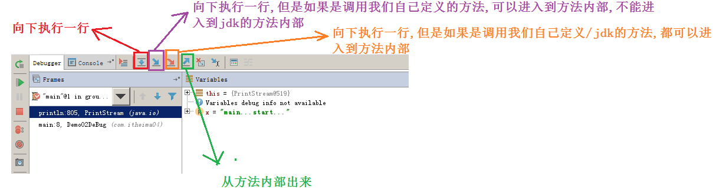

# day09 【方法重载、Debug调试】

##### 今日复习指南

```java
1.方法重载用(0.5个小时内完成,多写几遍)
	Demo02MethodOverLoad.java				定义四个重载的求和方法
    Demo05OverLoadTest.java					定义四个重载的判断是否相同的方法
    
2.方法练习(1.0个小时内完成,多写几遍)
    Demo02PrintArray.java			定义方法打印int数组的内容
    Demo03PrintMax.java 			定义方法获取int数组最大值		----必须要会写----
    Demo04GetArray					定义方法获取int类型的数组
    
3.方法参数区别和debug调试(0.5个小时内完成,演示效果)
    Demo01DeBugSum.java
    Demo02DeBug.java
```


##### 今日内容

```java
方法的重载【重点】
方法的参数传递【难点】
方法练习【重点】
Debug调试【理解】
```

### 第一章 方法重载【理解】

##### 1.1 方法重载的引入

```java
需求:
	1.定义一个获取两个int数字之和的方法
    2.定义一个获取三个int数字之和的方法
    3.定义一个获取两个double数字之和的方法
    4.定义一个获取三个double数字之和的方法

定义一个获取两个int数字之和的方法
	三要素:
		1.方法名称: getTwoIntNumSum
		2.参数列表: int a,int b
		3.返回值类型: int
发现问题:
	以下四个方法都是完成求和功能,只是参数列表不同,然而我们却给每个方法都起了一个很长的而且非常复杂的名		字,导致程序员的学习和使用成本增加(太复杂,记不住)

解决方案:
    利用方法重载的技术
```

```java
public class Demo01Method {
    public static void main(String[] args) {
        //输出/打印调用
        System.out.println(getTwoIntNumSum(10,20));
        System.out.println(getThreeIntNumSum(10,20,30));
        System.out.println(getTwoDoubleNumSum(10.0,20.0));
        System.out.println(getThreeDoubleNumSum(10.0,20.0,30.0));
    }

    //定义一个获取两个int数字之和的方法
    public static int getTwoIntNumSum(int a, int b) {
        return a + b;
    }

    //2.定义一个获取三个int数字之和的方法
    public static int getThreeIntNumSum(int a, int b,int c) {
        return a + b + c;
    }

    //3.定义一个获取两个double数字之和的方法
    public static double getTwoDoubleNumSum(double a, double b) {
        return a + b;
    }

    //4.定义一个获取三个double数字之和的方法
    public static double getThreeDoubleNumSum(double a, double b,double c) {
        return a + b + c;
    }
}

```


##### 1.2 方法重载的概念

```java
方法重载:
	1.概念:
    	在同一个类中,多个功能相同,但是参数列表不同的方法,可以使用相同的名称,
        这种多个同名不同参的方法,可以存在于同一个类中的现象,就叫做方法重载

        举例:
        	比如说每个类中有个叫做method的方法,我们可以再载入(书写),多个名称为method的方法,
            但是要求这多个方法之间的参数列表互不相同

	2.作用
    	(1)减少程序员的学习和使用成本
        (2)减少了方法名称的数量

    3.调用
    	(1)根据方法名称找到对应的方法
        (2)根据参数的数量再次确定方法
        (3)最后根据参数的类型确定方法(优先做类型的完全匹配 然后做自动类型提升匹配)
	

```

```java
public class Demo02MethodOverLoad {
    public static void main(String[] args) {
        //输出/打印调用
        System.out.println(getSum(10,20));
        System.out.println(getSum(10,20,30));
        System.out.println(getSum(10.0,20.0));
        System.out.println(getSum(10.0,20.0,30.0));
    }

    //定义一个获取两个int数字之和的方法
    public static int getSum(int a, int b) {
        System.out.println("两个int...");
        return a + b;
    }

    //2.定义一个获取三个int数字之和的方法
    public static int getSum(int a, int b,int c) {
        System.out.println("三个int...");
        return a + b + c;
    }

    //3.定义一个获取两个double数字之和的方法
    public static double getSum(double a, double b) {
        System.out.println("两个double...");
        return a + b;
    }

    //4.定义一个获取三个double数字之和的方法
    public static double getSum(double a, double b,double c) {
        System.out.println("三个double...");
        return a + b + c;
    }
}

```


##### 1.3 方法重载的注意事项

```java
/*
    方法重载参数列表不同有哪些情况?
        1.参数数量不同
        2.参数类型不同
        3.多个类型,顺序不同

    记住:
        方法重载,名称相同后,看参数列表的本质区别(不含参数名称),和其它的任何东西无关
 */
public class Demo03OverLoadNotice {
    public static void main(String[] args) {

    }

    //1.该方法没有参数
    public static void method(){

    }

    //2.该方法有一个int类型参数
    //方法2有一个参数,方法1没有参数,参数数量不同可以构成重载
    public static void method(int a){

    }

    //3.该方法有两个int类型参数
    //方法2有一个参数,方法1没有参数,参数数量不同可以构成重载
    //方法3有两个参数,方法2有一个参数,参数数量不同可以构成重载
    public static void method(int a,int b){

    }

    //4.该方法有一个double类型参数
    //方法4有一个double类型参数,方法2有一个int类型参数,参数类型不同可以构成重载
    public static void method(double a){

    }

    //5.该方法有一个double类型参数和一个int类型参数
    public static void method(double a, int b) {

    }

    //6.该方法有一个int类型参数和一个double类型参数
    //方法6的参数是先int类型后double类型,方法5的参数是先double类型,后int类型
    //方法参数有多个类型,但是顺序不同,可以构成重载
    public static void method(int a, double b) {

    }
}

```

```java
/*
    方法重载与哪些因素无关?(这些情况是无法构成重载的)
        1.与参数的名称无关
        2.与返回值类型无关
        3.与修饰符无关
 */
public class Demo04OverLoadNotice {
    public static void main(String[] args) {

    }

    //1.该方法有两个int类型参数,参数名称分别为a和b
    public static void method(int a,int b){

    }

    //2.该方法有两个int类型参数,参数名称分别为c和d
    //方法2 和 方法1 参数类型和数量都相同,只有参数名称不同,无法构成重载
    /*public static void method(int c,int d){

    }*/

    //3.该方法有两个int类型参数,参数名称分别为a和b
    //方法1和方法3,只有返回值类型不同,然而方法重载与返回值类型是无关的,所以无法构成重载
    /*public static int method(int a, int b) {
        return a + b;
    }*/


    //4.该方法有两个int类型参数,参数名称分别为a和b
    //方法1和方法4,只有修饰符不同,然而方法重载与修饰符是无关的,所以无法构成重载
    /*private void method(int a,int b){

    }*/

}

```


##### 1.4 方法重载的练习-比较两个数据是否相等

```java
/*
    需求:
	    使用方法重载的思想，设计比较两个数据是否相等的方法，兼容全整数类型(byte,short,int,long）
        方法重载的思想: 同一个类中,多个功能相同,参数列表不同的方法,可以使用同一个名字

    实现步骤:
        1.使用方法重载的思想,定义获取两个byte数据是否相同的方法compare
        2.使用方法重载的思想,定义获取两个short数据是否相同的方法compare
        3.使用方法重载的思想,定义获取两个int数据是否相同的方法compare
        4.使用方法重载的思想,定义获取两个long数据是否相同的方法compare
        5.在main方法中分别调用以上四个方法,传递对应类型的参数,获取并打印结果

    所以方法重载的思想,定义获取两个byte数据是否相同的方法compare
        三要素:
            1.方法名称:     compare
            2.参数列表:     byte a, byte b
            3.返回值类型:   boolean
 */
public class Demo05OverLoadTest {
    public static void main(String[] args) {
        //5.在main方法中分别调用以上四个方法,传递对应类型的参数,获取并打印结果
        //输出调用: 传递常量
        System.out.println(compare((byte) 10, (byte) 20));
        System.out.println(compare((short) 10, (short) 20));
        System.out.println(compare(10, 20));
        System.out.println(compare(10L, 20L));
        System.out.println("--------------");

        //赋值调用: 传递变量
        byte a = 10, b = 20;
        boolean result = compare(a, b);
        System.out.println(result);

        short c = 10, d = 20;
        result = compare(c, d);
        System.out.println(result);

        int e = 10, f = 20;
        result = compare(e, f);
        System.out.println(result);

        long g = 10, h = 20;
        result = compare(g, h);
        System.out.println(result);
    }

    //使用方法重载的思想,定义获取两个byte数据是否相同的方法compare
    public static boolean compare(byte a, byte b) {
        System.out.println("两个byte...");
        if (a == b) {
            return true;
        } else {
            return false;
        }
    }

    //2.使用方法重载的思想,定义获取两个short数据是否相同的方法compare
    public static boolean compare(short a, short b) {
        System.out.println("两个short...");
        if (a == b) {
            return true;
        }
        //执行到这里说明a和b是不相同的
        return false;
    }

    //3.使用方法重载的思想,定义获取两个int数据是否相同的方法compare
    public static boolean compare(int a, int b) {
        System.out.println("两个int...");
        //定义boolean变量result,初始值true,假设a和b是相同的
        boolean result = true;

        //如果a和b不相同,修改result的值
        if (a != b) {
            result = false;
        }

        //返回result
        return result;
    }

    //4.使用方法重载的思想,定义获取两个long数据是否相同的方法compare
    public static boolean compare(long a, long b) {
        System.out.println("两个long...");
        return a == b;
    }
}
```


### 第二章 方法的参数传递【理解】

##### 2.1 方法参数传递

```java
参数传递:
	可以理解当我们要调用一个方法时，我们会把指定的数值，传递给方法中的参数(定义方法时()中定义的变量)，
    这样方法中的参数就拥有了这个指定的值，可以使用该值，在方法中运算了。这种传递方式，我们称为参数传递。
        
形式参数: 定义方法时,()中定义的参数(1个/多个变量),叫做形式参数 定义时是没有值的
实际参数: 调用方法时,()中指定的数据(常量/变量),叫做实际参数	使用时必须是有值的 

```

```java
/*
    注意:
        1.基本类型变量a的值,赋值给基本类型变量b,其实是把变量a的值复制一份给变量b,
            之后不管如何修改变量b中的值,对变量a中的值是不会产生任何影响的

        2.局部变量:
            方法内部或者方法定义时()中定义的变量,称之为局部变量,只在方法内部有效,出了所在的方法就不能使用到了
 */
public class Demo01LocalVar {
    public static void main(String[] args) {
        int a = 10;
        int b;//定义,未赋值

        b = a;//把变量a的值赋值给变量b

        System.out.println("a="+a);//10
        System.out.println("b="+b);//10

        b*=10;

        System.out.println("a="+a);//10
        System.out.println("b="+b);//100

        //错误: m和n是在method方法中定义的,只能在method方法中有效
        //System.out.println(m);
        //System.out.println(n);


    }

    public static void method() {
        //错误: a和b是在main方法中定义的,只能在main方法中使用
        //System.out.println(a);
        //System.out.println(b);

        int m = 10, n = 20;

        int a = 1000, b = 2000;

        System.out.println(a);
        System.out.println(b);
    }
}
```


图解:


##### 2.2 基本类型作为方法参数传递

```java
基本类型作为方法参数传递的特点
```

```java
/*
    基本类型作为方法参数传递的特点【形参的改变，不会影响实参】
        1.基本类型变量保存的具体的数据值,进行赋值时,传递的也是具体的数据值
        2.基本类型作为方法参数时,形式参数的改变,不会影响实际参数
            形式参数: 定义方法时,()中定义的参数(1个/多个变量),叫做形式参数 定义时是没有值的
            实际参数: 调用方法时,()中指定的数据(常量/变量),叫做实际参数	使用时必须是有值的

    注意:
        1.方法的执行都有自己独立的栈内存空间
        2.方法内部定义的变量也有独立的内存空间
        3.不同的方法中可以定义同名的变量,
            因为所在的方法的栈内存空间不同,
            同名变量的内存空间也不同,
            它们之间是互不干扰,互不影响
 */
public class Demo02BaseVar {
    public static void main(String[] args) {
        int a = 10;
        int b = 20;
        System.out.println("ms..a="+a);//10
        System.out.println("ms..b="+b);//20
        change( a , b );//a和b叫做实际参数
        System.out.println("me..a="+a);//10
        System.out.println("me..b="+b);//20
    }

    public static void change(int a, int b) {//a和b叫做形式参数
        System.out.println("cs..a="+a);//10
        System.out.println("cs..b="+b);//20
        a = a * 10;
        b = b * 10;
        System.out.println("ce..a="+a);//100
        System.out.println("ce..b="+b);//200
        return ;
    }
}

```


##### 图解:


##### 2.2 引用类型作为方法参数传递

```java
引用类型作为方法参数传递的特点
```

```java
/*
    引用类型作为方法参数传递的特点【形参的改变，会影响实参】
        注意:
            1.引用类型变量,保存对象在堆内存空间的地址值
            2.引用类型变量,作为方法参数传递时,传递的是地址值
            3.通过形式参数找到对应的堆内存空间的内容,进行修改后,再通过实际参数,看到的是堆内存空间修改后的内容

        数组:
            1.数组变量也是引用类型变量,保存数组对象在堆内存空间的地址值
            2.数组变量,作为方法参数传递时,传递的是地址值
            3.通过形式参数数组变量找到对应的堆内存空间的数组,修改数组元素后,
                再通过实际参数数组变量,看到的一定是是堆内存空间的修改后的数组元素

        总结:
            所有引用变量,保存的都是地址值,作为方法参数/方法返回值,传递/返回的都是地址值
 */
public class Demo03RefVar {
    public static void main(String[] args) {
        int[] a = new int[]{ 10 , 20 };
        System.out.println("ms..a[0]="+a[0]);//10
        System.out.println("ms..a[1]="+a[1]);//20
        change( a );//a叫做实际参数,保存内存地址值
        System.out.println("me..a[0]="+a[0]);//100
        System.out.println("me..a[1]="+a[1]);//200
    }

    public static void change(int[] a) {//a叫做形式参数,接收内存地址值
        System.out.println("cs..a[0]="+a[0]);//10
        System.out.println("cs..a[1]="+a[1]);//20
        a[0] = a[0] * 10;
        a[1] = a[1] * 10;
        System.out.println("ce..a[0]="+a[0]);//100
        System.out.println("ce..a[1]="+a[1]);//200
        return ;
    }
}

```


图解:


### 第三章 方法的练习【重点】

##### 3.1 数组遍历练习(不定义方法)

```java
需求(先不定义方法):
	完成数组的遍历(打印数组元素)，要求遍历的结果是在一行上的。
    例如：[11, 22, 33, 44, 55]

举例:
	原数组: {11,22,33,44,55}
    打印格式:[11, 22, 33, 44, 55]
    
实现步骤:
	1.定义int数组array,并初始化
    2.打印"[",不换行
    3.使用for循环变量数组
    3.1 打印数组当前元素,不换行
    3.2 如果3.1中打印的元素不是最后一个元素,打印", ",不换行
    4.打印"]",可以换行也可以不换行
问题:
	没有把按照指定格式打印数组的功能定义成方法,这样有几个数组,就需要重复的写几遍这样的代码,
    导致代码可读性差,冗余度搞
```

```java
public class Demo01PrintArray {
    public static void main(String[] args) {
        //1.定义int数组array,并初始化
        int[] array = {11, 22, 33, 44, 55};

        //2.打印"[",不换行
        System.out.print("[");
        //3.使用for循环变量数组
        for (int i = 0; i < array.length; i++) {
            //3.1 打印数组当前元素,不换行
            System.out.print(array[i]);
            //3.2 如果3.1中打印的元素不是最后一个元素
            if (i != array.length - 1) {
                //打印", ",不换行
                System.out.print(", ");
            }
        }
        //4.打印"]",可以换行也可以不换行
        System.out.println("]");
        System.out.println("---------------");

        int[] array2 = {110, 220, 330, 440, 550};
        //2.打印"[",不换行
        System.out.print("[");
        //3.使用for循环变量数组
        for (int i = 0; i < array2.length; i++) {
            //3.1 打印数组当前元素,不换行
            System.out.print(array2[i]);
            //3.2 如果3.1中打印的元素不是最后一个元素
            if (i != array2.length - 1) {
                //打印", ",不换行
                System.out.print(", ");
            }
        }
        //4.打印"]",可以换行也可以不换行
        System.out.println("]");
    }
}

```


##### 3.2 数组遍历练习(定义方法)

```java
需求(定义方法):
	设计一个方法用于int数组遍历(打印数组元素)，
    要求遍历的结果是在一行上的。例如：[11, 22, 33, 44, 55]
举例:
	原数组: {11,22,33,44,55}
    打印格式:[11, 22, 33, 44, 55]
    
设计一个方法用于int数组遍历(打印数组元素)
	三要素:
		1.方法名称:     printArray
        2.参数列表:     int[] array
        3.返回值类型:   void

printArray方法内部的实现步骤:
	1.打印"[",不换行
    2.使用for循环变量数组
    2.1 打印数组中当前元素,不换行
    2.2 如果2.2中打印的不是最后一个元素,打印", ",不换行
    3.for循环结束,打印"]",可以换行也可以不换行

main方法的实现步骤:
	1.定义int数组array,并初始化
    2.调用printArray方法,传递数组变量array,完成遍历
```

```java
public class Demo02PrintArray {
    public static void main(String[] args) {
        //1.定义int数组array,并初始化
        int[] array = {11, 22, 33, 44, 55};

        //2.调用printArray方法,传递数组变量array,完成遍历
        printArray(array);

        int[] array2 = {110, 220, 330, 440, 550};

        printArray(array2);
    }

    //设计一个方法用于int数组遍历(打印数组元素)
    public static void printArray(int[] array) {
        //1.打印"[",不换行
        System.out.print("[");

        //2.使用for循环变量数组
        for (int i = 0; i < array.length; i++) {
            //2.1 打印数组中当前元素,不换行
            System.out.print(array[i]);
            //2.2 如果2.2中打印的不是最后一个元素
            if (i != array.length-1) {
                //打印", ",不换行
                System.out.print(", ");
            }
        }
        //3.for循环结束,打印"]",可以换行也可以不换行
        System.out.println("]");
        return;
    }

}

```

##### 3.2 方法练习求数组最大值

```java
需求:
	设计一个方法用于获取int数组中元素的最大值

举例:
	原数组: {11,22,33,44,55}
    最大值: 55
        
设计一个方法用于获取int数组中元素的最大值
	三要素:
    	1.方法名称:     getArrayMax
        2.参数列表:     int[] array
        3.返回值类型:    int

getArrayMax方法内部的实现步骤:
	1.假设索引为0的元素是最大的,保存到int变量max中
    2.使用for循环依次获取后面的(从索引1开始)每个元素
    2.1 如果当前元素值 大于 max,说明max中的元素已经不是最大的了
    2.2 把当前元素值,赋值给max
    3.for循环结束后,返回max

main方法的实现步骤:
	1.定义int数组array,并初始化
    2.调用getArrayMax方法,传递数组array,获取结果保存到int变量max中
    3.打印max
        
```

```java
public class Demo03PrintMax {
    public static void main(String[] args) {
        //1.定义int数组array,并初始化
        int[] array = {11, 22, 33, 44, 55};

        //2.调用getArrayMax方法,传递数组array,获取结果保存到int变量max中
        int max = getArrayMax(array);

        //3.打印max
        System.out.println("最大值: " + max);
    }

    //设计一个方法用于获取int数组中元素的最大值
    public static int getArrayMax(int[] array) {
        //1.假设索引为0的元素是最大的,保存到int变量max中
        int max = array[0];

        //2.使用for循环依次获取后面的(从索引1开始)每个元素
        for (int i = 1; i < array.length; i++) {
            //2.1 如果当前元素值 大于 max,说明max中的元素已经不是最大的了
            if (array[i] > max) {
                //2.2 把当前元素值,赋值给max
                max = array[i];
            }
        }
        //3.for循环结束后,返回max
        return max;
    }
}

```


```java
/*
    需求:
        定义一个静态(被static修饰的)方法,方法内部返回一个长度为6的存储1到100之间[1,100]的6个随机数字的int数组
        在main方法中调用上面的方法,获取数组并遍历

    定义一个方法,方法内部返回一个长度为6的存储1到100之间[1,100]的6个随机数字的int数组
        三要素:
            1.方法名称:     getArray
            2.参数列表:     不需要参数
            3.返回值类型:    int[]

    getArray方法内部的实现步骤:
        1.创建长度为6的int数组array,只能采用动态初始化方式
        2.创建产生随机数字的Random类的对象
        3.产生6个[1,100]之间的随机数字,存储到数组array中
        4.返回数组array

    main方法的实现步骤:
        1.调用getArray方法,获取一个int数组,保存到int类型的数组array中
        2.遍历int数组array
 */
public class Demo04GetArray {
    public static void main(String[] args) {
        //1.调用getArray方法,获取一个int数组,保存到int类型的数组array中
        int[] array = getArray();

        //2.遍历int数组array
        for (int i = 0; i < array.length; i++) {
            System.out.print(array[i]+" ");
        }
        System.out.println();
    }

    //定义一个方法,方法内部返回一个长度为6的存储1到100之间[1,100]的6个随机数字的int数组
    public static int[] getArray() {
        //1.创建长度为6的int数组array,只能采用动态初始化方式
        int[] array = new int[6];

        //2.创建产生随机数字的Random类的对象
        Random r = new Random();

        //3.产生6个[1,100]之间的随机数字,存储到数组array中
        for (int i = 0; i < array.length; i++) {
            //产生1个[1,100]之间的随机数字,赋值给数组索引为i的元素
            //[1,100] --> [0,99] + 1 --> [0,100) + 1
            array[i] = r.nextInt(100) + 1;
        }
        //4.返回数组array
        return array;
    }
}

```


##### 3.3 引用类型变量作为方法参数方法调用图解


### 第四章 Debug调试【重点】

##### 4.1 Debug查看求和

```java
使用步骤:
1.在代码的第一行左侧空白(行号后面)处单击鼠标左键,添加断点
2.右键选择"debug...",进入断点调试界面

public class Demo01DeBugSum {
    public static void main(String[] args) {

        System.out.println("main...start....");
        int a = 10;
        int b = 20;

        int sum = a + b;

        System.out.println("sum="+sum);

        System.out.println("main...end....");
    }
}

```


##### 4.2 Debug查看求和方法

```java
public class Demo02DeBug {
    public static void main(String[] args) {

        System.out.println("main...start...");

        method();

        System.out.println("main...end...");
    }

    public static void method() {
        for (int i = 1; i <= 5; i++) {
            System.out.println(i);
        }
        return ;
    }
}

```





##### 总结

```java
能够知道方法重载的特点
	1.概念: 在同一个类中,多个名称相同参数列表不同的方法,可以共同存在
	2.特点:
		(1)方法参数不同有哪些情况?
            a.数量不同
            b.类型不同
            c.多个类型顺序不同
        (2)与哪些因素无关?
            a.与方法名称无关
            b.与返回值类型无关
            c.与修饰符无关
能够使用方法重载完成比较两个整数是否相同并调用方

	public static boolean compare(byte a,byte b) {
		return a == b;
	}
	public static boolean compare(short a,short b) {
		return a == b;
	}
	public static boolean compare(int a,int b) {
		return a == b;
	}
	public static boolean compare(long a,long b) {
		return a == b;
	}
能够使用方法完成数组遍历并调用方法

	public static void  printArray(int[] array) {
		//...
	}
能够使用方法完成获取int数组最大值并调用方法
	public static int getArrayMax(int[] array) {
		//...
	}
能够使用断点调试查看循环求和流程
能够知道方法的参数是基本类型和引用类型的区别
	1.基本类型作为方法参数传递特点: 形参的改变不会影响实际参数
	2.引用类型作为方法参数传递特点: 形参的改变会影响实际参数
```

