# day01 【前言、入门程序、常量】

##### 今日复习指南

```java
1.入门案例(0.5个小时内完成,多写几遍)
	HelloWorld.java		编写,编译和运行
    
2.注释和关键字(0.5个小时内完成,多写几遍)
    Demo01ZhuShi.java
    Demo02GuanJianZi.java
    
3.常量及分类(1个小时内完成,演示效果)
    Demo03ChangLiang.java
    
4.其它知识(简单一看)
```


主要内容

```java
Java语言的发展历史【了解】
Java语言开发环境搭建【重点】
HelloWorld入门程序【重点】
注释和关键字【理解】
常量【重点】
进制及转换【了解】
```


### 第一章 开发前言

##### 1.1 Java语言概述【了解】

```java
Java是一种高级编程语言，而且是面向对象的编程语言。
Java语言是美国Sun公司（Stanford University Network），在1995年推出的高级的编程语言。
Java语言共同创始人之一：詹姆斯·高斯林 （James Gosling），被称为“Java之父”
Java语言的版本：1.0-1.4，5.0...8.0...13.0
目前我们学习的8.0
```

##### 1.2 Java语言能做什么

```java
Java语言主要应用在互联网程序的开发领域
网上购物商城
物流
金融
各行各业的门户网站
```

##### 1.3 Java语言的跨平台实现原理

```java
平台: 就是指操作系统windows,linux,macOS
跨平台: 跨域不同的操作系统
说白了: 在一个操作系统上编写的程序,可以在其它操作系统上运行
	一次编写,到处运行
JVM: 称为Java虚拟机,是专门用来运行Java程序的

问题1:
	JVM是跨平台的?	错误的
	因为每种操作系统的内部实现机制以及对数据的处理方式不同,
	要求针对不同的操作系统,安装不同的JVM

问题2:		正确的
	Java程序是跨平台的?

问题3:		正确的
	Java程序的跨平台是通过JVM的不跨平台实现的
```

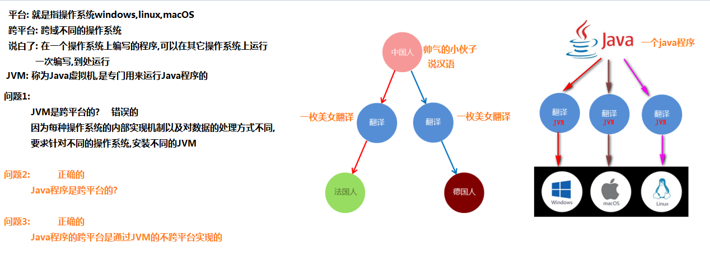

##### 1.4 JDK_JRE_JVM的组成和作用

```java
JVM: 叫做Java虚拟机,是专门用来运行Java程序的,但是不能单独只安装JVM
JRE: 叫做Java运行环境,包含JVM和核心类库,对于普通的软件使用者而言,只需要安装JRE就可以了
JDK: 叫做Java开发工具,包含JRE和开发工具

小贴士：
三者关系： JDK > JRE > JVM
```

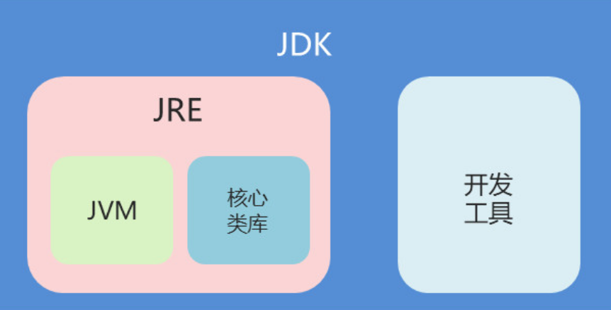

### 第二章 Java语言开发环境搭建

##### 2.1 JDK安装

```java
jdk的下载和安装
    1.注意操作系统是windows,linux,MacOS
    2.注意操作系统的位数是32位还是64位
    3.安装java相关软件的时候: 安装路径中不允许出现中文和空格-----务必注意-----
```


##### 2.2 常用DOS命令的使用

```java
如何进入DOS命令操作窗口?
    1.开始/命令提示符
    2.开始/搜索程序和文件 输入cmd
    3.windows键 + R --> 输入cmd
	4.窗口空白处/按住shift键 + 鼠标右键单击/在此处开命令窗口

```

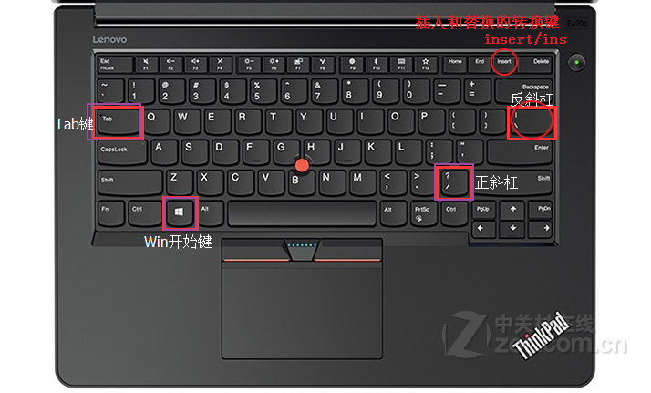

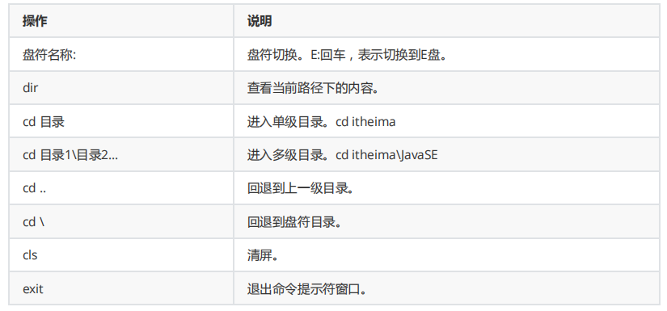

##### 2.3 环境变量JAVA_HOME的配置【了解，已经配置了的话，大家不用过多的浪费时间】

```java
记事本软件的启动方式?
    1.开始/程序/附件/记事本
    2.C:/windows/找到notepad.exe命令,双击启动
    3.如果在DOS窗口的命令中:
		C:\windows> notepad.exe	回车 运行这个命令
        首先在C:\windows路径下,寻找是否存在notepad.exe,发现有,直接运行
            
       	D:\abc> notepad.exe	回车 运行这个命令
        首先:在D:\abc路径下,寻找是否存在notepad.exe,发现没有
        其次: 如果发现在当前路径D:\abc没有要运行的notepad.exe命令,到系统环境变量path中寻找
        path:... C:\Windows;...,发现path中配置的路径C:\Windows有该命令,直接运行.如果path中配置的所有的路径中都没有要运行的命令,运行报错了.
            
            
            
            
给Java配置环境变量的意义/目的/作用? 
       让我们可以在任意路径下运行java开发的相关工具(javac: 编译工具,java: 运行工具)
            
            
    比如jdk的安装路径:C:\develop\Java\jdk1.8.0_162
    配置步骤:
	1.创建名称为JAVA_HOME的环境变量,取值是 C:\develop\Java\jdk1.8.0_162
    2.把步骤1中创建的名称为JAVA_HOME的环境变量,添加到系统环境变量path中
    找到系统环境变量path,在前面添加: %JAVA_HOME%\bin;...
        
    3.如果在DOS窗口的命令中:
		C:\develop\Java\jdk1.8.0_162\bin> javac.exe	回车 运行这个命令
        首先在C:\develop\Java\jdk1.8.0_162\bin路径下,寻找是否存在javac.exe,发现有,直接运行
        
        D:\abc> javac.exe	回车 运行这个命令
        首先:在D:\abc路径下,寻找是否存在javac.exe,发现没有
        其次: 如果发现在当前路径D:\abc没有要运行的javac.exe命令,到系统环境变量path中寻找
        path:... %JAVA_HOME%\bin;...,发现path中配置的名称为JAVA_HOME的环境变量,对应的路径C:\develop\Java\jdk1.8.0_162\bin中有要运行的javac.exe命令,直接运行,如果path中配置的所有路径中,都没有要运行的javac.exe命令,运行报错了
            
        寻找名称为JAVA_HOME的环境变量,找到后,使用其配置的具体路径进行替换:
		path:... C:\develop\Java\jdk1.8.0_162\bin;...,
		替换后的路径: C:\develop\Java\jdk1.8.0_162\bin中有javac命令,就可以直接运行

```


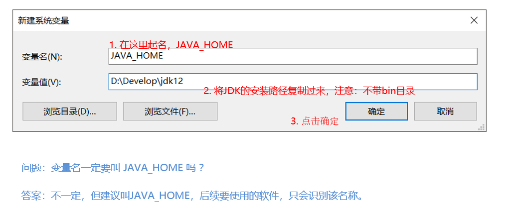

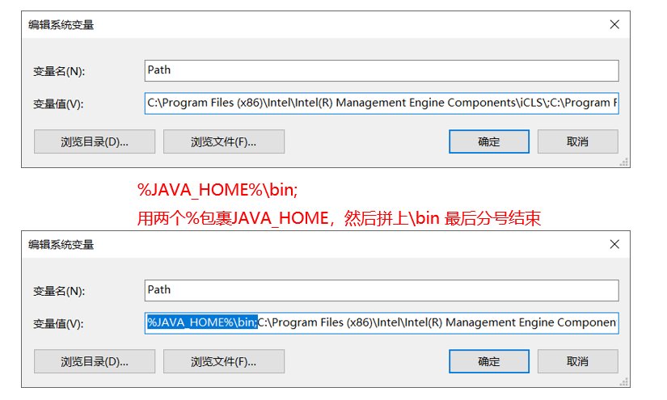    


### 第三章 HelloWorld入门程序

##### 3.1 程序开发的步骤

```java
1.源程序
	(1)程序员自己编写的,程序员可以看得懂的程序
	(2)内部就是字母,数字,$,_等
	(3)本质就是一个文本文件,但是扩展名不是.txt,而是.java
2.字节码程序
	JVM叫做Java虚拟机,是专门用来运行Java程序的,但是JVM是一个
	二货,只能识别0和1,像这种内部存储的都是0和1内容的文件,叫做
	字节码/.class文件,扩展名是.class
	问题: 如何把源程序转换成字节码程序呢?
	使用javac命令: 编译命令
	使用格式: 
		javac 文件名.java
		javac HelloWorld.java
		产生对应的字节码文件: HelloWorld.class
            
 3.运行字节码程序
	不管是java源文件还是编译后的字节码文件,都存储在硬盘中
	要运行的是字节码文件,也存储在硬盘,不会自动执行
	问题:如何把编译后的字节码文件交给JVM执行呢?
    使用java命令: 运行命令
    使用格式: 
		java 文件名
		java HelloWorld
		就会把HelloWorld.class字节码文件交给JVM运行了
            
```

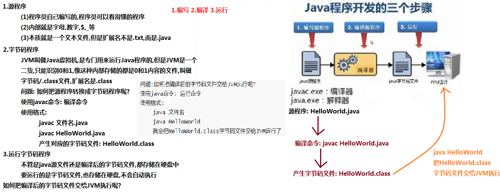

##### 3.2 HelloWorld案例的编写编译运行

```java
1.编写源程序
	创建一个名称为HelloWorld的文本文件,把扩展名修改为.java
	然后打开HelloWorld.java文件,输入以下内容:
	文件名称必须要和class后面的名字保持一模一样
    public class HelloWorld {
        public static void main(String[] args){
            System.out.println("HelloWorld");
        }
    }
2.编译源程序: 生成对应的字节码(文件中都是0和1)程序
	使用javac命令: 编译命令
	使用格式: 
		javac 文件名.java
		javac HelloWorld.java
		产生对应的字节码文件: HelloWorld.class
    注意:
		(1)必须保证当前路径下可以看到要编译的java文件
		(2)必须保证当前路径下javac命令可以使用
		(3)javac命令后面跟的文件名必须写扩展名.java
3.运行字节码程序:
	使用java命令: 运行命令
    使用格式: 
		java 文件名
		java HelloWorld
		就会把HelloWorld.class字节码文件交给JVM运行了
	 注意:
		(1)必须保证当前路径下可以看到要运行的class文件
		(2)必须保证当前路径下java命令可以使用
		(3)java命令后面跟的文件名不能写扩展名.class
```


##### 3.3 HelloWorld案例的常见问题

```java
非法字符问题。Java中的符号都是英文格式的。
大小写问题。Java语言对大小写敏感（区分大小写）。
在系统中显示文件的扩展名，避免出现HelloWorld.java.txt文件。
编译命令后的java文件名需要带文件后缀.java
运行命令后的class文件名（类名）不带文件后缀.class
不要把main写成mian
```

##### 3.4 Notepad++软件的安装和配置

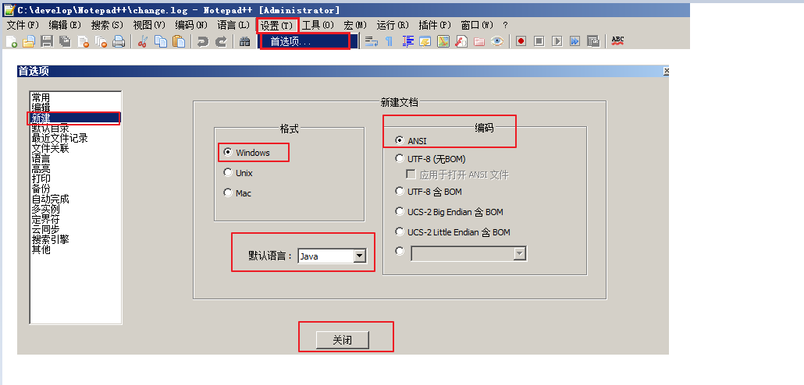

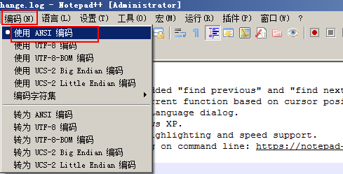

搜狗输入法的设置: 中文状态使用英文标点符号

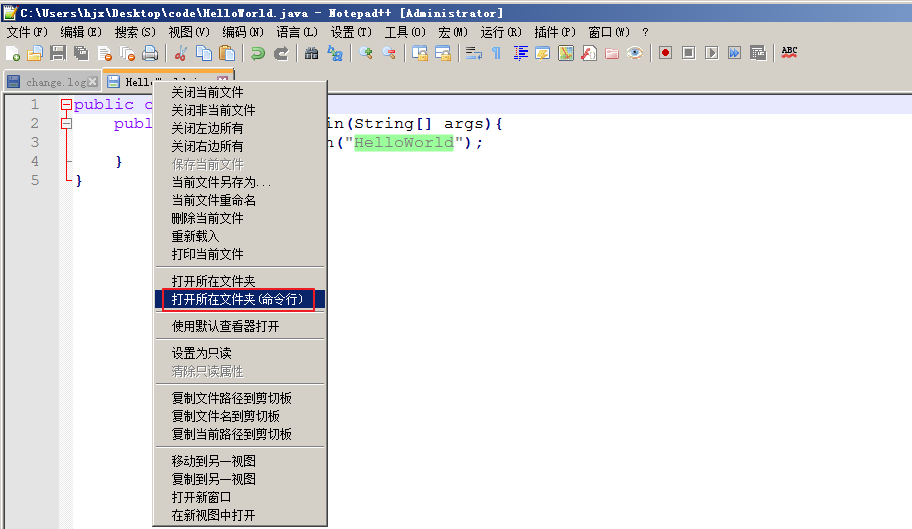

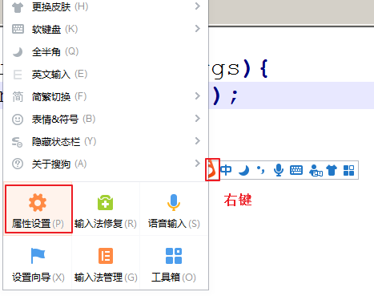

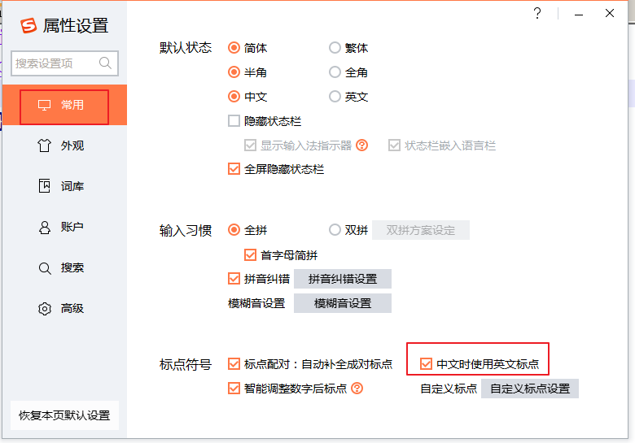

### 第四章 注释和关键字

##### 4.1 注释

```java
1.概念: 是用来对程序中的内容进行解释说明的信息,不参与编译,也不参与运行,更不会影响程序的运行效率.
    
2.分类:
	(1)//: 单行注释,只能写一行内容
	(2)/* ... */: 多行注释,里面可以写一行/多行内容
	(3)/** ... */: 文档注释		基本不用
	
```

```java
//这里是定义一个类,public class 是固定写法
//注意: class后面的名字必须和文件名保持一模一样
public class Demo01ZhuShi {
	/*
		这里是定义一个方法,名字叫做main,称为主方法
		main方法是程序的入口
		public static void main(String[] args): 都是固定写法
	*/
	public static void main(String[] args){
		/*
			这里是输出语句,()中双引号中的内容,
			会被原样输出到控制台
		*/
		System.out.println("zhushi~~~~~~");
	}
}
```


##### 4.2 关键字

```java
邮箱:	@前面: 邮箱的名字	@后面: 哪家的邮箱
	zhangsan@163.com			正确的
	nigulasi_zhangsan@163.com	正确的
	nigulasi@zhangsan@163.com   错误的
	理解: @符号在邮箱中有特殊含义和用法,不能随便按照自己的想法来使用
	

1.概念: 是指在程序中，Java已经定义好的单词，具有特殊含义。
2.注意:
	(1)今天不讲解单词的特殊含义和用法是什么
	(2)今天主要让大家能够辨识/认识出哪些是关键字
3.特点:
	(1)单词中所有字母都是小写
	(2)在高级编辑器中是彩色显示
4.找出以下代码中的关键字
	public class static void

```

```
public class Demo02GuanJianZi {
	public static void main(String[] args){
		System.out.println("guanjianzi~~~~~");
	}
}
```

​       


### 第五章 常量 

##### 5.1 常量的概念和分类

```java
数学中:
	b = a + 5;//数字5是一个常数,其值不可以发生改变
	y = x + 5.5;//数字5.5是一个常数,其值不可以发生改变

数学中的常数,对应到java中叫做常量
数学中的常数是有分类的:
	比如:
		5: 数字5叫做整数常数,其值不可以发生改变
		5.5: 数字5.5叫做小数常数,其值不可以发生改变
数学中的常数是有分类的,对应到java中的常量也是有分类的,而且java中常量的分类比数学中更加丰富

1.常量的概念: 在程序的执行过程中,其值不会发生改变的量
2.常量的分类:
	(1)整数常量:	5,-10
    (2)小数常量:	5.5,-6.6
    (3)字符常量:
		java中规定,字符常量必须使用单引号''引起来,
		而且单引号''中只能写一个字符(不能不写,也不能写2个及以上的字符)
        举例:ABE
			A:	'a'								正确的
            B:  ' '		' '内部有一个空格字符	  正确的
            C:  ''		''内部什么都没有		   错误的
            D:	'ab'							错误的
            E:	'好'							   正确的
            F:	'女子'						  错误的
    (4)字符串常量:
		java中规定,字符串常量必须使用双引号""引起来,
		而且双引号""中可以写多个字符(0个/1个/2个/3个/...)
        举例:ABCDEF
			A:	"a"								正确的
            B:  " "		" "内部有一个空格字符	  正确的
            C:  ""		""内部什么都没有		   正确的
            D:	"ab"							正确的
            E:	"好"							   正确的
            F:	"女子"						  正确的  
    (5)布尔常量: 只有两个值
    	true:	表示对的,正确的,肯定的,成立的,是的
		false:  表示不对的,错误的,否定的,不成立的,不是的
	(6)空常量: 只有一个值 null
    	不能直接打印空常量null
```

##### 5.2 打印不同类型的常量

```java
/*
	打印不同类型的常量
		System.out.println(xxx): 把()中的xxx输出到控制台,并换行
		System.out.print(xxx): 把()中的xxx输出到控制台,不换行
		System.out.println(): 单独换行,没有内容输出到控制台
		
	注意:
		()中的xxx根据不同的类型,书写格式是不一样的
		整数和小数: 直接写
		字符:必须使用单引号
		字符串: 必须使用双引号
		布尔常量: 直接写
		
	ctrl + d: 复制一行
*/
public class Demo03ChangLiang {
	public static void main(String[] args) {
		//1.整数常量
		//System.out.println(5);
		System.out.print(5);
		System.out.println();//单独换行
		//System.out.println(-10);
		System.out.print(-10);
		System.out.println();//单独换行
		//2.小数常量
		System.out.println(5.5);
		System.out.println(-6.6);
		
		//3.字符常量
		System.out.println('a');//正确的
		System.out.println(' ');//正确的
		//System.out.println('');//错误的,''中不能没有内容
		//System.out.println('ab');//错误的,''中不能写2个及以上的字符
		System.out.println('好');
		//System.out.println('女子');//错误的,''中不能写2个及以上的字符
		
		//4.字符串常量
		System.out.println("a");//正确的
		System.out.println("ab");//正确的
		System.out.println("");//正确的
		System.out.println(" ");//正确的
		System.out.println("好");//正确的
		System.out.println("真的好像你!!!!");//正确的
		
		//5.布尔常量
		System.out.println(true);
		System.out.println(false);
		
		//6.空常量
		//System.out.println(null);//错误: 不能直接打印空常量null
	}
}
```

### 第六章 计算机中的进制与字节【了解了解】

##### 6.1 进制及转换

- 进制

  ```java
  进制的概念：	逢几进一,就叫做几进制
  进制的分类：
  	十进制:	逢十进一,每位数字0-9
      二进制:	逢二进一,每位数字0-1
      八进制:	逢八进一,每位数字0-7
      十六进制:	逢十六进一,每位数字0-15 0-9,10(A),11(B),12(C),13(D),14(E),15(F)    
  ```

  

- 转换

  ```java
  1.十进制转十进制(对于十进制数字,每位数字上都含有一个10的多少次方,从右向左,第一位是10的0次方,第二位是10的1次方,第三位是10的2次方...)
  	x^y表示: x的y次方	
  	1234 = 1000 + 200 + 30 + 4
      	 = 1*10^3 + 2*10^2 + 2*10^1 + 4*10^0  
           
  2.二进制转十进制(对于二进制数字,每位数字上都含有一个2的多少次方,从右向左,第一位是2的0次方,第二位是2的1次方,第三位是10的2次方...):		
  	1101	= 1*2^3 + 1*2^2 + 0*2^1 + 1*2^0
  			= 1*8 + 1*4 + 0*2 + 1*1
          	= 8 + 4 + 0 + 1
          	= 13
      11111   = 1*2^4 + 1*2^3 + 1*2^2 + 1*2^1 + 1*2^0
    		= 1*16 + 1*8 + 1*4 + 1*2 + 1*1
          	= 16 + 8 + 4 + 2 + 1
        	= 31
    
  3.十进制转二进制(除以2去余数,倒过来写): 
      十进制的13转换成二进制:1101	
  	十进制的75转换成二进制:1001011
          
  ```
  
  ##### 十进制转二进制图解:
  
  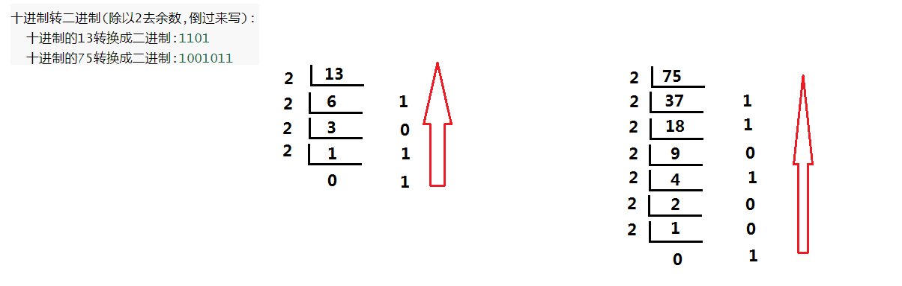

##### 6.2 计算机中的存储单位(2的10次方就是1024) 

```java
位: 计算机中存储一个二进制数字1或者0所占用的空间,用单词bit表示,简写b
字节: 8位(0或者1)就叫做一个字节,用单词byte表示,简写B			----非常重要的-----
字节是我们常见的计算机中最小存储单元。
1024B = 1KB
1024KB = 1MB
1024MB = 1GB
1024GB = 1TB
//...

```


##### 总结

```java
能够说出JDK,JRE,JVM各自的作用和关系
	1.JVM: java虚拟机,是专门用来运行java程序的,但是不能独立安装
	2.JRE: java运行环境,包含JVM和核心类库
	3.JDK: java开发工具,包含JRE和开发工具
	
能够完成HelloWorld案例的编写及运行
	1.编写源程序
		public class HelloWorld {
			public static void main(String[] args) {
				System.out.println("HelloWorld");
			}
		}
	2.编译源程序生成字节码程序
		javac HelloWorld.java
		生成对应的字节码文件: HelloWorld.class
            
	3.运行字节码程序
		java HelloWorld
		
能够使用注释对程序进行说明
	//单行注释
	/* ... */多行注释
	/** ... */ 文档注释
	
能够知道关键字的特点 
	1.所有字母都是小写
	2.高级编辑器中彩色显示
	
能够知道常量的分类
	1.整数常量:	100,200
	2.小数常量: -6.6,8.8
	3.字符常量: 'a'
	4.字符串常量: ""," ","a","aaaaa"
	5.布尔常量: true,false
	6.空常量: null			不能直接打印空常量null
```
