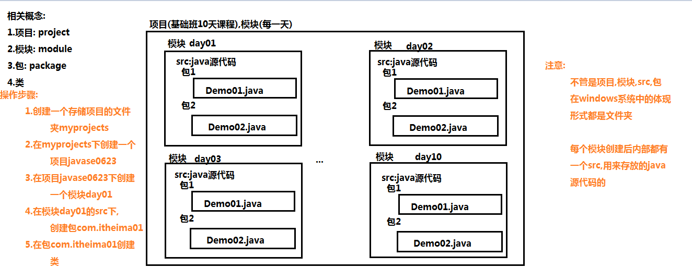
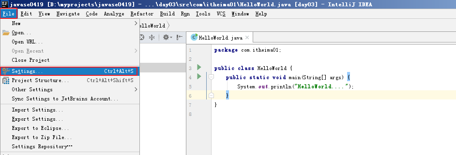
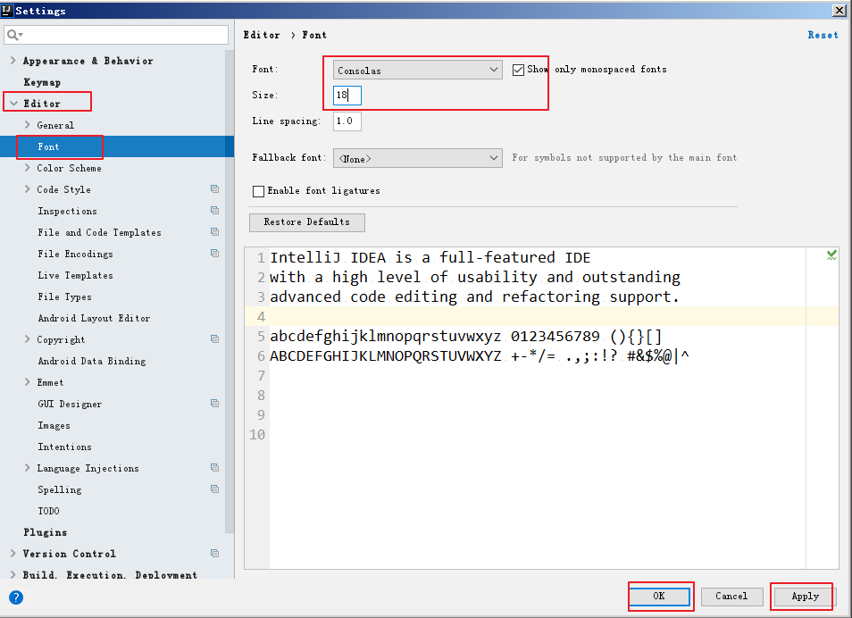
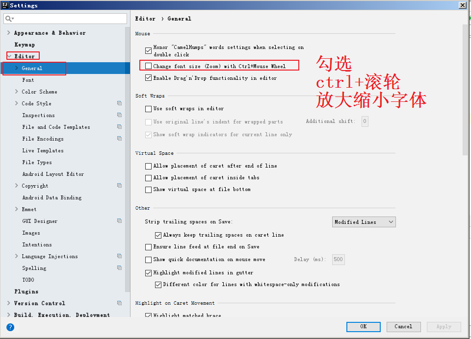
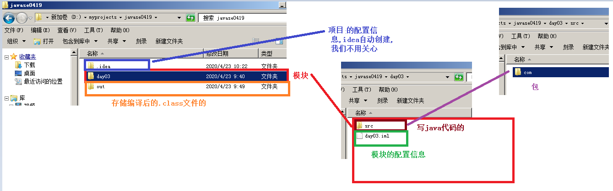
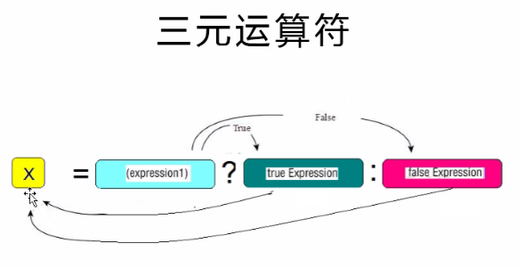
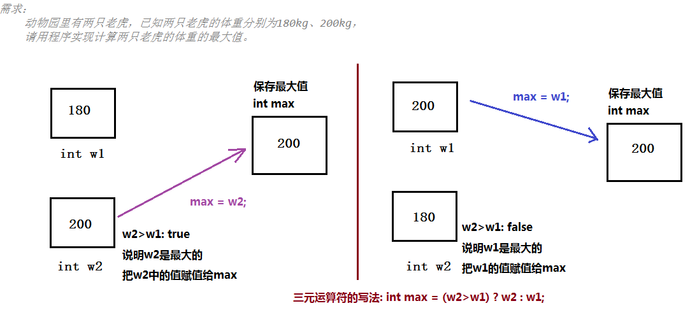
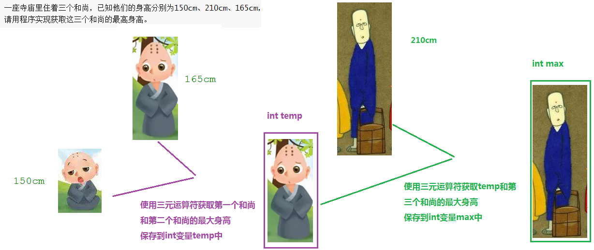
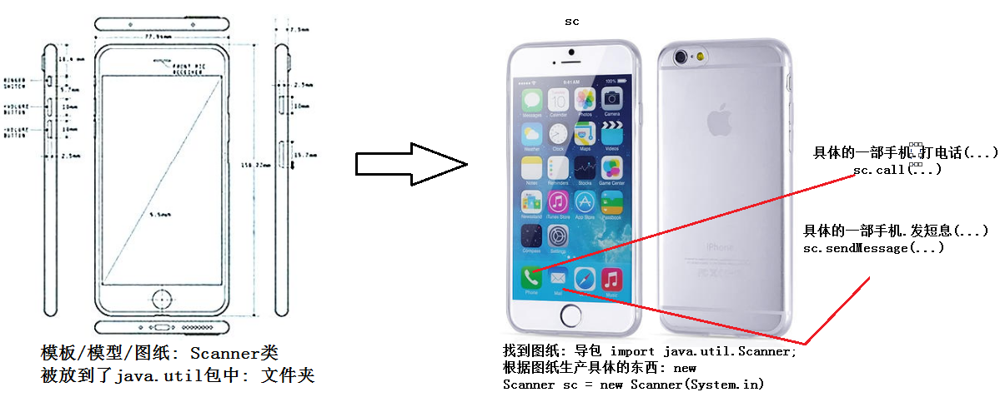

# day03 【IDEA、运算符、数据输入】

##### 今日复习指南

```java
1.IDEA操作(0.5个小时内完成)
    (1)创建项目
    (2)创建模块
    (3)创建包
    (4)创建类
2.运算符(0.5个小时内完成)
    (1)关系运算符:Demo01GuanXi.java
	(2)逻辑运算符:Demo03DuanLu.java						短路&&和||
	(3)三元运算符:Demo03SanYuanMax.java					三个和尚的最大身高
3.键盘录入(1个小时内完成: 多练几遍)
    Demo01ScannerSum.java							   获取键盘录入的两个int数字求和
    Demo02ScannerMax.java							   获取键盘录入的三个int数字求最大值

```

##### 今天内容介绍

```java
IDEA【重点：操作】
运算符【重点：理解】
数据输入【重点：格式需要记忆】
练习【重点：操作】
```

### 第一章 开发工具IntelliJ IDEA

##### 1.1 IDEA开发工具的安装

##### 1.2 IDEA的首次驱动

```java
查看文件夹 IDEA操作文档\01_首次驱动项目和模块的创建.docx文件
```



##### 1.3 IDEA的包和类的创建

```java
查看文件夹 IDEA操作文档\02_包和类的创建.docx
```

##### 1.4 IDEA字体的设置和快捷键的修改

```java
查看文件夹 IDEA操作文档\03_字体设置及快捷键修改.docx
```



##### 修改字体



##### ctrl+滚轮放大/缩小字体




##### 1.5 IDEA工程目录的介绍



##### 1.6 IDEA快捷键的使用

```java
1.psvm + 回车: main方法
2.sout + 回车: 输出语句
3.ctrl + d: 复制当前行
4.ctrl + alt + L: 格式化代码
5.alt + shift + ↑: 向上移动代码
6.alt + shift + ↓: 向下移动代码
7.ctrl + /: 单行注释
8.ctrl + shift + /: 多行注释
9.alt + 回车: 代码修正
10.alt + /: 自动提示
11.ctrl + Y: 删除当前行
    

```

##### 1.7 IDEA创建模块和删除模块

```java
查看文件夹IDEA操作文档\04_非首次模块的创建导入删除.docx
```

##### 1.8 IDEA导入项目和关闭项目

```java
查看文件夹IDEA操作文档\05_非首次项目的创建导入打开.docx
```


### 第二章 运算符

##### 2.1 关系运算符

```java
1.作用:	用来比较两个数据之间的大小关系的	
        
2.特点:	
	不管关系表达式写的多么复杂或者多么简短,关系运算符的结果只有两个,要么是true,要么是false
    
3.分类:
	== 		a==b，	判断a和b的值是否相等，成立为true，不成立为false
	!= 		a!=b，	判断a和b的值是否不相等，成立为true，不成立为false
	> 		a>b，		判断a是否大于b，成立为true，不成立为false
	>= 		a>=b，	判断a是否大于或者等于b，成立为true，不成立为false
	< 		a<b，		判断a是否小于b，成立为true，不成立为false
	<= 		a<=b，	判断a是否小于或者等于b，成立为true，不成立为false
        
4.注意:
	(1)==: 代表比较是否相同
	(2)=: 代表赋值操作
```

```java
//关系运算符
public class Demo01GuanXi {
    public static void main(String[] args) {
        //定义2个int变量,并初始化
        int a = 10, b = 20;
        //boolean result = a > b;
        //System.out.println(result);//false
        System.out.println(a > b);//10 > 20: false
        System.out.println(a >= b);//10 >= 20: false
        System.out.println(a < b);//10 < 20: true
        System.out.println(a <= b);//10 <= 20: true
        System.out.println(a != b);//10 != 20: true
        System.out.println(a == b);//10 == 20: false
        //=代表赋值操作
        //把变量b的值赋值给变量a,再打印a的值
        System.out.println(a = b);//20
    }
}
```


##### 2.2 逻辑运算符

```java
举例: 咱们班哥们在黑马学习java,顺利毕业,高薪就业,找到了对象,谈了好长时间,需要谈婚论嫁
到你对象家和准岳母谈判:
	准岳母:
		小伙子呀,你呢? 必须得有房(条件1:true/false),而且呢,你呀,还得有车(条件2:true/false),然后你们的事情才能决定下来(结果: true/false)
		
	注意:
		像上面的情况,必须两个条件都成立(true),结果才成立(true),需要使用逻辑运算符&连接这两个条件
	
	准岳母:
		小伙子呀,你呢? 要么有房(条件1:true/false),要么有车(条件2:true/false),然后你们的事情才能决定下来(结果: true/false)
		
	注意: 
		像上面的情况,两个条件只要有一个成立(true),结果就成立(true),需要使用逻辑运算符|连接这两个条件
		
		
            
    
1.作用: 用来连接布尔表达式的,结果也是布尔类型,要么是true,要么是false
    
2.分类:
	(1)&(shift+7)【有false，则false】: 
					逻辑与,表示并且的意思,只有两个或者多个条件都为true时,结果才为true	
					只要有一个条件为false,最终的结果就是false
					
	(2)|(shift+|)【有true，则true】: 
					逻辑与,表示或者的意思,两个或者多个条件中,只要有一个是true,结果就是true
					只有当两个或者多个条件都是false时,结果才为false
	(3)^(shift+6): 逻辑异或,相同为false,不同为true		目前暂时不用
    (4)!(shift+1): 逻辑取反		!true: false,!false: true
    	
```

```java
public class Demo02LuoJi {
    public static void main(String[] args) {
        int a = 10, b = 20, c = 30;
        System.out.println((a > b) & (a > c));//10>20 & 10>30 --> false & false --> false
        System.out.println((a < b) & (a < c));//10<20 & 10<30 --> true  & true --> true
        System.out.println((a > b) & (a < c));//10>20 & 10<30 --> false & true --> false
        System.out.println((a < b) & (a > c));//10<20 & 10>30 --> true  & false --> false
        System.out.println("----------------");
        System.out.println((a > b) | (a > c));//10>20 | 10>30 --> false | false --> false
        System.out.println((a < b) | (a < c));//10<20 | 10<30 --> true  | true --> true
        System.out.println((a > b) | (a < c));//10>20 | 10<30 --> false | true --> true
        System.out.println((a < b) | (a > c));//10<20 | 10>30 --> true  | false --> true
        System.out.println("----------------");
        System.out.println((a > b) ^ (a > c));//10>20 ^ 10>30 --> false ^ false --> false
        System.out.println((a < b) ^ (a < c));//10<20 ^ 10<30 --> true  ^ true --> false
        System.out.println((a > b) ^ (a < c));//10>20 ^ 10<30 --> false ^ true --> true
        System.out.println((a < b) ^ (a > c));//10<20 ^ 10>30 --> true  ^ false --> true
        System.out.println("----------------");
        System.out.println(!true);//false
        System.out.println(!false);//true
        System.out.println(3!=2);//true
        System.out.println(!(3==2));//true
    }
}
```


##### 2.3 逻辑运算符的短路效果

```java
短路的逻辑运算符
	1.基本使用
    	(1)&&【左侧为false，右侧不计算】: 短路逻辑与
        	如果&&左侧的条件结果为false,已经决定了最终的&&的结果为false,所以不再计算&&右边的条件

        (2)||【左侧为true，右侧不计算】: 短路逻辑或
            如果||左侧的条件结果为true,已经决定了最终的||的结果为true,所以不再计算||右边的条件
    2.特点:
    	(1)&& 和 &: 运算结果是相同的,但是&&具有短路的效果,可以提高效率
        (2)|| 和 |: 运算结果是相同的,但是||具有短路的效果,可以提高效率

    ----有连接多个条件,都是用短路&&和||,因为具有短路的效果,可以提高效率------
```

```java
public class Demo03DuanLu {
    public static void main(String[] args) {
        int a = 2;
        /*
            表达式(3<2) && (++a>3)从左向右计算
            先计算表达式(3<2)结果是false,对于&&而言左侧为false,已经决定了&&最终的结果就是false,
            所以不再计算&&右侧的表达式(++a>3),最终a的值没有变化,还是2
        */
        System.out.println((3 < 2) && (++a > 3));//false
        System.out.println(a);//2

        int b = 2;
        /*
            表达式(3<2) & (++b>3)从左向右计算
            先计算表达式(3<2)结果是false,虽然已经决定了&的最终结果为false,
            但是对于&而言不管左侧是false还是true,都要计算&右侧的表达式,
            所以计算&右侧的表达式(++b>3),最终b的值变成了3
        */
        System.out.println((3 < 2) & (++b > 3));//false
        System.out.println(b);//3

        int c = 2;
         /*
            表达式(3 > 2) || (++c > 2)从左向右计算
            先计算表达式(3 > 2)结果是true,对于||而言左侧为true,已经决定了||最终的结果就是true,
            所以不再计算||右侧的表达式(++c > 2),最终c的值没有变化,还是2
        */
        System.out.println((3 > 2) || (++c > 2));//true
        System.out.println(c);//2

        int d = 2;
        /*
            表达式(3 > 2) | (++d > 2)从左向右计算
            先计算表达式(3 > 2)结果是true,虽然已经决定了|的最终结果为true,
            但是对于|而言不管左侧是false还是true,都要计算|右侧的表达式,
            所以计算|右侧的表达式(++d > 2),最终d的值变成了3
        */
        System.out.println((3 > 2) | (++d > 2));//true
        System.out.println(d);//3
    }
}

```


##### 2.4 三元运算符格式

```java
1.格式:
	数据类型 变量名称 = 布尔表达式1 ? 表达式2 : 表达式3;
	
	注意:
		?前面的式子不管多么简单或者多么复杂,结果必须是buer类型
		
2.执行流程:	
  (1)计算布尔表达式1的结果,看是true还是false
  (2)如果布尔表达式1的结果是true,把表达式2的结果赋值给左侧的变量
  (3)如果布尔表达式1的结果是false,把表达式3的结果赋值给左侧的变量
```

##### 执行流程图解:




##### 2.5 三元运算符的练习之两只老虎(最大值)

```java
需求：
    动物园里有两只老虎，已知两只老虎的体重分别为180kg、200kg，
    请用程序实现计算两只老虎的体重的最大值。

实现步骤:
	1.定义2个int变量w1和w2,分别代表两只老虎的体重,并根据题目需求进行初始化
	2.使用三元运算符计算w1和w2的最大值,保存到int变量max中
	3.打印max的值
```

##### 图解分析



```java
public class Demo01SanYuanMax {
    public static void main(String[] args) {
        //1.定义2个int变量w1和w2,分别代表两只老虎的体重,并根据题目需求进行初始化
        int w1 = 180;
        int w2 = 200;

        //2.使用三元运算符计算w1和w2的最大值,保存到int变量max中
        int max = (w2 > w1) ? w2 : w1;

        //3.打印max的值
        System.out.println("最大值: "+max);
    }
}

```


##### 2.6 三元运算符的练习之两只老虎(相等)

```java
需求：
    动物园里有两只老虎，已知两只老虎的体重分别为180kg、200kg，
    请用程序实现判断两只老虎的体重是否相同。

实现步骤:
	1.定义2个int变量w1和w2,分别代表两只老虎的体重,并根据题目需求进行初始化
	2.使用三元运算符比较w1和w2是否相同,结果保存到boolean类型变量result中
	3.打印结果数据result的值
```

```java
public class Demo02SanYuanEquals {
    public static void main(String[] args) {
        //1.定义2个int变量w1和w2,分别代表两只老虎的体重,并根据题目需求进行初始化
        int w1 = 180;
        int w2 = 200;

        //2.使用三元运算符比较w1和w2是否相同,结果保存到boolean类型变量result中
        boolean result = (w1==w2) ? true : false;

        //3.打印结果数据result的值
        System.out.println("是否相同呢? "+result);
    }
}
```


##### 2.7 三元运算符的练习之三个和尚

```java
需求：
    一座寺庙里住着三个和尚，已知他们的身高分别为150cm、210cm、165cm，
    请用程序实现获取这三个和尚的最高身高。

实现步骤:
	1.定义3个int变量h1,h2,h3,分别代表三个和尚的身高,并根据题目需求进行初始化
	2.使用三元运算符获取h1和h2的最大身高,保存到int变量temp中
	3.使用三元运算符获取temp和h3的最大身高,保存到int变量max中
	4.打印max的值
```

##### 图解分析



```java
public class Demo03SanYuanMax {
    public static void main(String[] args) {
        //1.定义3个int变量h1,h2,h3,分别代表三个和尚的身高,并根据题目需求进行初始化
        int h1 = 150, h2 = 210, h3 = 165;

        //2.使用三元运算符获取h1和h2的最大身高,保存到int变量temp中
        int temp = (h1 > h2) ? h1 : h2;

        //3.使用三元运算符获取temp和h3的最大身高,保存到int变量max中
        int max = (temp > h3) ? temp : h3;

        //4.打印max的值
        System.out.println("最大身高: "+max);
    }
}
```


### 第三章 数据输入（应用）

##### 3.1 键盘录入的基本使用

```java
数据输出: 把程序的运行结果输出到控制台,从而显示到屏幕上
数据输入: 获取键盘录入的数据到程序中,从而在程序中对数据进行相关的运算

问题1:
	获取键盘录入的数据的功能非常常用的,但是如果让我们程序员自己实现,将非常麻烦,没有必要.JDK的开发人员已经把获取键盘录入数据的功能实现好了,程序员可以直接使用.JDK的开发人员把获取键盘录入数据的功能定义成一个叫做Scanner的类中,并且把Scanner类放入了java.util包中
	
问题2:
	如何使用jdk中的某个包中的某个类呢?
        
Java中数据类型分成基本类型(四类八种)和引用类型,对于引用类型的使用有固定的三个步骤:
键盘录入java.util.Scanner类也是属于引用类型的,所以使用也有固定的三个步骤:
	1.导包(找到我们要使用的东西)
        格式: import 包名.类名;
		键盘录入: import java.util.Scanner;

	2.创建对象
		格式: 类名 对象名称 = new 类名(实际参数...);
		类名: 之前写代码时,关键字class后面的名称
		对象名称: 就是一个标识符,只要符合标识符的命名规范,其实就是起个名字
		创建Scanner类的对象:
			Scanner sc = new Scanner(System.in);
			注意: ()中的System.in目前是固定写法,后面单独讲解
			
	3.使用
		sc.nextInt(): 获取键盘录入的整数数字
		
		
```

##### 键盘录入的理解




##### 3.2 键盘录入的练习

```java
需求：
    获取键盘录入的两个整数(int类型)数字,在控制台输出求和的结果。
    
实现步骤:
	1.导包: import java.util.Scanner
	2.创建键盘录入对象: Scanner sc = new Scanner(System.in);
	3.获取键盘录入的两个整数数字,分别保存到int变量a和b中
	4.计算a和b中的数据之和,保存到int变量sum中
	5.打印sum中的值
```

```java
public class Demo01ScannerSum {
    public static void main(String[] args) {
        //1.导包: import java.util.Scanner
        //2.创建键盘录入对象: Scanner sc = new Scanner(System.in);
        Scanner sc = new Scanner(System.in);

        //3.获取键盘录入的两个整数数字,分别保存到int变量a和b中
        System.out.println("请输入第一个整数数字");
        int a = sc.nextInt();
        System.out.println("您输入的第一个整数数字: "+a);

        System.out.println("请输入第二个整数数字");
        int b = sc.nextInt();
        System.out.println("您输入的第二个整数数字: "+b);

        //4.计算a和b中的数据之和,保存到int变量sum中
        int sum = a + b;

        //5.打印sum中的值
        System.out.println("以上两个整数数字之和: "+sum);
    }
}
```


##### 3.3 键盘录入改写三个和尚案例

```java
需求：
    一座寺庙里住着三个和尚，已知他们的身高分别为150cm、210cm、165cm，身高需要使用键盘录入
    请用程序实现获取这三个和尚的最高身高。
    
实现步骤:
	1.导包: import java.util.Scanner
	2.创建键盘录入Scanner类的对象: Scanner sc = new Scanner(System.in)
    3.获取键盘录入的三个整数数字,代表三个和尚的身高,分别保存到int变量h1,h2,h3中
    4.使用三元运算符计算h1和h2的最大值,保存到int变量temp中
    5.使用三元运算符计算temp和h3的最大值,保存到int变量max中
    6.打印max的值
注意:
	以上步骤1到2(先导包,再创建对象)可以合成一步完成
        方式一: 推荐使用
            正确输入Scanner的前几个字母,根据提示选择需要的Scanner类,回车
            正确输入Scanner的前几个字母,如果没有提示,按alt + / 然后根据提示选择需要的Scanner类,回车

        方式二:
            完整输入类名Scanner,按alt + 回车,然后根据提示选择需要的Scanner类,回车
```

```java
public class Demo02ScannerMax {
    public static void main(String[] args) {
        //1.导包: import java.util.Scanner
        //2.创建键盘录入Scanner类的对象: Scanner sc = new Scanner(System.in)
        Scanner sc = new Scanner(System.in);

        //3.获取键盘录入的三个整数数字,代表三个和尚的身高,分别保存到int变量h1,h2,h3中
        System.out.println("请输入第一个和尚的身高: ");
        int h1 = sc.nextInt();

        System.out.println("请输入第二个和尚的身高: ");
        int h2 = sc.nextInt();

        System.out.println("请输入第三个和尚的身高: ");
        int h3 = sc.nextInt();

        System.out.println("您输入的第一个和尚的身高: " + h1);
        System.out.println("您输入的第二个和尚的身高: " + h2);
        System.out.println("您输入的第三个和尚的身高: " + h3);

        //4.使用三元运算符计算h1和h2的最大值,保存到int变量temp中
        int temp = (h1 > h2) ? h1 : h2;

        //5.使用三元运算符计算temp和h3的最大值,保存到int变量max中
        int max = (temp > h3) ? temp : h3;

        //6.打印max的值
        System.out.println("三个和尚的最大身高: "+max);
    }
}
```


## 总结

```
能够知道&&和&的区别	
	&&和&: 运算结果相同
	&: 不管左侧的表达式是true还是false,右侧表达式都必须计算
	&&: 如果左侧表达式是false,右侧不计算
	
能够使用三元运算符完成获取两个数中较大值
	int a = 10, b = 20;
	int max = (a<b) ? b : a;
	
能够使用键盘录入数据并完成两个数据求和
	//1.导包
	import java.util.Scanner;
	//2.创建对象
	Scanner sc = new Scanner(System.in);
	//3.获取键盘录入的2个int数字
	int a = sc.nextInt();
	int b = sc.nextInt();
	//4.求和
	int sum = a + b;
	
能够使用IDEA完成HelloWorld案例	
能够知道IDEA的项目结构
能够使用IDEA完成模块的导入
```

